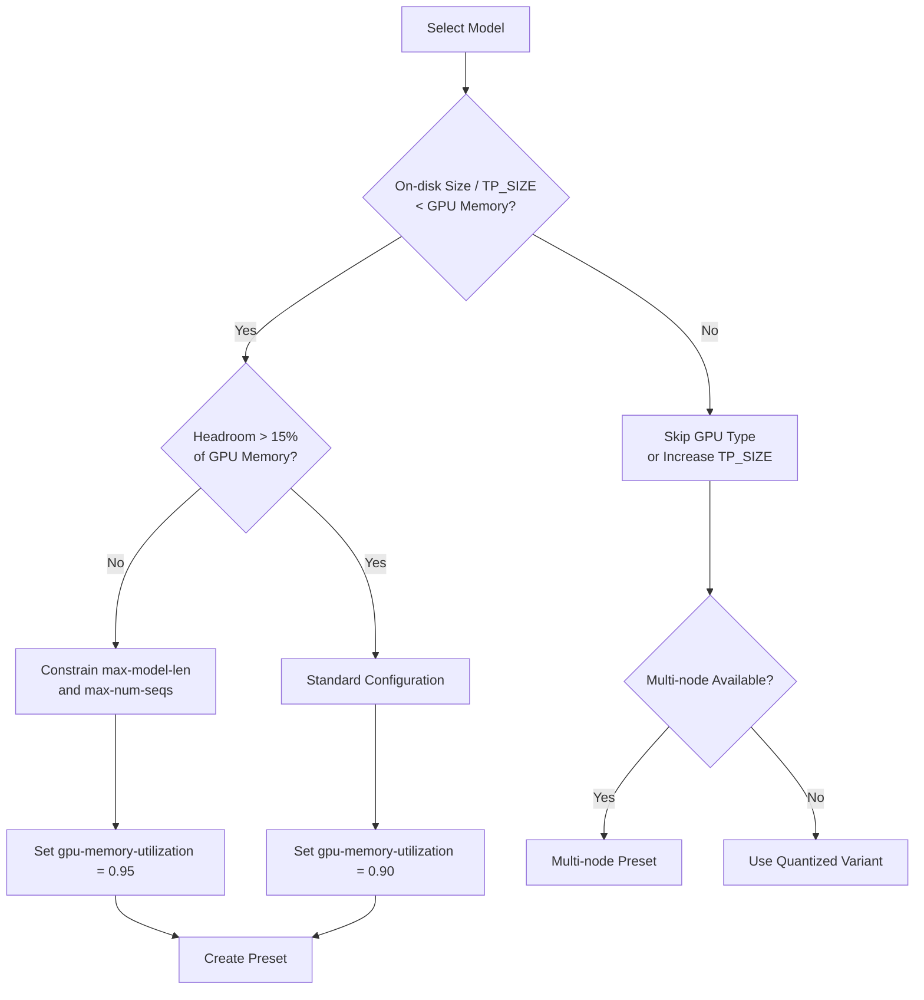
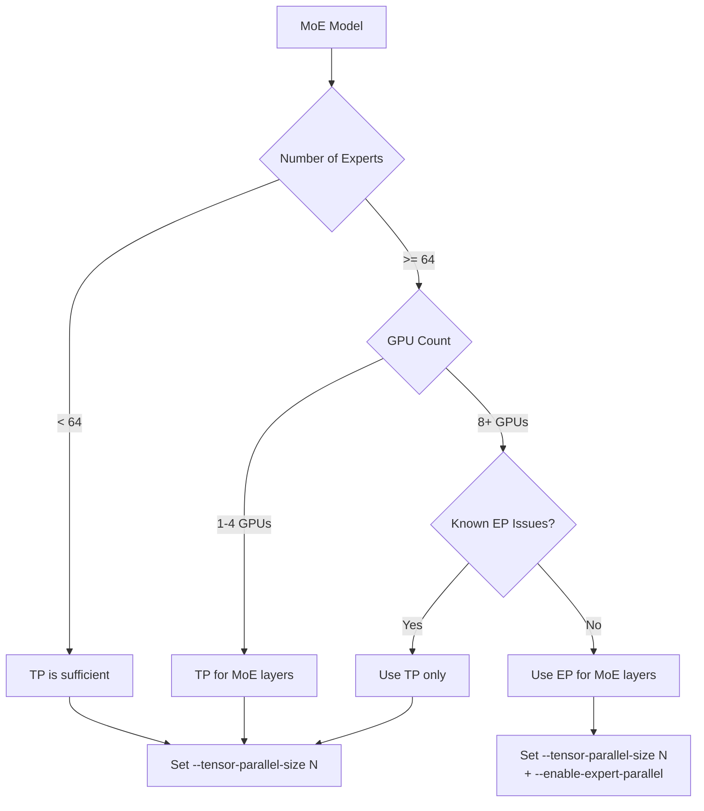

# MAF-19394: E2E vLLM Presets for H100/H200

## 1. Overview

This report documents the research and design decisions behind the end-to-end Odin presets
for running four large-scale MoE models on NVIDIA H100 and H200 GPUs using upstream vLLM v0.15.1.

- **Task**: Create production-ready Odin presets for H100/H200 GPU configurations
- **Runtime image**: `vllm/vllm-openai:v0.15.1`
- **Target models**:
  - `deepseek-ai/DeepSeek-R1`
  - `openai/gpt-oss-120b`
  - `zai-org/GLM-4.7-Flash`
  - `moonshotai/Kimi-K2.5`

All four models use Mixture-of-Experts (MoE) architectures, which require careful parallelism
and memory planning to run efficiently on multi-GPU nodes.

## 2. Model Architecture Summary

| Model         | Total Params | Activated Params | Architecture | Experts               | Top-k | Context Length | Weight Format             | On-disk Size |
| ------------- | ------------ | ---------------- | ------------ | --------------------- | ----- | -------------- | ------------------------- | ------------ |
| DeepSeek-R1   | 671B         | ~37B             | MoE + MLA    | 256 routed + 1 shared | 8     | 163,840        | FP8 native                | ~671 GB      |
| gpt-oss-120b  | 116.83B      | 5.13B            | MoE + GQA    | 128                   | 4     | 131,072        | MXFP4 (MoE) + BF16 (attn) | ~63 GB       |
| GLM-4.7-Flash | ~30B         | ~3B              | MoE + MLA    | 64 routed + 1 shared  | 4     | 202,752        | BF16                      | ~60 GB       |
| Kimi-K2.5     | 1T           | 32B              | MoE + MLA    | 384                   | 8     | 256,000        | INT4 (W4A16 QAT)          | ~595 GB      |

Key observations:

- All four models are MoE, meaning total parameter count far exceeds activated parameter count
  per token. This dictates that weight memory dominates GPU usage while compute is relatively modest.
- DeepSeek-R1 and Kimi-K2.5 use Multi-head Latent Attention (MLA), which compresses KV cache
  but requires `trust-remote-code` for custom attention kernels.
- gpt-oss-120b ships with mixed-precision MXFP4 weights for MoE layers and BF16 for attention,
  keeping disk footprint small despite 117B total parameters.
- Kimi-K2.5 at 1T total parameters is the largest model, but INT4 QAT quantization brings on-disk
  size down to ~595 GB.

## 3. GPU Memory Fit Analysis

### H100 (80 GB per GPU, 640 GB for 8x)

| Model         | Per-GPU Weight Memory (TP=8) | Fits 8x H100? | Notes                                                    |
| ------------- | ---------------------------- | ------------- | -------------------------------------------------------- |
| DeepSeek-R1   | ~84 GB                       | No            | Exceeds 80 GB per GPU. Skipped for H100.                 |
| gpt-oss-120b  | ~63 GB (1 GPU)               | Yes           | Fits on a single GPU. Multi-GPU gives KV cache headroom. |
| GLM-4.7-Flash | ~60 GB (1 GPU)               | Yes           | Fits on 1 GPU. TP=2 for 128K context, TP=4 for 200K.     |
| Kimi-K2.5     | ~74.4 GB                     | Barely        | Only 5.6 GB headroom per GPU. Very tight.                |

### H200 (141 GB per GPU, 1128 GB for 8x)

| Model         | Per-GPU Weight Memory (TP=8) | Fits 8x H200? | Notes                                           |
| ------------- | ---------------------------- | ------------- | ----------------------------------------------- |
| DeepSeek-R1   | ~84 GB                       | Yes           | 57 GB headroom per GPU. Comfortable.            |
| gpt-oss-120b  | ~63 GB (1 GPU)               | Yes           | 78 GB headroom on single GPU. Very comfortable. |
| GLM-4.7-Flash | ~60 GB (1 GPU)               | Yes           | 81 GB headroom. 128K+ context on single GPU.    |
| Kimi-K2.5     | ~74.4 GB                     | Yes           | ~66.6 GB headroom per GPU. Comfortable.         |

### Memory Fit Decision Flow



## 4. Expert Parallelism (EP) vs Tensor Parallelism (TP) for MoE

MoE models support two distinct parallelism strategies for distributing expert layers across GPUs:

### Tensor Parallelism (TP)

- Each expert's weight tensor is sharded across all GPUs in the TP group.
- Every GPU participates in every expert computation.
- Communication pattern: **all-reduce** after each expert layer.
- Simple to configure: set `--tensor-parallel-size N`.

### Expert Parallelism (EP)

- Whole experts are distributed across GPUs. Each GPU holds a subset of experts.
- Tokens are routed to the GPU holding the relevant expert.
- Communication pattern: **all-to-all** dispatch and combine.
- Activated with `--enable-expert-parallel`. EP_SIZE = TP_SIZE x DP_SIZE.

### When to Use Which



| Factor               | TP                                             | EP                                        |
| -------------------- | ---------------------------------------------- | ----------------------------------------- |
| Communication        | all-reduce (synchronous)                       | all-to-all (asynchronous)                 |
| Expert count scaling | Overhead grows with expert count               | Scales naturally with expert count        |
| Best for             | Small expert counts (< 64), few GPUs           | Large expert counts (128+), 8+ GPUs       |
| Memory efficiency    | All GPUs store partial weights for all experts | Each GPU stores full weights for a subset |

**Model-specific decisions:**

- **DeepSeek-R1 (256 experts)**: EP recommended on 8 GPUs. All-to-all is more efficient than
  all-reduce for 256 experts.
- **gpt-oss-120b (128 experts)**: EP **not used** due to community-reported RuntimeErrors on
  some GPU types. Stick with TP.
- **GLM-4.7-Flash (64 experts)**: TP sufficient at 1-4 GPUs.
- **Kimi-K2.5 (384 experts)**: EP strongly recommended. 384 experts make TP impractical on 8 GPUs.

## 5. Preset Configuration Details

### Naming Convention

Preset filenames follow the pattern:

```
vllm-v0.15.1-<model-org>-<model-name>-nvidia-<gpu>-<parallelism>
```

Where `<parallelism>` is one of:
- `1` — single GPU, no parallelism
- `tpN-moe-tpN` — TP for both attention and MoE layers
- `tpN-moe-epN` — TP for attention, EP for MoE layers (EP_SIZE = TP_SIZE)
- `dpN-moe-epN` — DP+EP single-node (TP=1, one GPU per DP rank)
- `dpN-moe-epN` with `dataLocal` — Wide-EP multi-node (TP=1, 8 GPUs per DP rank across multiple nodes)

---

### 5.1 DeepSeek-R1 (5 presets)

DeepSeek-R1 does not fit on 8x H100 in native FP8 with TP=8 (~84 GB/GPU > 80 GB limit), so
single-node H100 TP presets are not provided. However, Wide-EP (DP=16, EP=16, TP=1) distributes
expert weights across 16 H100 GPUs (2 nodes), bringing per-GPU weight memory down to ~70 GB,
which fits within H100's 80 GB limit.

#### Preset 1: `vllm-v0.15.1-deepseek-ai-deepseek-r1-nvidia-h200-tp8-moe-tp8`

| Setting     | Value               |
| ----------- | ------------------- |
| GPU         | NVIDIA H200 x8      |
| Parallelism | TP=8 for all layers |

```
ISVC_EXTRA_ARGS:
  --trust-remote-code
  --max-model-len 32768
  --max-num-seqs 128
  --gpu-memory-utilization 0.9
  --kv-cache-dtype auto
  --reasoning-parser deepseek_r1
  --enable-chunked-prefill
```

**Rationale**: Pure TP configuration. Simpler setup, suitable for users who want a
straightforward deployment without EP complexity.

#### Preset 2: `vllm-v0.15.1-deepseek-ai-deepseek-r1-nvidia-h200-tp8-moe-ep8`

| Setting     | Value                     |
| ----------- | ------------------------- |
| GPU         | NVIDIA H200 x8            |
| Parallelism | TP=8 attention + EP=8 MoE |

```
ISVC_EXTRA_ARGS:
  --trust-remote-code
  --max-model-len 32768
  --max-num-seqs 128
  --gpu-memory-utilization 0.9
  --kv-cache-dtype auto
  --reasoning-parser deepseek_r1
  --enable-chunked-prefill
  --enable-expert-parallel
```

**Rationale**: EP distributes the 256 experts across 8 GPUs, reducing all-reduce overhead.
Expected to deliver better throughput for production workloads with high concurrency.

#### Preset 3: `vllm-v0.15.1-deepseek-ai-deepseek-r1-nvidia-h200-dp8-moe-ep8`

| Setting     | Value                                  |
| ----------- | -------------------------------------- |
| GPU         | NVIDIA H200 x8                         |
| Parallelism | DP=8, EP=8, TP=1 (one GPU per DP rank) |

```
env:
  VLLM_USE_DEEP_GEMM: "1"

ISVC_EXTRA_ARGS:
  --trust-remote-code
  --enable-expert-parallel
  --max-model-len 16384
  --max-num-seqs 112
  --max-num-batched-tokens 57344
  --gpu-memory-utilization 0.9
  --reasoning-parser deepseek_r1
```

**Rationale**: High-throughput configuration. DP attention eliminates KV cache duplication across
ranks, maximizing effective batch size. At 1,024 concurrent requests, DP+EP delivers ~47% higher
throughput than TP+EP. `VLLM_USE_DEEP_GEMM=1` enables DeepGEMM FP8 fused kernels for DeepSeek.
`--max-num-batched-tokens 57344` comes from official vLLM recipe benchmarks.

#### Preset 4: `vllm-v0.15.1-deepseek-ai-deepseek-r1-nvidia-h100-dp16-moe-ep16` (Wide-EP)

| Setting     | Value                                       |
| ----------- | ------------------------------------------- |
| GPU         | NVIDIA H100 x16 (2 nodes × 8)               |
| Parallelism | DP=16, EP=16, TP=1 — Wide-EP across 2 nodes |

```
env:
  VLLM_USE_DEEP_GEMM: "1"
  VLLM_ALL2ALL_BACKEND: deepep_low_latency

ISVC_EXTRA_ARGS:
  --trust-remote-code
  --enable-expert-parallel
  --max-model-len 32768
  --max-num-seqs 128
  --max-num-batched-tokens 57344
  --gpu-memory-utilization 0.9
  --reasoning-parser deepseek_r1
```

**Rationale**: Wide-EP distributes the 256 experts across 16 GPUs (EP=16). Per-GPU memory with
DP=16, EP=16, TP=1 is ~70 GB (40 GB experts + 30 GB replicated attention), which fits within
H100's 80 GB limit. This is the only way to run DeepSeek-R1 FP8 on H100 hardware. Validated by
Microsoft Azure ND-H100-v5 benchmarks. `deepep_low_latency` uses NVSHMEM-based all-to-all for
efficient cross-node expert routing (requires InfiniBand). `GLOO_SOCKET_IFNAME` must be set
by the user to match their network interface.

**Odin spec**: `parallelism.data: 16, parallelism.dataLocal: 8, parallelism.expert: true` creates
a LeaderWorkerSet with `size = 16/8 = 2` (leader + 1 worker pod, each with 8 GPUs).

#### Preset 5: `vllm-v0.15.1-deepseek-ai-deepseek-r1-nvidia-h200-dp16-moe-ep16` (Wide-EP)

| Setting     | Value                                       |
| ----------- | ------------------------------------------- |
| GPU         | NVIDIA H200 x16 (2 nodes × 8)               |
| Parallelism | DP=16, EP=16, TP=1 — Wide-EP across 2 nodes |

```
env:
  VLLM_USE_DEEP_GEMM: "1"
  VLLM_ALL2ALL_BACKEND: deepep_low_latency

ISVC_EXTRA_ARGS:
  --trust-remote-code
  --enable-expert-parallel
  --max-model-len 65536
  --max-num-seqs 256
  --max-num-batched-tokens 57344
  --gpu-memory-utilization 0.9
  --reasoning-parser deepseek_r1
```

**Rationale**: Same Wide-EP topology on H200. H200's 141 GB provides 71 GB headroom per GPU
(vs 10 GB on H100), enabling 4× longer context (65K vs 32K) and 2× the batch size. The vLLM
Dec 2025 blog reported ~2,200 tok/s per H200 with this configuration on CoreWeave.

**Common design decisions for DeepSeek-R1 presets:**

- `--max-model-len`: Reduced from the model's native 163K to conserve KV cache memory (32K for
  H100 Wide-EP, 16K for single-node DP, 65K for H200 Wide-EP).
- `--reasoning-parser deepseek_r1`: Enables structured extraction of chain-of-thought reasoning
  from `<think>` tags.
- `--enable-chunked-prefill`: (TP presets only) Prevents long-prompt prefills from blocking
  decoding, improving latency under mixed workloads.

---

### 5.2 gpt-oss-120b (5 presets)

gpt-oss-120b ships pre-quantized (MXFP4 for MoE layers, BF16 for attention) and is compact
at ~63 GB on disk. No additional quantization flags are needed. FP8 KV cache is recommended
on Hopper GPUs to maximize context length.

EP is **not used** due to community-reported RuntimeErrors with `--enable-expert-parallel`
on some GPU types.

> **Note**: The single-GPU H100 preset was removed after E2E testing confirmed OOM — the ~64 GiB
> model leaves no headroom for KV cache + CUDA graph warmup on an 80 GB GPU.

#### Preset 3: `vllm-v0.15.1-openai-gpt-oss-120b-nvidia-h100-tp2-moe-tp2`

| Setting     | Value          |
| ----------- | -------------- |
| GPU         | NVIDIA H100 x2 |
| Parallelism | TP=2           |

```
ISVC_EXTRA_ARGS:
  --trust-remote-code
  --max-model-len 131072
  --max-num-seqs 64
  --gpu-memory-utilization 0.90
  --kv-cache-dtype fp8
```

**Rationale**: 2 GPUs provide enough headroom for full 131K context. FP8 KV cache halves
cache memory, enabling high concurrency.

#### Preset 5: `vllm-v0.15.1-openai-gpt-oss-120b-nvidia-h100-tp4-moe-tp4`

| Setting     | Value          |
| ----------- | -------------- |
| GPU         | NVIDIA H100 x4 |
| Parallelism | TP=4           |

```
ISVC_EXTRA_ARGS:
  --trust-remote-code
  --max-model-len 131072
  --max-num-seqs 128
  --gpu-memory-utilization 0.90
  --kv-cache-dtype fp8
```

**Rationale**: 4 GPUs maximize throughput for high-concurrency workloads while supporting
full context length.

#### Preset 6: `vllm-v0.15.1-openai-gpt-oss-120b-nvidia-h100-tp8-moe-tp8`

| Setting     | Value          |
| ----------- | -------------- |
| GPU         | NVIDIA H100 x8 |
| Parallelism | TP=8           |

```
ISVC_EXTRA_ARGS:
  --trust-remote-code
  --max-model-len 131072
  --max-num-seqs 128
  --gpu-memory-utilization 0.90
  --kv-cache-dtype fp8
```

**Rationale**: Full 8-GPU node utilization. Maximum throughput configuration with ample memory
for KV cache.

#### Preset 7: `vllm-v0.15.1-openai-gpt-oss-120b-nvidia-h200-1`

| Setting     | Value          |
| ----------- | -------------- |
| GPU         | NVIDIA H200 x1 |
| Parallelism | None           |

```
ISVC_EXTRA_ARGS:
  --trust-remote-code
  --max-model-len 131072
  --max-num-seqs 64
  --gpu-memory-utilization 0.90
  --kv-cache-dtype fp8
```

**Rationale**: H200's 141 GB allows full 131K context on a single GPU with 78 GB headroom
for KV cache. No multi-GPU needed for standard workloads.

#### Preset 8: `vllm-v0.15.1-openai-gpt-oss-120b-nvidia-h200-tp2-moe-tp2`

| Setting     | Value          |
| ----------- | -------------- |
| GPU         | NVIDIA H200 x2 |
| Parallelism | TP=2           |

```
ISVC_EXTRA_ARGS:
  --trust-remote-code
  --max-model-len 131072
  --max-num-seqs 128
  --gpu-memory-utilization 0.90
  --kv-cache-dtype fp8
```

**Rationale**: 2x H200 for high-concurrency production workloads requiring maximum throughput
at full context length.

---

### 5.3 GLM-4.7-Flash (5 presets)

GLM-4.7-Flash is a compact MoE model (~30B total, ~3B activated) with MLA and a very long
native context window (202K). The KV cache dtype is set to `auto` (not `fp8`) due to a
known bug where FP8 KV cache causes repetitive/looping output with this model.

MTP (Multi-Token Prediction) speculative decoding is **not included** due to performance
regressions observed on some GPU types.

#### Preset 9: `vllm-v0.15.1-zai-org-glm-4.7-flash-nvidia-h100-1`

| Setting     | Value          |
| ----------- | -------------- |
| GPU         | NVIDIA H100 x1 |
| Parallelism | None           |

```
ISVC_EXTRA_ARGS:
  --trust-remote-code
  --tool-call-parser glm47
  --reasoning-parser glm45
  --max-model-len 32768
  --max-num-seqs 32
  --gpu-memory-utilization 0.90
  --kv-cache-dtype auto
```

**Rationale**: Single H100 with reduced context (32K) and moderate batch size. The ~60 GB
model leaves ~12 GB for KV cache at 0.90 utilization.

#### Preset 10: `vllm-v0.15.1-zai-org-glm-4.7-flash-nvidia-h100-tp2-moe-tp2`

| Setting     | Value          |
| ----------- | -------------- |
| GPU         | NVIDIA H100 x2 |
| Parallelism | TP=2           |

```
ISVC_EXTRA_ARGS:
  --trust-remote-code
  --tool-call-parser glm47
  --reasoning-parser glm45
  --max-model-len 131072
  --max-num-seqs 64
  --gpu-memory-utilization 0.90
  --kv-cache-dtype auto
```

**Rationale**: 2 GPUs unlock 128K context with sufficient KV cache headroom.

#### Preset 11: `vllm-v0.15.1-zai-org-glm-4.7-flash-nvidia-h100-tp4-moe-tp4`

| Setting     | Value          |
| ----------- | -------------- |
| GPU         | NVIDIA H100 x4 |
| Parallelism | TP=4           |

```
ISVC_EXTRA_ARGS:
  --trust-remote-code
  --tool-call-parser glm47
  --reasoning-parser glm45
  --max-model-len 200000
  --max-num-seqs 64
  --gpu-memory-utilization 0.90
  --kv-cache-dtype auto
```

**Rationale**: 4 GPUs enable near-full native context (200K). MLA keeps KV cache manageable
even at this length.

#### Preset 12: `vllm-v0.15.1-zai-org-glm-4.7-flash-nvidia-h200-1`

| Setting     | Value          |
| ----------- | -------------- |
| GPU         | NVIDIA H200 x1 |
| Parallelism | None           |

```
ISVC_EXTRA_ARGS:
  --trust-remote-code
  --tool-call-parser glm47
  --reasoning-parser glm45
  --max-model-len 131072
  --max-num-seqs 64
  --gpu-memory-utilization 0.90
  --kv-cache-dtype auto
```

**Rationale**: H200's 141 GB provides 81 GB headroom, enough for 128K context on a single GPU.

#### Preset 13: `vllm-v0.15.1-zai-org-glm-4.7-flash-nvidia-h200-tp2-moe-tp2`

| Setting     | Value          |
| ----------- | -------------- |
| GPU         | NVIDIA H200 x2 |
| Parallelism | TP=2           |

```
ISVC_EXTRA_ARGS:
  --trust-remote-code
  --tool-call-parser glm47
  --reasoning-parser glm45
  --max-model-len 200000
  --max-num-seqs 64
  --gpu-memory-utilization 0.90
  --kv-cache-dtype auto
```

**Rationale**: 2x H200 enables full 200K context for long-document workloads.

**Common design decisions for GLM-4.7-Flash presets:**

- `--tool-call-parser glm47`: Required for proper function/tool call parsing with GLM-4.7's
  native tool call format.
- `--reasoning-parser glm45`: Enables structured reasoning extraction compatible with the
  GLM-4.5 reasoning format used by this model.
- `--kv-cache-dtype auto`: Intentionally not FP8. FP8 KV cache causes a known bug where
  output degenerates into repetitive loops.

---

### 5.4 Kimi-K2.5 (3 presets)

Kimi-K2.5 is the largest model at 1T total parameters (384 experts), quantized to INT4
(W4A16 QAT) for a ~595 GB on-disk footprint. It includes MoonViT, a 400M-parameter vision
encoder.

#### Preset 14: `vllm-v0.15.1-moonshotai-kimi-k2.5-nvidia-h100-tp8-moe-ep8`

| Setting     | Value                     |
| ----------- | ------------------------- |
| GPU         | NVIDIA H100 x8            |
| Parallelism | TP=8 attention + EP=8 MoE |

```
ISVC_EXTRA_ARGS:
  --trust-remote-code
  --enable-expert-parallel
  --mm-encoder-tp-mode data
  --compilation_config.pass_config.fuse_allreduce_rms true
  --tool-call-parser kimi_k2
  --reasoning-parser kimi_k2
  --enable-auto-tool-choice
  --max-model-len 4096
  --max-num-seqs 16
  --gpu-memory-utilization 0.95
  --kv-cache-dtype fp8
```

**Rationale**: H100 with only 5.6 GB headroom per GPU demands aggressive constraints.
Context limited to 4K, batch size to 16, and memory utilization pushed to 0.95. EP is
essential for 384 experts on 8 GPUs.

#### Preset 15: `vllm-v0.15.1-moonshotai-kimi-k2.5-nvidia-h200-tp8-moe-tp8`

| Setting     | Value               |
| ----------- | ------------------- |
| GPU         | NVIDIA H200 x8      |
| Parallelism | TP=8 for all layers |

```
ISVC_EXTRA_ARGS:
  --trust-remote-code
  --mm-encoder-tp-mode data
  --compilation_config.pass_config.fuse_allreduce_rms true
  --tool-call-parser kimi_k2
  --reasoning-parser kimi_k2
  --enable-auto-tool-choice
  --max-model-len 65536
  --max-num-seqs 64
  --gpu-memory-utilization 0.90
  --kv-cache-dtype fp8
```

**Rationale**: Pure TP on H200 with ample memory. Simpler configuration for users who
prefer stability over maximum throughput.

#### Preset 16: `vllm-v0.15.1-moonshotai-kimi-k2.5-nvidia-h200-tp8-moe-ep8`

| Setting     | Value                     |
| ----------- | ------------------------- |
| GPU         | NVIDIA H200 x8            |
| Parallelism | TP=8 attention + EP=8 MoE |

```
ISVC_EXTRA_ARGS:
  --trust-remote-code
  --enable-expert-parallel
  --mm-encoder-tp-mode data
  --compilation_config.pass_config.fuse_allreduce_rms true
  --tool-call-parser kimi_k2
  --reasoning-parser kimi_k2
  --enable-auto-tool-choice
  --max-model-len 65536
  --max-num-seqs 64
  --gpu-memory-utilization 0.90
  --kv-cache-dtype fp8
```

**Rationale**: EP with 384 experts on 8 GPUs reduces all-to-all communication overhead
compared to TP's all-reduce. Recommended for production throughput.

**Common design decisions for Kimi-K2.5 presets:**

- `--mm-encoder-tp-mode data`: MoonViT (400M params) is small enough that tensor-parallelizing
  it adds more communication overhead than it saves. Data parallelism is more efficient — each
  GPU processes a different image independently.
- `--compilation_config.pass_config.fuse_allreduce_rms true`: Fuses allreduce + RMS norm
  operations for improved throughput. Recommended by the official vLLM Kimi-K2.5 recipe.
- `--tool-call-parser kimi_k2`: Required for Kimi-K2.5's native tool call format.
- `--reasoning-parser kimi_k2`: Enables structured reasoning extraction from Kimi-K2.5's
  chain-of-thought output.
- `--enable-auto-tool-choice`: Enables automatic tool calling mode.
- `--kv-cache-dtype fp8`: Safe for this model and halves KV cache memory on Hopper GPUs.

## 6. Preset Summary Matrix

| #   | Model         | GPU  | Count       | Parallelism             | max-model-len | max-num-seqs | gpu-mem-util | KV dtype | Image | Tested |
| --- | ------------- | ---- | ----------- | ----------------------- | ------------- | ------------ | ------------ | -------- | ----- | ------ |
| 1   | DeepSeek-R1   | H200 | 8           | TP=8                    | 32,768        | 128          | 0.90         | auto     | v0.15.1 | — |
| 2   | DeepSeek-R1   | H200 | 8           | TP=8 + EP=8             | 32,768        | 128          | 0.90         | auto     | v0.15.1 | — |
| 3   | DeepSeek-R1   | H200 | 8           | DP=8 + EP=8             | 16,384        | 112          | 0.90         | auto     | v0.15.1 | — |
| 4   | DeepSeek-R1   | H100 | 16 (2-node) | DP=16 + EP=16 (Wide-EP) | 32,768        | 128          | 0.90         | auto     | v0.15.1 | — |
| 5   | DeepSeek-R1   | H200 | 16 (2-node) | DP=16 + EP=16 (Wide-EP) | 65,536        | 256          | 0.90         | auto     | v0.15.1 | — |
| ~~6~~ | ~~gpt-oss-120b~~ | ~~H100~~ | ~~1~~ | ~~None~~            | ~~4,096~~     | ~~8~~        | ~~0.95~~     | ~~fp8~~  | — | OOM (deleted) |
| 7   | gpt-oss-120b  | H100 | 2           | TP=2                    | 131,072       | 64           | 0.90         | fp8      | v0.15.1 | PASS |
| 8   | gpt-oss-120b  | H100 | 4           | TP=4                    | 131,072       | 128          | 0.90         | fp8      | v0.15.1 | PASS |
| 9   | gpt-oss-120b  | H100 | 8           | TP=8                    | 131,072       | 128          | 0.90         | fp8      | v0.15.1 | PASS |
| 10  | gpt-oss-120b  | H200 | 1           | None                    | 131,072       | 64           | 0.90         | fp8      | v0.15.1 | — |
| 11  | gpt-oss-120b  | H200 | 2           | TP=2                    | 131,072       | 128          | 0.90         | fp8      | v0.15.1 | — |
| 12  | GLM-4.7-Flash | H100 | 1           | None                    | 32,768        | 32           | 0.90         | auto     | glm5 | PASS |
| 13  | GLM-4.7-Flash | H100 | 2           | TP=2                    | 131,072       | 64           | 0.90         | auto     | glm5 | PASS |
| 14  | GLM-4.7-Flash | H100 | 4           | TP=4                    | 200,000       | 64           | 0.90         | auto     | glm5 | PASS |
| 15  | GLM-4.7-Flash | H200 | 1           | None                    | 131,072       | 64           | 0.90         | auto     | glm5 | — |
| 16  | GLM-4.7-Flash | H200 | 2           | TP=2                    | 200,000       | 64           | 0.90         | auto     | glm5 | — |
| 17  | Kimi-K2.5     | H100 | 8           | TP=8 + EP=8             | 4,096         | 16           | 0.95         | auto     | v0.15.1 | PASS |
| 18  | Kimi-K2.5     | H200 | 8           | TP=8                    | 65,536        | 64           | 0.90         | fp8      | v0.15.1 | — |
| 19  | Kimi-K2.5     | H200 | 8           | TP=8 + EP=8             | 65,536        | 64           | 0.90         | fp8      | v0.15.1 | — |

## 7. Known Issues and Caveats

### DeepSeek-R1 on H100

DeepSeek-R1 in native FP8 requires ~84 GB per GPU with TP=8, exceeding the H100's 80 GB
limit. Possible workarounds (not implemented in these presets):

- AWQ 4-bit quantization to reduce weight memory by ~50%
- Multi-node deployment with 16x H100 (2 nodes)

### GLM-4.7-Flash FP8 KV Cache Bug

Using `--kv-cache-dtype fp8` with GLM-4.7-Flash causes output to degenerate into repetitive
loops. All GLM-4.7-Flash presets use `--kv-cache-dtype auto` to avoid this issue.

### GLM-4.7-Flash vLLM Compatibility

The `glm4_moe_lite` architecture is not recognized by vLLM v0.15.1 or v0.17.1 (bundled
transformers < 5.0.0). **Use `vllm/vllm-openai:glm5` image** instead. All GLM-4.7-Flash
presets have been updated accordingly.

### Kimi-K2.5 on H100 — FP8 KV Cache Instability

With `--kv-cache-dtype fp8`, the H100 EP8 preset produces **garbled output after ~30-50
tokens** in both instant and thinking modes. Short responses (1-2 tokens) are correct,
but longer generation degenerates into random token salad.

| KV cache dtype | Short output (1-2 tokens) | Long output (>50 tokens) |
|----------------|---------------------------|--------------------------|
| fp8            | PASS                      | FAIL (garbled)           |
| auto (BF16)    | PASS                      | PASS                     |

Root cause: FP8 KV cache numerical instability on H100 for this model. Not memory pressure
per se — the model loads and serves fine — but FP8 quantization errors accumulate during
longer generation sequences. Switching to `--kv-cache-dtype auto` (BF16) resolves the issue
completely. Both instant mode and thinking mode produce correct, coherent output.

### Kimi-K2.5 Thinking Mode

Kimi-K2.5 defaults to **thinking mode**. For instant (non-reasoning) responses, clients
must pass `chat_template_kwargs: {"thinking": false}` in the request body (or via
`extra_body` in the OpenAI Python SDK). Recommended temperature: 1.0 for thinking mode,
0.6 for instant mode; `top_p: 0.95` for both.

### Kimi-K2.5 `--trust-remote-code` on Read-Only PVCs

Models using `--trust-remote-code` on read-only PVCs require `HF_MODULES_CACHE=/tmp/hf_modules`
to allow vLLM to write dynamically loaded module caches. Without this, the tokenizer fails
to load because `transformers` cannot create its dynamic module directory on the read-only
filesystem. The `vllm-hf-hub-offline` utility template now sets this variable.

### gpt-oss-120b Expert Parallelism

Community reports indicate that `--enable-expert-parallel` causes RuntimeErrors on some GPU
types with gpt-oss-120b. All gpt-oss-120b presets use pure TP parallelism only.

### Wide-EP Network Requirements

The Wide-EP presets (`dp16-moe-ep16`) require:

- **InfiniBand** (or equivalent high-bandwidth, low-latency interconnect) between nodes.
  Standard Ethernet is insufficient for `deepep_low_latency` all-to-all throughput.
- **`GLOO_SOCKET_IFNAME`** must be set to match the cluster's network interface name
  (e.g., `eth0`, `ib0`). This is cluster-specific and intentionally omitted from presets.
- **nvshmem** must be available in the container for `deepep_low_latency` backend. If not
  available, fall back to `VLLM_ALL2ALL_BACKEND=allgather_reducescatter`.

### Wide-EP Worker Headless Mode

The current `vllm-dp` runtime base does not pass `--headless` to worker pods. In Wide-EP
deployments, each worker node runs a full API server unnecessarily. This is functionally
correct but wasteful. Users can ignore the extra API endpoints on worker pods.

## 8. E2E Test Results (2026-03-12 ~ 2026-03-14, c-cluster H100-80GB-HBM3)

Test environment: c-cluster `hyeonki` namespace, models served from read-only PVC via
`vllm-hf-hub-offline` template (`HF_HUB_OFFLINE=1`, `HF_HOME=/mnt/models`).

### deepseek-ai/DeepSeek-R1

| Preset | Image | Result |
|--------|-------|--------|
| dp16-moe-ep16 | `vllm/vllm-openai:v0.15.1` | Not tested (16 GPU needed, cluster resource constraint) |

vLLM v0.15.1 supports DeepSeek-R1 well; no issues expected.

### openai/gpt-oss-120b

| Preset | Image | Result |
|--------|-------|--------|
| H100 x1 | `vllm/vllm-openai:v0.15.1` | **FAIL — OOM**. Model weights (MXFP4) ~64 GiB, no headroom for KV cache + CUDA graph warmup on 80 GB GPU. |
| tp2-moe-tp2 | `vllm/vllm-openai:v0.15.1` | **PASS** |
| tp4-moe-tp4 | `vllm/vllm-openai:v0.15.1` | **PASS** |
| tp8-moe-tp8 | `vllm/vllm-openai:v0.15.1` | **PASS** |

**Action:** Deleted `openai-gpt-oss-120b-nvidia-h100-1` preset (single-GPU H100 not viable).

### zai-org/GLM-4.7-Flash

| Preset | Image | Result |
|--------|-------|--------|
| H100 x1 | `vllm/vllm-openai:v0.15.1` | **FAIL** — `glm4_moe_lite` architecture not recognized (bundled transformers < 5.0.0) |
| H100 x1 | `vllm/vllm-openai:v0.17.1` | **FAIL** — Same issue |
| H100 x1 | `vllm/vllm-openai:glm5` | **PASS** — Server started, model loaded and serving |
| H100 tp2-moe-tp2 | `vllm/vllm-openai:glm5` | **PASS** — Model loaded (28.19 GiB, 462s). Correct answer ("4" for 2+2). KV cache supports 5.98× concurrency at 131K context. |
| H100 tp4-moe-tp4 | `vllm/vllm-openai:glm5` | **PASS** — Model loaded and serving. Correct answer ("4" for 2+2). 200K context supported. |

**Action:** Changed image from `v0.15.1` to `glm5` for all 5 GLM-4.7-Flash presets (3 H100 + 2 H200).

### moonshotai/Kimi-K2.5

| Preset | Image | Result |
|--------|-------|--------|
| H100 tp8-moe-ep8 | `vllm/vllm-openai:v0.15.1` | **FAIL** (initial) — `KimiK25Config` not recognized by `AutoTokenizer`. Root cause: missing tokenizer files on PVC, not a vLLM compatibility issue. |
| H100 tp8-moe-ep8 | `vllm/vllm-openai:v0.15.1` | **FAIL** (retry, `--kv-cache-dtype fp8`) — Model loaded, server started. Garbled output after ~30 tokens in both instant and thinking modes. Short responses (e.g., "4" for 2+2) correct. |
| H100 tp8-moe-ep8 | `vllm/vllm-openai:v0.15.1` | **PASS** (`--kv-cache-dtype auto`) — Both instant mode and thinking mode produce correct, coherent output. Instant: chess history paragraph (289 tokens). Thinking: 15×37=555 with step-by-step reasoning (495 tokens). |

**Root cause**: FP8 KV cache numerical instability on H100 for Kimi-K2.5. Quantization errors
accumulate during longer generation. Switching to `--kv-cache-dtype auto` (BF16) resolves it.
Previous garbled output was compounded by incomplete model files (only 22/64 weight shards on PVC).

**Action:** Changed H100 preset from `--kv-cache-dtype fp8` to `--kv-cache-dtype auto`.
Added `--compilation_config.pass_config.fuse_allreduce_rms true` and `--enable-auto-tool-choice`
to all 3 Kimi-K2.5 presets per official vLLM recipe. Added `HF_MODULES_CACHE=/tmp/hf_modules`
to `vllm-hf-hub-offline` utility template.

### Other Changes

- All H100 presets: `moai.moreh.io/accelerator.model` and `mif.moreh.io/accelerator.model`
  changed from `h100` to `h100-80gb-hbm3` to match actual c-cluster node labels.
- All 3 Kimi-K2.5 presets: Added `--compilation_config.pass_config.fuse_allreduce_rms true`
  and `--enable-auto-tool-choice` per official vLLM Kimi-K2.5 recipe.
- Kimi-K2.5 H100 preset: Changed `--kv-cache-dtype fp8` to `--kv-cache-dtype auto` after
  FP8 KV cache caused garbled output on longer sequences.
- All 18 E2E presets: Added `--disable-uvicorn-access-log --no-enable-log-requests` because
  preset `ISVC_EXTRA_ARGS` overrides runtime-base's value during Odin strategic merge patch.
- Commits: `475474a`, `79c4e78`, `c5b75fb`, `cb452e2`, `6e5ad42` (`MAF-19394` branch).

## 9. Sources

- [vLLM Official Documentation — Production Metrics](https://docs.vllm.ai/en/latest/serving/metrics.html) and [Engine Arguments](https://docs.vllm.ai/en/latest/serving/engine_args.html)
- [vLLM Recipes — DeepSeek-R1 Deployment](https://docs.vllm.ai/en/latest/recipes/deepseek_r1.html)
- [vLLM Blog — Expert Parallelism](https://blog.vllm.ai/2025/01/27/v0.7.0-release.html)
- [Microsoft Azure Benchmarks — DeepSeek-R1 on ND H100 v5](https://techcommunity.microsoft.com/blog/azure-high-performance-computing/deploy-deepseek-r1-on-azure/4376225)
- [HuggingFace Model Cards](https://huggingface.co/deepseek-ai/DeepSeek-R1) for DeepSeek-R1, gpt-oss-120b, GLM-4.7-Flash, Kimi-K2.5
- [OpenAI gpt-oss-120b Documentation](https://github.com/openai/gpt-oss-120b)
- [Zhipu AI GLM-4.7-Flash Documentation](https://huggingface.co/zai-org/GLM-4.7-Flash)
- [MoonshotAI Kimi-K2.5 Deployment Guidance](https://huggingface.co/moonshotai/Kimi-K2.5)
- [ROCm MoE Playbook — EP vs TP Analysis](https://rocm.blogs.amd.com/software-tools-optimization/vllm-moe-guide/README.html)
- [Red Hat — Optimizing vLLM for DeepSeek-R1](https://developers.redhat.com/articles/2025/03/19/how-we-optimized-vllm-deepseek-r1)
- [Red Hat — Scaling DeepSeek MoEs with Wide EP](https://developers.redhat.com/articles/2025/09/08/scaling-deepseek-style-moes-vllm-and-llm-d-using-wide-ep)
- [vLLM Blog — Large Scale Serving: DeepSeek @ 2.2k tok/s/H200 with Wide-EP](https://blog.vllm.ai/2025/12/17/large-scale-serving.html)
- [vLLM Blog — Driving WideEP Toward Maturity on Blackwell](https://blog.vllm.ai/2026/02/03/dsr1-gb200-part1.html)
- [vLLM Docs — Expert Parallel Deployment](https://docs.vllm.ai/en/latest/serving/expert_parallel_deployment/)
- [vLLM Docs — Data Parallel Deployment](https://docs.vllm.ai/en/latest/serving/data_parallel_deployment/)
- [Microsoft Azure — DeepSeek R1 on ND-H100-v5 Performance Analysis](https://techcommunity.microsoft.com/blog/azurehighperformancecomputingblog/performance-analysis-of-deepseek-r1-ai-inference-using-vllm-on-nd-h100-v5/4449351)
- [SimpliSmart — Deploy GPT-OSS-120B on H100 GPUs](https://simplismart.ai/blog/deploy-gpt-oss-120b-h100-vllm)
- [Kempner Institute — Distributed Inference with vLLM for DeepSeek-R1](https://github.com/KempnerInstitute/distributed-inference-vllm/blob/main/README_DeepSeekR1.md)
- [MoonshotAI — Kimi-K2.5 Deploy Guidance](https://github.com/MoonshotAI/Kimi-K2.5/blob/master/docs/deploy_guidance.md)
- [vLLM Recipes — Kimi-K2.5 Deployment](https://docs.vllm.ai/projects/recipes/en/latest/moonshotai/Kimi-K2.5.html)
- [Unsloth — GLM-4.7-Flash Local Deployment Guide](https://unsloth.ai/docs/models/glm-4.7-flash)
