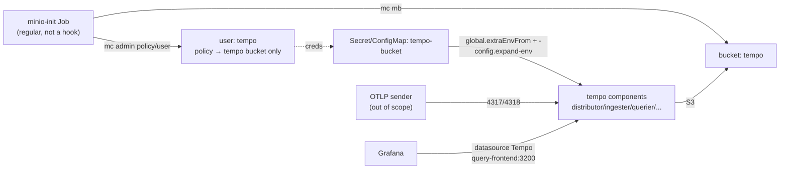

# 2026-06-02 — Tempo tracing in the MIF umbrella chart (MAF-19962)

Implementation snapshot for adding Grafana Tempo to the `moai-inference-framework`
umbrella chart, plus the related refactor that gives every MinIO storage consumer
a dedicated, bucket-scoped user. Captured at chart HEAD `5f2a130`.

## Goal

Bundle Tempo (distributed tracing) into the MIF observability stack the same way
Loki is bundled, so that a `tempo.enabled=true` install brings up Tempo, backs it
with the bundled MinIO, and exposes the collected traces through a Grafana
datasource. The chart's responsibility ends at **"Tempo installed + data viewable
in Grafana."** Generating spans is each component's own job (see Out of scope).

The chart already bundles Loki, Prometheus, and Grafana (L, P, G of LGTM); only
Tempo (T) was missing.

## Source of truth

| Item | Value |
| --- | --- |
| Authoritative repo | `moreh-dev/mif`, chart `deploy/helm/moai-inference-framework`, branch `main` (HEAD `5f2a130`) |
| Tempo reference deployment | valhalla cluster, provisioned by `moreh-dev/moreh-iac` PR #486 (`SNUSHC/valhalla/mif/tempo.tf`) |
| Integration precedent | the chart's existing Loki integration (`Chart.yaml` dep + `templates/loki/` + `templates/grafana/datasource-loki.yaml` + `values.yaml` loki/minio sections) |

The valhalla deployment backs Tempo with Ceph RGW (Rook OBC); the bundled chart
backs it with MinIO. Both expose the identical env-var contract
(`BUCKET_NAME`/`BUCKET_HOST`/`BUCKET_PORT`/`AWS_ACCESS_KEY_ID`/`AWS_SECRET_ACCESS_KEY`),
so the Tempo values are reused verbatim and only the backend differs.

## Decisions

### Chart flavor and source

- **`tempo-distributed`** (not single-binary `tempo`), default `replicas: 1` for each
  component. Matches the valhalla flavor; valhalla's production replica counts
  (distributor 2 / ingester 3 / querier 2 / query-frontend 2 / compactor 1 /
  memcached 2) are recorded as comments for operators.
- **Repository `https://grafana-community.github.io/helm-charts`, version `2.23.1`**
  (app Tempo `2.10.5`). Grafana's general-purpose Helm charts (including
  `tempo-distributed`, `tempo`, `grafana`, and `loki`) moved to the
  `grafana-community` org; the legacy `https://grafana.github.io/helm-charts` is
  maintenance-only and tops out at `tempo-distributed` 1.10.0. The
  `grafana-community` repo is therefore the current upstream. `deploy/helm/AGENTS.md`
  still names the legacy URL for Loki; migrating Loki/Grafana to `grafana-community`
  is left as a separate follow-up.

### Service naming (verified via `helm template`)

`tempo.fullname` resolves to `<release>-tempo` whenever the release name does not
contain the string `tempo`. Under the umbrella (release e.g. `mif`, dependency
alias `tempo`) the services are:

- OTLP receivers: `<release>-tempo-distributor` — `4317` (gRPC), `4318` (HTTP).
- Query: `<release>-tempo-query-frontend:3200` (HTTP), `:9095` (gRPC).

The Grafana datasource URL uses `{{ .Release.Name }}-tempo-query-frontend`. (In
valhalla the release is literally named `tempo`, so the service is
`tempo-distributor` with no prefix — this is why the cutover endpoint differs.)

### MinIO credentials — scoped user per consumer (refactor, includes Loki)

Two commits. The first refactors the shared MinIO provisioning; the second adds
Tempo on top of it.

Background: Loki originally used a dedicated `loki` MinIO user scoped by policy to
the `loki` bucket. PR #79 (`f41d68b`) removed that and switched Loki to the MinIO
**root** credentials. The reason was a deadlock, not a problem with scoped users:
the MinIO sub-chart provisions buckets, users, and policies through a single
`post-install` Helm hook (`charts/minio-*/templates/post-job.yaml`,
`helm.sh/hook: post-install,post-upgrade`). Under `--wait`, that hook only runs
after the release is Ready, but Loki cannot become Ready until its bucket and
credentials exist — a circular wait. PR #79 broke the **bucket** half by creating
it from a regular (non-hook) Job, and took the shortcut of using root credentials
to avoid having to re-implement user/policy creation outside the hook.

This work finishes that design instead of repeating the shortcut: the regular init
Job also creates a bucket-scoped **policy** and a dedicated **user** for each
consumer, using the same `mc admin` command forms the sub-chart itself uses
(`mc admin policy create`, `mc admin user add`, `mc admin policy attach`, each made
idempotent). The MinIO sub-chart's `users`/`policies` (the deadlocking hook) are
never set. Each consumer's credentials are read from its own
`<consumer>-bucket` Secret + ConfigMap (mounted into the Job), so secret values are
never baked into the Job manifest.

This is the security posture the user chose (least privilege, bucket isolation),
and it is applied symmetrically to Loki and Tempo.

**Upgrade note (existing installs).** On `helm upgrade` of a cluster where Loki
currently authenticates as the MinIO root user, the init Job creates the `loki`
user and its bucket-scoped policy idempotently, and Loki reconnects as `loki`.
Data written under the root user stays readable: the bucket name is unchanged
(`loki`) and the policy grants bucket-level `s3:*`, and MinIO authorizes by
bucket/prefix rather than per-object ownership. No data migration is required.

## Components

### Commit 1 — `refactor(deploy): provision scoped MinIO users via the init Job`

| File | Change |
| --- | --- |
| `templates/minio/init-job.yaml` | New location of the former `templates/loki/minio-init-job.yaml`. Generalized: for each enabled storage consumer (gated by `<consumer>.enabled`), wait for MinIO, create the bucket, create a bucket-scoped policy, create the dedicated user (idempotent), and attach the policy. Reads each consumer's bucket name + credentials from the mounted `<consumer>-bucket` Secret/ConfigMap. |
| `templates/loki/minio-init-job.yaml` | Deleted (moved). |
| `templates/loki/credentials.yaml` | `AWS_ACCESS_KEY_ID`/`AWS_SECRET_ACCESS_KEY` default to the dedicated `loki` user (`loki` / `loki123!`) instead of `minio.rootUser`/`rootPassword`. |
| `values.yaml` | `lokiBucket` comments updated: defaults describe the dedicated `loki` user provisioned by the init Job, not root. |
| `deploy/helm/AGENTS.md` | MinIO section corrected: scoped users/policies are provisioned by the regular init Job via `mc admin`, **not** the sub-chart's `users`/`policies` (whose hook deadlocks). |

The consumer list is built in the Job template from enablement flags
(`loki.enabled`, and `tempo.enabled` once it exists), so disabling a consumer
skips its bucket/user. `minio.buckets` is retained for sub-chart compatibility.

### Commit 2 — `MAF-19962: feat(deploy): add Tempo tracing to the MIF chart`

| File | Change |
| --- | --- |
| `Chart.yaml` | Add dependency `tempo-distributed` (alias `tempo`, version `2.23.1`, repo `https://grafana-community.github.io/helm-charts`, condition `tempo.enabled`). |
| `Chart.lock`, `charts/tempo-distributed-2.23.1.tgz` | Regenerated by `make helm-dependency`. |
| `values.yaml` | New `tempo:` section; new `tempoBucket:` section; `minio.buckets` gains `- name: tempo`. |
| `templates/tempo/credentials.yaml` | `tempo-bucket` ConfigMap (`BUCKET_*`) + Secret (`AWS_*`), scoped `tempo` user defaults (`tempo` / `tempo123!`). Mirrors `templates/loki/credentials.yaml`. |
| `templates/grafana/datasource-tempo.yaml` | Tempo datasource ConfigMap (`grafana_datasource: "1"`, `uid: tempo`, url `<release>-tempo-query-frontend:3200`). Mirrors `datasource-loki.yaml`. Minimal config (no `serviceMap`, no streaming). |
| `README.md` | Regenerated by `make helm-docs`. |
| `docs/specs/2026-06-02-mif-helm-tempo.md` | This document. |

`tempo:` values (defaults are lightweight + cluster-portable):

- `traces.otlp.grpc.enabled: true`, `traces.otlp.http.enabled: true` (opens 4317/4318).
- `storage.trace.backend: s3` with `${BUCKET_*}`/`${AWS_*}` placeholders;
  `insecure: true`, `forcepathstyle: true`.
- `global.extraArgs: [-config.expand-env=true]` and `global.extraEnvFrom` referencing
  the `tempo-bucket` Secret + ConfigMap (verified to propagate to all six workloads).
- `compactor.config.compaction.block_retention: 2160h` (90 days, matches Loki).
- `replicas: 1` per component, paired with `ingester.config.replication_factor: 1`.
  The chart default is 3; with a single ingester the distributor rejects writes
  ("N live replicas required"), so the replication factor must track
  `ingester.replicas` (valhalla runs 3 / 3). `reportingEnabled: false`;
  `metaMonitoring.serviceMonitor.enabled: false`.
- **Not** set in chart defaults (valhalla-specific, recorded only as comments):
  `storageClass: ceph-block`, `tolerations: amd.com/gpu`, `dnsService: coredns`,
  and `ingester.persistence` (left disabled, matching the bundled Loki write/backend).

## Data flow

## Verification

1. `make helm-dependency` — regenerate `Chart.lock` and vendored `.tgz`.
2. `make helm-lint` — chart validity.
3. `helm template` with `tempo.enabled=true` — confirm the Tempo workloads, the
   `tempo-bucket` Secret/ConfigMap, the datasource ConfigMap, and the init Job's
   `mc admin` steps render.
4. `make helm-docs` — `README.md` regenerated with no unexpected diff.
5. kind cluster e2e — install the chart, confirm: the init Job creates the
   `loki`/`tempo` buckets + scoped users; Tempo components reach Ready (no new
   deadlock); the Grafana sidecar provisions the Tempo datasource. Since span
   senders are out of scope, push a synthetic OTLP span to
   `<release>-tempo-distributor:4318/v1/traces` and read it back through
   `<release>-tempo-query-frontend:3200` and the Grafana datasource.

## Out of scope (follow-ups)

- Span emission from InferenceService (vLLM), Heimdall (aigateway), and the Gateway
  (istio) — each component owns its own OTLP export.
- moreh-iac cutover: removing the standalone valhalla `tempo` release and pointing
  Heimdall's injected `OTEL_EXPORTER_OTLP_TRACES_ENDPOINT` at the bundled
  `<release>-tempo-distributor:4317` (the bundled service name is release-prefixed,
  unlike valhalla's `tempo-distributor`).
- Migrating Loki/Grafana dependencies from the legacy `grafana.github.io` repo to
  `grafana-community.github.io`, and updating `deploy/helm/AGENTS.md` accordingly.
- Tempo metrics-generator / service graph (requires the generator; datasource
  `serviceMap` omitted until then).
- Website/user documentation for the tracing stack.
