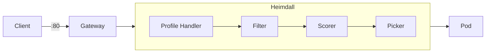

# Heimdall Scheduler — Expert Guide

## Identity and Scope

Heimdall is the request-routing and scheduling component of the MoAI Inference Framework (MIF). It implements the Kubernetes [Gateway API Inference Extension](https://gateway-api-inference-extension.sigs.k8s.io/) Endpoint Picker Protocol (EPP), deciding which inference pod each incoming request should be sent to.

Heimdall is Moreh's implementation of the EPP within the broader Kubernetes inference ecosystem. The Gateway API Inference Extension defines standard CRDs (`InferencePool`, `EndpointPickerConfig`) that decouple scheduling logic from the gateway controller (Istio, Kgateway, etc.). The open-source [llm-d](https://github.com/llm-d/llm-d) project provides a reference EPP implementation; Heimdall is a production-grade alternative that extends the standard with MIF-specific features such as the `pd-profile-handler` for prefill-decode disaggregation, `lora-affinity-scorer`, and deep integration with Odin's InferenceService operator. While the core plugin types (filters, scorers, pickers) follow the Gateway API Inference Extension specification, Heimdall's plugin set and configuration options are a superset of what the upstream standard defines.

**This skill covers:**
- Heimdall plugin selection and configuration
- `heimdall-values.yaml` authoring
- EndpointPickerConfig and InferencePool resources
- Deployment via Helm
- Integration with Odin InferenceService
- Monitoring and troubleshooting

**Out of scope:** Odin operator internals, vLLM engine tuning, Gateway controller setup (Istio/Kgateway), cluster-level infrastructure.

**Key codebase paths:**
- `website/docs/reference/heimdall/` — API reference and plugin docs
- `website/docs/getting-started/quickstart.mdx` — end-to-end deployment example
- `test/e2e/*/config/heimdall-values.yaml.tmpl` — real-world config templates
- `test/utils/heimdall.go` — Helm install/uninstall test utilities

---

## Architecture Overview

### Request flow



The detailed control flow:

1. **Gateway** receives the client request and forwards it to Heimdall.
2. **Profile handler** plugin selects which scheduling profile(s) to invoke.
3. **Filter** plugins narrow down the candidate pods.
4. **Scorer** plugins assign a numeric score to each remaining candidate.
5. **Picker** plugin selects the final target pod based on scores.
6. **Pre-request** plugins (if any) transform the request before delivery.
7. **Gateway** forwards the request to the chosen pod.
8. **Post-response** plugins (if any) enrich the response before returning to the client.

### Plugin categories

| Category | Role | Activation |
| --- | --- | --- |
| Profile handler | Selects scheduling profile(s) per request | Auto-invoked; exactly one must be instantiated |
| Pre-request | Transforms request before pod delivery | Auto-invoked once instantiated |
| Post-response | Transforms response before client delivery | Auto-invoked once instantiated |
| Filter | Restricts candidate pod set | Active only when included in a scheduling profile |
| Scorer | Assigns score to each candidate pod | Active only when included in a scheduling profile |
| Picker | Selects final target from scored candidates | Active only when included in a scheduling profile |

---

## Configuration Structure

A `heimdall-values.yaml` has four core sections and several optional sections:

```yaml
# Core sections
global:           # Image pull secrets
config:           # EndpointPickerConfig (plugins + scheduling profiles)
gateway:          # Gateway resource reference
inferencePool:    # Target ports for inference pods

# Optional sections
serviceMonitor:   # Prometheus ServiceMonitor (enabled by default)
poolPodMonitor:   # PodMonitor for model serving pods (enabled by default)
tracing:          # OpenTelemetry tracing (disabled by default)
udsTokenizer:     # UDS tokenizer sidecar (disabled by default)
replicas:         # Number of Heimdall pods (default: 1)
extraVolumes:     # Additional volumes (e.g., model PVC for tokenizer access)
extraVolumeMounts: # Mount points for extra volumes
extraArgs:        # Additional CLI arguments for the Heimdall container
extraManifests:   # Arbitrary additional Kubernetes manifests
```

### API versions

Heimdall uses two Kubernetes API groups from the Gateway API Inference Extension ecosystem:

| Resource | API Group | Version | Status |
| --- | --- | --- | --- |
| `InferencePool` | `inference.networking.k8s.io` | `v1` | Graduated (stable) |
| `EndpointPickerConfig` | `inference.networking.x-k8s.io` | `v1alpha1` | Extension (experimental) |

Note the different API groups: `k8s.io` (graduated) vs. `x-k8s.io` (extension). This distinction matters when installing CRDs and configuring RBAC.

### `config` section

The `config` section is the core of Heimdall configuration. It maps directly to an `EndpointPickerConfig` resource.

```yaml
config:
  apiVersion: inference.networking.x-k8s.io/v1alpha1
  kind: EndpointPickerConfig
  plugins:              # Plugin instantiation list
    - type: <pluginType>
      name: <instanceName>        # optional, defaults to type
      parameters:                 # optional, plugin-specific
        <key>: <value>
  schedulingProfiles:   # Scheduling profile definitions
    - name: <profileName>
      plugins:
        - pluginRef: <instanceName>
          weight: <int>           # optional, scorer weight (default: 1)
  saturationDetector:   # optional
    queueDepthThreshold: <int>
    kvCacheUtilThreshold: <float>  # 0.0-1.0
    metricsStalenessThreshold: <duration>
  data:                 # optional, DataLayer for precise-prefix-cache-scorer
    sources:
      - pluginRef: <instanceName>
        extractors:
          - pluginRef: <instanceName>
```

### `gateway` section

```yaml
gateway:
  name: <gatewayResourceName>       # must match the Gateway resource name
  namespace: <namespace>            # optional, defaults to release namespace
  gatewayClassName: <istio|kgateway> # default: kgateway
  labels:                            # optional
    istio.io/rev: <revision>         # only if using Istio revision
  bbrHeader: "X-Gateway-Model-Name" # body-based routing header (default)
  bbrModel: ""                       # model name to match; enables BBR when non-empty
```

> **Note:** The chart default for `gatewayClassName` is `kgateway`. The MIF quickstart overrides this to `istio`. Always set this to match your installed gateway controller.

Body-based routing (`bbrHeader` + `bbrModel`): When `bbrModel` is set, the HTTPRoute is configured to match requests whose body (extracted via the header specified by `bbrHeader`) contains the given model name. This enables model-level routing through a single Gateway.

### `inferencePool` section

```yaml
inferencePool:
  matchLabels: {}     # custom pod selector; defaults to mif.moreh.io/pool: <poolName>
  targetPorts:
    - number: 8000    # vLLM default serving port
```

> **Note:** If `matchLabels` is empty (default), the InferencePool selector defaults to `mif.moreh.io/pool: <inferencePoolName>`. Override this only if your pods use a different label scheme.

### `serviceMonitor` section (enabled by default)

```yaml
serviceMonitor:
  enabled: true           # default: true
  interval: 15s           # scrape interval
  labels:
    release: mif          # must match Prometheus operator's serviceMonitorSelector
```

### `poolPodMonitor` section (enabled by default)

Monitors model serving pods (vLLM/SGLang) matching the InferencePool selector. Automatically relabels vLLM metrics with `llm_` prefix and extracts `role`, `pool`, `inference_service` labels.

```yaml
poolPodMonitor:
  enabled: true           # default: true
  interval: 15s           # scrape interval
```

### Other optional sections

```yaml
extraVolumes:       # additional volumes (e.g., model PVC for tokenizer access)
extraVolumeMounts:  # mount points for extra volumes
extraArgs:          # additional CLI arguments appended to container args
extraManifests:     # arbitrary Kubernetes manifests deployed alongside
tracing:            # OpenTelemetry configuration
  enabled: false
  samplerType: parentbased_traceidratio
  samplerArgument: "0.1"
udsTokenizer:       # UDS tokenizer sidecar for precise-prefix-cache-scorer
  enabled: false
```

---

## Plugin Selection Guide

Use this decision tree to choose the right plugins for your deployment.

### Step 1: Choose a profile handler

| Deployment type | Profile handler | Profiles created |
| --- | --- | --- |
| **Aggregate** — all pods serve both prefill and decode | `single-profile-handler` | `default` |
| **PD-disaggregated** — separate prefill and decode pod pools | `pd-profile-handler` | `prefill`, `decode` |

- If using `pd-profile-handler`, you **must** also instantiate `prefill-filter` and `decode-filter`.
- Pods must be labeled with `mif.moreh.io/role: prefill`, `decode`, or `both`.

### Step 2: Choose scorer(s)

Start simple. Add complexity only when metrics justify it.

| Scorer | Use when | Requires | Complexity |
| --- | --- | --- | --- |
| `queue-scorer` | Default choice — route to pod with shortest queue | Nothing extra | Low |
| `load-aware-scorer` | Threshold-based scoring — empty queue gets high score, full queue gets zero | `threshold` parameter | Low |
| `kv-cache-utilization-scorer` | KV cache pressure varies across pods | vLLM metrics endpoint | Medium |
| `active-request-scorer` | Need time-windowed active request tracking | `requestTimeout` parameter | Medium |
| `running-requests-size-scorer` | Score by currently running (not queued) requests | Nothing extra | Low |
| `prefix-cache-scorer` | Prefix locality matters (shared prompts/system prompts) | `--enable-prefix-caching` in vLLM | Medium |
| `precise-prefix-cache-scorer` | Production prefix-aware routing with indexer backend | Redis/Valkey + tokenizer + ZMQ | High |
| `session-affinity-scorer` | Multi-turn conversations should stick to same pod | Client sends `x-session-token` header | Low |
| `lora-affinity-scorer` | LoRA adapter routing — prefer pods with adapter loaded | LoRA-enabled vLLM | Medium |
| `no-hit-lru-scorer` | Distribute cold (cache-miss) requests for even cache growth | Pair with `prefix-cache-scorer` | Medium |

**Combining multiple scorers:** When using multiple scorers in one profile, set `weight` on each to control relative influence. Higher weight = more impact on final score.

### Step 3: Choose a picker

| Picker | Behavior | Best for |
| --- | --- | --- |
| `max-score-picker` | Always picks highest-scored pod (deterministic) | Predictable routing; debugging |
| `weighted-random-picker` | Score-proportional random selection | Load distribution with score influence |
| `random-picker` | Uniform random, ignores scores | Pure round-robin-like distribution |

**Recommendation:** Start with `max-score-picker`. Switch to `weighted-random-picker` if you need stochastic load balancing.

### Step 4: Add filters (if needed)

| Filter | Purpose |
| --- | --- |
| `prefill-filter` | Required with `pd-profile-handler` — keeps `mif.moreh.io/role: prefill` pods |
| `decode-filter` | Required with `pd-profile-handler` — keeps `role: decode`, `both`, or unlabeled |
| `by-label` | Custom filtering by any label key/values |
| `by-label-selector` | Custom filtering by `matchLabels` map |

### Step 5: Add response plugins (optional)

| Plugin | Purpose |
| --- | --- |
| `response-header-handler` | Adds `x-decoder-host-port` and `x-prefiller-host-port` headers to response |

---

## Configuration Patterns

> **Note:** The Helm chart's default values.yaml ships with Pattern 3 (PD-disaggregated + KV cache awareness). Pattern 1 is the quickstart override for simplicity. Choose the pattern that matches your deployment topology.

### Pattern 1: Basic aggregate (quickstart) [verified]

The simplest configuration. All pods are equal; route to the one with the shortest queue.

```yaml
config:
  apiVersion: inference.networking.x-k8s.io/v1alpha1
  kind: EndpointPickerConfig
  plugins:
    - type: single-profile-handler
    - type: queue-scorer
    - type: max-score-picker
  schedulingProfiles:
    - name: default
      plugins:
        - pluginRef: queue-scorer
        - pluginRef: max-score-picker
```

**When to use:** Getting started, small deployments, homogeneous pods.

### Pattern 2: PD-disaggregated [verified]

Separate prefill and decode pods for higher throughput. Each phase has its own scheduling profile.

```yaml
config:
  apiVersion: inference.networking.x-k8s.io/v1alpha1
  kind: EndpointPickerConfig
  plugins:
    - type: pd-profile-handler
    - type: prefill-filter
    - type: decode-filter
    - type: queue-scorer
    - type: max-score-picker
  schedulingProfiles:
    - name: prefill
      plugins:
        - pluginRef: prefill-filter
        - pluginRef: queue-scorer
        - pluginRef: max-score-picker
    - name: decode
      plugins:
        - pluginRef: decode-filter
        - pluginRef: queue-scorer
        - pluginRef: max-score-picker
```

**When to use:** Large-scale deployments where prefill and decode have distinct resource profiles.

### Pattern 3: Production PD with KV cache awareness [verified]

Adds `kv-cache-utilization-scorer` to avoid routing to pods with high KV cache pressure.

```yaml
config:
  apiVersion: inference.networking.x-k8s.io/v1alpha1
  kind: EndpointPickerConfig
  plugins:
    - type: pd-profile-handler
    - type: prefill-filter
    - type: decode-filter
    - type: queue-scorer
    - type: kv-cache-utilization-scorer
    - type: max-score-picker
  schedulingProfiles:
    - name: prefill
      plugins:
        - pluginRef: prefill-filter
        - pluginRef: queue-scorer
          weight: 1
        - pluginRef: kv-cache-utilization-scorer
          weight: 1
        - pluginRef: max-score-picker
    - name: decode
      plugins:
        - pluginRef: decode-filter
        - pluginRef: queue-scorer
          weight: 1
        - pluginRef: kv-cache-utilization-scorer
          weight: 1
        - pluginRef: max-score-picker
```

**When to use:** Production environments with varying workloads where KV cache utilization differs across pods. The plugin and scoring profile setup above is the **Helm chart default configuration** — tune scorer weights to shift priority between queue depth and KV cache pressure.

**Optional: saturation detection.** Add a `saturationDetector` block to reject requests to overloaded pods (not included in chart defaults):

```yaml
  saturationDetector:
    queueDepthThreshold: 128
    kvCacheUtilThreshold: 0.9
    metricsStalenessThreshold: 30s
```

### Pattern 4: Prefix-cache-aware with session affinity [unverified]

Combines prefix locality with session stickiness for multi-turn conversational workloads. This pattern is constructed from plugin specs and has not been validated in production. Weight values are illustrative and should be tuned for your workload.

```yaml
config:
  apiVersion: inference.networking.x-k8s.io/v1alpha1
  kind: EndpointPickerConfig
  plugins:
    - type: single-profile-handler
    - type: queue-scorer
    - type: prefix-cache-scorer
    - type: session-affinity-scorer
    - type: max-score-picker
  schedulingProfiles:
    - name: default
      plugins:
        - pluginRef: queue-scorer
          weight: 1
        - pluginRef: prefix-cache-scorer
          weight: 3
        - pluginRef: session-affinity-scorer
          weight: 5
        - pluginRef: max-score-picker
```

**When to use:** Chatbot / multi-turn applications where vLLM has `--enable-prefix-caching` and clients manage `x-session-token` headers. Weights prioritize session affinity > prefix locality > queue depth.

### Pattern 5: LoRA affinity routing [unverified]

Routes requests to pods that already have the required LoRA adapter loaded, reducing adapter swap overhead. This pattern is constructed from plugin specs and has not been validated in production. Weight values are illustrative and should be tuned for your workload.

```yaml
config:
  apiVersion: inference.networking.x-k8s.io/v1alpha1
  kind: EndpointPickerConfig
  plugins:
    - type: single-profile-handler
    - type: queue-scorer
    - type: lora-affinity-scorer
    - type: max-score-picker
  schedulingProfiles:
    - name: default
      plugins:
        - pluginRef: queue-scorer
          weight: 1
        - pluginRef: lora-affinity-scorer
          weight: 3
        - pluginRef: max-score-picker
```

**When to use:** Multi-LoRA serving where pods load different adapters and routing to a pod with the adapter already loaded reduces swap latency. Requires LoRA-enabled vLLM.

See [references/config-recipes.md](references/config-recipes.md) for complete `heimdall-values.yaml` reference examples.

---

## Deployment

### Prerequisites

- Helm repository added:
  ```shell
  helm repo add moreh https://moreh-dev.github.io/helm-charts
  helm repo update moreh
  ```
- Gateway API CRDs + Inference Extension CRDs installed on the cluster
- A Gateway controller (Istio or Kgateway) deployed
- Target namespace created and labeled:
  ```shell
  kubectl create namespace <namespace>
  kubectl label namespace <namespace> mif=enabled
  ```
- `moreh-registry` image pull secret available in the namespace

### Install

```shell
helm upgrade -i heimdall moreh/heimdall \
    --version <version> \
    -n <namespace> \
    -f heimdall-values.yaml
```

### Verify

```shell
kubectl get all -n <namespace> -l app.kubernetes.io/instance=heimdall
```

Expected resources:
- Pod: `heimdall-*` (1/1 Running)
- Service: `heimdall` with ports 9002/TCP (gRPC), 9090/TCP (metrics), 5557/TCP (ZMQ)
- Deployment: `heimdall`
- ReplicaSet: `heimdall-*`

Additional resources created (not shown by `get all`):
- ConfigMap: stores the rendered EndpointPickerConfig
- InferencePool: pod selector for routing targets
- HTTPRoute: binds Heimdall to the Gateway
- ClusterRole + ClusterRoleBinding: RBAC for InferencePool/Pod access
- ServiceMonitor (if enabled): Prometheus scrape target
- PodMonitor (if enabled): monitors model serving pods
- DestinationRule (Istio only): traffic policy

Container ports (internal):
- 9002: gRPC (Endpoint Picker Protocol)
- 9003: gRPC health check
- 9090: Prometheus metrics
- 5557: ZMQ (KV events for precise-prefix-cache-scorer)

### Uninstall

```shell
helm uninstall heimdall -n <namespace>
```

---

## Integration with Odin InferenceService

### Linking InferenceService to Heimdall

The `inferencePoolRefs` field in an InferenceService registers its pods with Heimdall's InferencePool:

```yaml
apiVersion: odin.moreh.io/v1alpha1
kind: InferenceService
metadata:
  name: <serviceName>
spec:
  replicas: <count>
  inferencePoolRefs:
    - name: heimdall    # must match Heimdall's InferencePool name
  templateRefs:
    - name: vllm        # runtime base
    - name: <preset>    # model-specific template
  parallelism:
    tensor: <tp>
```

> **Note:** `inferencePoolRefs` currently supports a maximum of 1 entry (enforced by Odin's CRD validation). Each InferenceService can register with exactly one InferencePool.

### Pod label conventions

Heimdall and MIF use these labels for routing and observability:

| Label | Purpose | Example values |
| --- | --- | --- |
| `mif.moreh.io/pool` | Pool membership | `heimdall` |
| `mif.moreh.io/role` | PD role assignment | `prefill`, `decode`, `both` |
| `app.kubernetes.io/name` | Application name | `vllm` |
| `app.kubernetes.io/instance` | InferenceService name | `llama-3-2-1b` |

---

## Monitoring

### ServiceMonitor

ServiceMonitor is **enabled by default** (`serviceMonitor.enabled: true`). The default label is `release: mif`. If your Prometheus operator uses a different `serviceMonitorSelector`, override the label:

```yaml
serviceMonitor:
  labels:
    release: <prometheus-stack-release-name>
```

### PodMonitor for model serving pods

Also enabled by default (`poolPodMonitor.enabled: true`). This monitors vLLM/SGLang pods matching the InferencePool selector and auto-relabels their metrics with `llm_` prefix.

### Grafana dashboard metrics

The MIF Grafana dashboard includes these Heimdall-specific panels:

- **Ready Pods** — per namespace/pool
- **Inference RPS** — requests per second through Heimdall
- **Heimdall E2E Latency** — P50/P75/P95 scheduling latency
- **KVCache Hit/Req Ratio** — prefix cache efficiency
- **Queue Depth** — per-pod queue sizes

---

## Troubleshooting

### Heimdall pod not starting

1. **Image pull failure:** Verify `moreh-registry` secret exists in the namespace.
   ```shell
   kubectl get secret moreh-registry -n <namespace>
   ```
2. **CRD missing:** Ensure Gateway API and Inference Extension CRDs are installed.
   ```shell
   kubectl get crd inferencepools.inference.networking.k8s.io
   ```
3. **Version mismatch:** Check chart version compatibility with cluster Kubernetes version.

### Requests not being routed

1. **InferencePool selector mismatch:** Verify pod labels match the InferencePool's `spec.selector.matchLabels`.
   ```shell
   kubectl get inferencepool -n <namespace> -o yaml
   kubectl get pods -n <namespace> --show-labels
   ```
2. **Gateway name mismatch:** The `gateway.name` in values must match the actual Gateway resource name.
3. **Gateway class mismatch:** Ensure `gateway.gatewayClassName` matches the installed gateway controller (`istio` or `kgateway`).

### Latency spikes

1. **Check saturation:** If `saturationDetector` is configured, verify thresholds are not too aggressive.
2. **Scorer weights:** Review relative weights — an overly dominant scorer may cause suboptimal routing.
3. **KV cache pressure:** Check per-pod KV cache utilization in Grafana; add `kv-cache-utilization-scorer` if not present.

### PD-disaggregation pods not being selected

1. **Missing role labels:** Ensure pods have `mif.moreh.io/role` set to `prefill`, `decode`, or `both`.
2. **Wrong profile handler:** Verify `pd-profile-handler` (not `single-profile-handler`) is instantiated.
3. **Filters not in profile:** Both `prefill-filter` and `decode-filter` must be in their respective scheduling profiles.

---

## Best Practices

1. **Start simple.** Begin with `queue-scorer` + `max-score-picker`. Add scorers only when metrics show a need.
2. **One profile handler.** Exactly one profile handler must be instantiated. Using both `single-profile-handler` and `pd-profile-handler` is invalid.
3. **PD filters are mandatory.** When using `pd-profile-handler`, always pair with `prefill-filter` (in the prefill profile) and `decode-filter` (in the decode profile).
4. **Set scorer weights explicitly** when combining multiple scorers. Default weight of 1 for all scorers may not reflect your routing priorities.
5. **Enable ServiceMonitor** in all non-development deployments for observability.
6. **Use `saturationDetector`** in production to reject requests to overloaded pods rather than queueing indefinitely.
7. **Prefer `prefix-cache-scorer` over `precise-prefix-cache-scorer`** unless you have a Redis/Valkey infrastructure and need block-level precision. The simpler scorer covers most prefix-caching use cases.
8. **Mount model volumes** via `extraVolumes`/`extraVolumeMounts` when Heimdall's precise-prefix-cache-scorer needs local tokenizer access.
