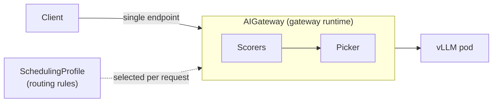

# Heimdall — Expert Guide

## Identity and Scope

Heimdall is the request-routing subsystem of the MoAI Inference Framework (MIF). It has two parts:

- **Heimdall operator** — reconciles an `AIGateway` resource into a gateway `Deployment` and `Service`, and injects the gateway sidecar into the inference pods bound to that gateway.
- **Gateway runtime** — the request entrypoint. It receives every request through a single endpoint and routes each one to an inference pod according to the selected `SchedulingProfile`.

Heimdall works with three custom resources in the `heimdall.moreh.io/v1alpha1` group:

| Resource | Scope | Who writes it | Purpose |
| --- | --- | --- | --- |
| `AIGateway` | namespaced | operator user | one gateway deployment; binds request models to scheduling profiles |
| `SchedulingProfile` | cluster-scoped | operator user | routing rules: the scorers and picker that select the destination pod |
| `InferenceWorker` | namespaced | the gateway sidecar (not authored by hand) | advertises one inference pod (address, framework, role, models) to the gateway |

**This skill covers:** authoring `SchedulingProfile` and `AIGateway`, choosing scheduling plugins, e2e vs pd routing, binding InferenceServices to a gateway, deploying the Heimdall operator, and troubleshooting routing.

**Out of scope:** Odin operator internals, vLLM engine tuning, cluster-level infrastructure.

**References — when to consult:**

For field-level CRD detail and the full plugin catalog beyond this guide, consult the reference docs. Prefer the local path when filesystem access is available; use the URL as a fallback.

| Topic | Local path | URL (fallback) |
| --- | --- | --- |
| CRD field reference (`AIGateway`, `SchedulingProfile`, `InferenceWorker`) | `website/docs/reference/heimdall/usage.mdx` | https://test-docs.moreh.io/dev/reference/heimdall/usage/ |
| Plugin catalog (scorers, pickers) | `website/docs/reference/heimdall/plugins.mdx` | https://test-docs.moreh.io/dev/reference/heimdall/plugins/ |
| End-to-end quickstart | `website/docs/getting-started/quickstart.mdx` | https://test-docs.moreh.io/dev/getting-started/quickstart/ |
| Operator install (prerequisites) | `website/docs/getting-started/prerequisites.mdx` | https://test-docs.moreh.io/dev/getting-started/prerequisites/ |

---

## Architecture Overview

### Request flow



1. The **gateway** (run from an `AIGateway`) receives the request.
2. The `AIGateway` binds the request's model to a `SchedulingProfile` (the reserved model `default` is the fallback).
3. The profile's **scorers** each assign a score to every candidate pod; the **picker** selects the destination.
4. In `pd` mode the profile first splits into `prefill` and `decode` sub-profiles (an internal `role-filter` keeps the pods of the matching role).
5. The gateway forwards the request to the chosen pod.

### How pods join a gateway (sidecar injection)

An inference pod joins a gateway through the `mif.moreh.io/aigateway` label, whose value is the target `AIGateway` name:

1. You set `mif.moreh.io/aigateway: <name>` on the `InferenceService`.
2. Odin propagates the label to the vLLM pods.
3. The Heimdall operator's mutating webhook injects the gateway sidecar into the labeled pods.
4. The sidecar registers each pod as an `InferenceWorker`, and the gateway discovers the workers that carry its name.

### Plugin categories

| Category | Role | Activation |
| --- | --- | --- |
| Scorer | Assigns a score to each candidate pod | Active only when referenced from a profile's `pluginRefs` |
| Picker | Selects the final pod from the scored candidates | Active only when referenced from a profile's `pluginRefs` |
| Filter (`role-filter`) | Restricts candidates by prefill/decode role | Injected automatically in `pd` mode; not user-declared |

---

## Configuration

Heimdall is configured by authoring two custom resources — `AIGateway` and `SchedulingProfile` (the third, `InferenceWorker`, is created automatically by the gateway sidecar). There is no `heimdall-values.yaml` plugin config.

### SchedulingProfile (cluster-scoped)

```yaml
apiVersion: heimdall.moreh.io/v1alpha1
kind: SchedulingProfile
metadata:
  name: <profileName>
spec:
  profileHandler: e2e            # "e2e" (one profile) or "pd" (prefill + decode)
  plugins:                       # declare the available scorer/picker plugins
    - type: <pluginType>         # e.g. inflight-requests-scorer, max-score-picker
      name: <alias>              # optional; defaults to the type
      config:                    # optional; only some plugins take config
        <key>: <value>
  profiles:                      # e2e -> { default: ... }; pd -> { prefill:, decode: }
    default:
      pluginRefs:                # each entry references a plugin by its effective name
        - name: <pluginName>     # = spec.plugins[].name (its alias, or the type if unset)
          weight: <number>       # optional scorer weight (default 1)
```

- `spec.plugins` declares the available plugins; `spec.profiles.<name>.pluginRefs` lists which of them run (and each scorer's `weight`) for that profile.
- **Role filtering for prefill/decode is applied internally** in `pd` mode and is not configured here.

### AIGateway (namespaced)

```yaml
apiVersion: heimdall.moreh.io/v1alpha1
kind: AIGateway
metadata:
  name: <gatewayName>
spec:
  replicas: 1
  schedulingProfiles:            # bind request models to SchedulingProfile names
    - model: default             # reserved: gateway-wide fallback
      profile: <profileName>
    # - { model: <modelName>, profile: <otherProfile> }   # per-model override
  # image: { tag: <pin> }        # optional; the operator fills the tag by default
  # extraEnvVars / extraVolumes / extraVolumeMounts: ...   # e.g. mount a model PVC
```

- The operator reconciles the `AIGateway` into a gateway `Deployment` and `Service`. The gateway pod is labeled `app.kubernetes.io/name=aigateway`, `app.kubernetes.io/instance=<gatewayName>`.
- `schedulingProfiles` is evaluated in list order; `default` is the lowest-priority fallback regardless of position.
- The gateway image tag is filled by the operator (`aigateway.defaultTag` chart value); set `spec.image.tag` only to pin a version.

### InferenceWorker (auto-created)

You do not author `InferenceWorker`. The gateway sidecar creates and maintains one per inference pod, advertising its address, framework, serving role, and hosted models. See the reference for its fields.

---

## Plugin Selection Guide

The plugin catalog is generated from source — see `website/docs/reference/heimdall/plugins.mdx` for the authoritative list. This section is a selection guide.

### Step 1 — pick the mode (`profileHandler`)

| Mode | `profileHandler` | Profiles | Use when |
| --- | --- | --- | --- |
| End-to-end | `e2e` | `default` | All pods serve both prefill and decode |
| Prefill/decode disaggregated | `pd` | `prefill`, `decode` | Separate prefill and decode pods |

In `pd` mode, each pod must carry `mif.moreh.io/role` (`prefill` or `decode`) — the label lives on the `InferenceService` (set directly or supplied by its prefill/decode preset) and Odin propagates it to the pods; the internal `role-filter` then routes each sub-profile to the matching pods.

### Step 2 — choose scorer(s)

Start simple; add scorers only when metrics justify it. All scorers are declared under `spec.plugins` and referenced (with an optional `weight`) from a profile.

| Scorer | Route toward | Notes |
| --- | --- | --- |
| `inflight-requests-scorer` | pod with fewest in-flight requests | good default |
| `running-requests-scorer` | pod with fewest running requests | |
| `waiting-requests-scorer` | pod with the shortest wait queue | |
| `kv-utilization-scorer` | pod with lower KV utilization | |
| `kv-cache-utilization-scorer` | pod with lower KV cache occupancy | uses the worker's advertised cache capacity |
| `token-length-scorer` | pod suited to the prompt length | |
| `prefix-cache-scorer` | pod likely holding the prompt's prefix | **takes config** (below) |
| `constant-scorer` | (fixed score) | testing / tie-breaking |

`prefix-cache-scorer` config keys (set under the plugin's `config:`; unknown keys are rejected):

| Key | Meaning |
| --- | --- |
| `normalization` | `longestPrefix` (default) or `input` |
| `transform` | `linear` (default) or `logistic` |
| `k` | logistic steepness (default `14.0`; used when `transform: logistic`) |
| `x0` | logistic center (default `0.7`; used when `transform: logistic`) |

```yaml
plugins:
  - type: prefix-cache-scorer
    config:
      normalization: longestPrefix
      transform: logistic
      k: 14.0
      x0: 0.7
```

The scorer's block size must match the engine's KV block size, and this is handled automatically: each pod's `InferenceWorker` advertises `modelCard.kvCacheBlockSize` (read from the engine) and the scorer uses that value. You do not set it on the scorer — a `config.blockSize` key is deprecated and ignored (the gateway logs a warning and uses the InferenceWorker value).

**Combining scorers:** give each a `weight` in the profile's `pluginRefs`; a higher weight has more influence on the final score.

### Step 3 — choose a picker

| Picker | Behavior | Best for |
| --- | --- | --- |
| `max-score-picker` | always picks the highest score (deterministic) | predictable routing, debugging |
| `weighted-random-picker` | score-proportional random selection | stochastic load spreading |
| `random-picker` | uniform random, ignores scores | even distribution |

**Recommendation:** start with `max-score-picker`; switch to `weighted-random-picker` for stochastic balancing.

---

## Configuration Patterns

### Pattern 1 — end-to-end (aggregate)

All pods serve both roles; score by in-flight requests and pick the highest.

```yaml
apiVersion: heimdall.moreh.io/v1alpha1
kind: SchedulingProfile
metadata:
  name: e2e-basic
spec:
  profileHandler: e2e
  plugins:
    - type: inflight-requests-scorer
    - type: max-score-picker
  profiles:
    default:
      pluginRefs:
        - name: inflight-requests-scorer
          weight: 100
        - name: max-score-picker
```

### Pattern 2 — prefill/decode disaggregated

Separate prefill and decode pods. `role-filter` is applied internally per sub-profile; you only declare scorers/picker.

```yaml
apiVersion: heimdall.moreh.io/v1alpha1
kind: SchedulingProfile
metadata:
  name: pd-basic
spec:
  profileHandler: pd
  plugins:
    - type: inflight-requests-scorer
    - type: max-score-picker
  profiles:
    prefill:
      pluginRefs:
        - name: inflight-requests-scorer
          weight: 100
        - name: max-score-picker
    decode:
      pluginRefs:
        - name: inflight-requests-scorer
          weight: 100
        - name: max-score-picker
```

Bind either profile from an `AIGateway`:

```yaml
apiVersion: heimdall.moreh.io/v1alpha1
kind: AIGateway
metadata:
  name: mif
spec:
  replicas: 1
  schedulingProfiles:
    - model: default
      profile: pd-basic
```

More recipes (KV-cache-aware, prefix-cache) are in [references/config-recipes.md](references/config-recipes.md).

---

## Binding an InferenceService to a gateway

An `InferenceService` (Odin) joins a gateway through a single label:

```yaml
apiVersion: odin.moreh.io/v1alpha1
kind: InferenceService
metadata:
  name: <serviceName>
  labels:
    mif.moreh.io/aigateway: mif          # = AIGateway name
    # mif.moreh.io/role: prefill         # only in pd mode (prefill | decode)
spec:
  replicas: 2
  templateRefs:
    - name: vllm                         # runtime-base
    - name: <preset>                     # model-specific template
```

- `mif.moreh.io/aigateway` binds the pods to the AIGateway; routing and sidecar injection rely on it.
- In `pd` mode, the pod must also carry `mif.moreh.io/role` (`prefill` or `decode`) — set it on the `InferenceService` or let its prefill/decode preset supply it; the role filter uses this label to place the pod.

---

## Deployment

The gateway is **not** installed as its own chart — the Heimdall operator creates it from an `AIGateway`. Install the operator and its CRDs, then apply the resources.

### Prerequisites (once per cluster)

```shell
helm repo add moreh https://moreh-dev.github.io/helm-charts
helm repo update moreh
```

- **cert-manager** — required by the operator's admission webhooks.
- **CRDs** (packaged separately so their lifecycle is independent of the operators):
  ```shell
  helm upgrade -i heimdall-crd moreh/heimdall-crd --version <heimdall-crd-version> -n mif --create-namespace  # AIGateway
  helm upgrade -i heimdall-aigateway-crd moreh/heimdall-aigateway-crd --version <heimdall-aigateway-crd-version> -n mif  # SchedulingProfile, InferenceWorker
  ```
- **Heimdall operator** — reconciles `AIGateway` and injects the gateway sidecar. Install it after Odin's `InferenceService` CRD (it injects sidecars into Odin-managed pods):
  ```shell
  helm upgrade -i heimdall moreh/heimdall --version <heimdall-version> -n mif
  ```

Each chart is versioned independently — pin every `--version` to the matching entry in your release's chart list (see `website/docs/getting-started/prerequisites.mdx` for the full ordered install: cert-manager → moai-inference-framework → CRDs → Odin → Heimdall → presets).

### Deploy the routing resources

```shell
kubectl apply -f scheduling-profile.yaml          # cluster-scoped
kubectl apply -n <namespace> -f aigateway.yaml
```

### Verify the gateway is running

```shell
kubectl get pod -n <namespace> \
  -l app.kubernetes.io/name=aigateway,app.kubernetes.io/instance=<gatewayName>
```

Expect a `Running` gateway pod. The operator also creates the gateway `Service`.

---

## Troubleshooting

### Requests not routed to a pod

1. **Binding label:** the `InferenceService` (and therefore its pods) must carry `mif.moreh.io/aigateway: <gatewayName>`.
   ```shell
   kubectl get pods -n <namespace> -l mif.moreh.io/aigateway=<gatewayName>
   ```
2. **Sidecar not injected:** confirm the Heimdall operator is running and its webhook is healthy; the gateway sidecar must be present on the inference pods.
3. **No InferenceWorker:** the sidecar registers an `InferenceWorker` per pod — check they exist.
   ```shell
   kubectl get inferenceworker -n <namespace>
   ```

### Profile not applied

1. **Model binding:** the model in the request must resolve to a profile via `AIGateway.spec.schedulingProfiles` (or fall through to `default`).
2. **Name match:** `schedulingProfiles[].profile` must equal an existing `SchedulingProfile` name (cluster-scoped).

### pd routing sends nothing to prefill/decode

1. **Role labels:** confirm prefill pods carry `mif.moreh.io/role: prefill` and decode pods `mif.moreh.io/role: decode` (the label is set on the `InferenceService` — directly or via its preset — and propagated to pods by Odin).
2. **Mode:** the bound `SchedulingProfile` must use `profileHandler: pd` with both `prefill` and `decode` profiles.

### Gateway pod not starting

1. Check the AIGateway status and the Heimdall operator logs.
2. Ensure the `heimdall-crd` / `heimdall-aigateway-crd` CRDs are installed and cert-manager is healthy.

---

## Best Practices

1. **Start simple.** `inflight-requests-scorer` + `max-score-picker` in an `e2e` profile covers most cases; add scorers only when metrics show a need.
2. **Declare, then reference.** Every plugin in a profile's `pluginRefs` must be declared in `spec.plugins`.
3. **Set weights explicitly** when combining scorers — the relative weights encode your routing priority.
4. **Don't set `blockSize` on `prefix-cache-scorer`.** The block size that must match the engine is sourced automatically from the pod's `InferenceWorker` (`modelCard.kvCacheBlockSize`); a `config.blockSize` key is deprecated and ignored (the gateway warns and uses the InferenceWorker value). Tune the scorer via `transform`/`k`/`x0` instead.
5. **Use one binding label.** Route pods to a gateway only through `mif.moreh.io/aigateway`; add `mif.moreh.io/role` for pd.
6. **Let the operator manage the gateway image.** Pin `spec.image.tag` only when you must; otherwise the operator keeps it current.
