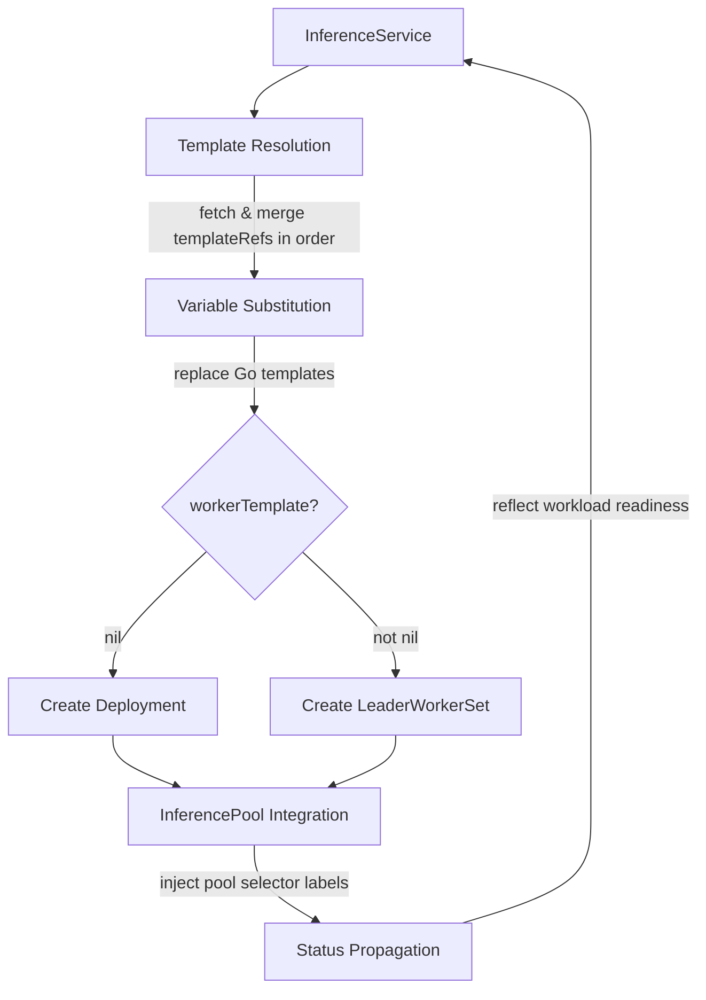
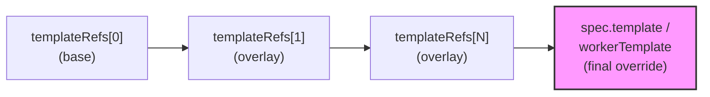

# Odin Inference Operator — Expert Guide

## Identity and Scope

Odin is the Kubernetes operator at the core of the MoAI Inference Framework (MIF). It manages the lifecycle of inference workloads by reconciling `InferenceService` custom resources into Kubernetes-native Deployments or LeaderWorkerSets, depending on the parallelism configuration.

Odin introduces a **template composition system** (`InferenceServiceTemplate`) that allows reusable configurations — runtime-bases and model-specific presets — to be layered and merged using Kubernetes strategic merge patch semantics. This enables a separation of concerns: platform teams maintain runtime-bases, model teams maintain presets, and end users compose them with minimal configuration.

**This skill covers:**
- InferenceService and InferenceServiceTemplate CRDs
- Template composition (templateRefs, merging, variable substitution)
- Parallelism configuration (tensor, pipeline, data, expert)
- Workload types (Deployment vs. LeaderWorkerSet)
- Runtime-bases and preset selection
- Odin Helm chart (operator) and inference-service chart
- Rollout strategies
- Heimdall integration (inferencePoolRefs)
- Monitoring and troubleshooting

**Out of scope:** Heimdall plugin configuration (see `guide-heimdall`), vLLM engine internals, Gateway controller setup, cluster-level infrastructure.

**Key codebase paths:**
- `website/docs/reference/odin/api-reference.mdx` — API field reference
- `website/docs/features/preset.mdx` — template composition guide
- `website/docs/getting-started/quickstart.mdx` — end-to-end deployment
- `deploy/helm/moai-inference-preset/templates/runtime-bases/` — runtime-base definitions
- `deploy/helm/moai-inference-preset/templates/presets/` — model-specific presets
- `test/e2e/*/config/inference-service.yaml.tmpl` — E2E test InferenceService patterns

---

## Architecture Overview

### Reconciliation flow



### CRDs

| CRD | API Group | Short Names | Purpose |
| --- | --- | --- | --- |
| `InferenceService` | `odin.moreh.io/v1alpha1` | `is`, `isvc` | User-facing resource for deploying inference workloads |
| `InferenceServiceTemplate` | `odin.moreh.io/v1alpha1` | `ist`, `isvctmpl` | Reusable template for composable configurations |

---

## InferenceService Spec

```yaml
apiVersion: odin.moreh.io/v1alpha1
kind: InferenceService
metadata:
  name: <name>
spec:
  replicas: <int>                    # default: 1
  inferencePoolRefs:                 # max 1 entry
    - name: <poolName>
  templateRefs:                      # merged in order, later overrides earlier
    - name: <templateName>
  rolloutStrategy:                   # optional
    type: <RollingUpdate|Recreate>
    rollingUpdate:
      maxUnavailable: <intOrString>
      maxSurge: <intOrString>
      partition: <int>               # LeaderWorkerSet only
  parallelism:                       # optional
    tensor: <int>                    # min: 1
    pipeline: <int>                  # min: 1; mutually exclusive with data
    data: <int>                      # min: 1; mutually exclusive with pipeline
    dataLocal: <int>                 # min: 1; must be set with data
    dataRPCPort: <int>               # 1-65535
    expert: <bool>                   # enable expert parallelism (MoE models)
  template: <PodTemplateSpec>        # for Deployment or LWS leader
  workerTemplate: <PodTemplateSpec>  # for LWS workers; triggers LWS mode
```

### Key validation rules (enforced by webhook)

1. **At least one of `template` or `workerTemplate`** must be provided (directly or via templateRefs).
2. **`workerTemplate` requires parallelism** — if `workerTemplate` is specified, `parallelism.data` or `parallelism.pipeline` must be set.
3. **Pipeline and data are mutually exclusive** — cannot set both `parallelism.pipeline` and `parallelism.data` simultaneously.
4. **`data` and `dataLocal` are paired** — the validating webhook requires both to be set or both omitted. In practice, the user can set only `data`: the **mutating webhook** automatically defaults `dataLocal` to `data` before validation runs.
5. **`inferencePoolRefs` max 1** — currently supports exactly one InferencePool reference.
6. **Template references must exist** — validated against local namespace, then system namespace (`mif`).
7. **Rollout constraints:**
   - LeaderWorkerSet: only `RollingUpdate` supported
   - Deployment: both `RollingUpdate` and `Recreate`
   - `partition` is only valid for LeaderWorkerSet

### Status

```shell
kubectl get inferenceservice -n <namespace>
```

| Column | Source | Description |
| --- | --- | --- |
| READY | `.status.conditions[?(@.type=='Ready')].status` | `True`, `False`, or `Unknown` |
| DESIRED | `.spec.replicas` | Desired replica count |
| UP-TO-DATE | `.status.updatedReplicas` | Replicas with current spec |
| AGE | `.metadata.creationTimestamp` | Time since creation |

Wait for readiness:
```shell
kubectl wait inferenceservice -n <namespace> <name> --for=condition=Ready --timeout=15m
```

---

## InferenceServiceTemplate and Template Composition

### Template spec

```yaml
apiVersion: odin.moreh.io/v1alpha1
kind: InferenceServiceTemplate
metadata:
  name: <name>
spec:
  parallelism: <ParallelismSpec>       # optional
  template: <PodTemplateSpec>          # optional
  workerTemplate: <PodTemplateSpec>    # optional
```

### Merging rules

Templates are merged using **Kubernetes strategic merge patch** in the order specified by `templateRefs`, with the InferenceService's own `spec` applied last (highest priority).



**Merge behavior:**
- Lists with strategic merge keys (e.g., containers by `name`, env vars by `name`) merge by key, not replace
- Scalar fields in later templates override earlier ones
- Unset fields in overlays do not erase base values

### Variable substitution

Templates support Go template syntax with [Sprig functions](http://masterminds.github.io/sprig/). Variables are resolved at reconciliation time.

Available variables:

| Variable | Type | Description |
| --- | --- | --- |
| `.Name` | string | InferenceService name |
| `.Namespace` | string | InferenceService namespace |
| `.Labels` | map | InferenceService labels |
| `.Spec.Parallelism.Tensor` | int | Tensor parallelism value |
| `.Spec.Parallelism.Pipeline` | int | Pipeline parallelism value |
| `.Spec.Parallelism.Data` | int | Data parallelism value |
| `.Spec.Parallelism.DataLocal` | int | Data local parallelism value |
| `.Spec.Parallelism.DataRPCPort` | int | Data RPC port value |
| `.Spec.Parallelism.Expert` | bool | Expert parallelism flag |

**Example:** A runtime-base uses `{{ .Spec.Parallelism.Tensor }}` in container args:
```yaml
args:
  - --tensor-parallel-size
  - "{{ .Spec.Parallelism.Tensor }}"
```
When the InferenceService sets `parallelism.tensor: 4`, this renders as `--tensor-parallel-size 4`.

### Template lookup order

1. **Local namespace** — where the InferenceService is created
2. **System namespace** — typically `mif`, where presets are installed by the `moai-inference-preset` chart

Templates in the local namespace take precedence. Templates in non-system namespaces are **only available within that namespace**.

### Deletion protection

InferenceServiceTemplates cannot be deleted if any InferenceService references them (enforced by validating webhook).

---

## Parallelism and Workload Types

The presence and configuration of parallelism determines the workload type and pod topology.

### Decision matrix

| `workerTemplate` | Parallelism | Workload type | Pod topology |
| --- | --- | --- | --- |
| Not set | None or tensor only | **Deployment** | `replicas` independent pods |
| Not set | N/A | **Deployment** | Simple pod replication |
| Set | `data` | **LeaderWorkerSet** | `replicas` groups, each with `data/dataLocal` workers |
| Set | `pipeline` | **LeaderWorkerSet** | `replicas` groups, each with `pipeline` workers |

### Tensor parallelism

Tensor parallelism shards the model across GPUs **within a single pod**. It does not affect the number of pods — instead, it determines how many GPU devices each pod requests.

```yaml
parallelism:
  tensor: 4    # Each pod uses 4 GPUs
```

Tensor parallelism is configured in the runtime-base via the `--tensor-parallel-size` vLLM argument (using template variable substitution).

### Data parallelism (LeaderWorkerSet)

Data parallelism distributes batches across multiple pods (workers). Odin creates a **LeaderWorkerSet** where:
- **Size** = `data / dataLocal` (number of worker pods per group)
- **Leader** uses `template` pod spec
- **Workers** use `workerTemplate` pod spec
- Startup policy: LeaderCreatedStartupPolicy (leader starts first)

```yaml
parallelism:
  data: 8          # Total data parallel size
  dataLocal: 4     # Local parallelism per worker
                   # → 8/4 = 2 workers per group
```

### Pipeline parallelism (LeaderWorkerSet)

Pipeline parallelism splits the model across pipeline stages, each on a separate pod.
- **Size** = `pipeline` (number of worker pods per group)

```yaml
parallelism:
  pipeline: 4    # 4 pipeline stages = 4 workers per group
```

### Expert parallelism

Enable for Mixture-of-Experts (MoE) models. Combines with data parallelism:

```yaml
parallelism:
  data: 16
  dataLocal: 8
  expert: true
```

### Mutual exclusivity

**Pipeline and data parallelism cannot be used simultaneously.** This is enforced by the validating webhook:
- Set `pipeline` for pipeline-parallel deployments
- Set `data` (+ `dataLocal`) for data-parallel deployments
- Never set both

---

## Runtime-Bases and Presets

### Available runtime-bases

Runtime-bases define the container startup logic, parallelism wiring, and pod structure. They are installed in the `mif` namespace by the `moai-inference-preset` Helm chart.

| Runtime-base | Workload type | `template` / `workerTemplate` | Use case |
| --- | --- | --- | --- |
| `vllm` | Deployment | `template` | Simple aggregate (no PD disaggregation) |
| `vllm-dp` | LeaderWorkerSet | `workerTemplate` | Data-parallel aggregate |
| `vllm-pp` | LeaderWorkerSet | `workerTemplate` | Pipeline-parallel aggregate |
| `vllm-decode` | Deployment | `template` | Decode-only (PD disaggregation) |
| `vllm-decode-dp` | LeaderWorkerSet | `workerTemplate` | Decode-only with data parallelism |
| `vllm-decode-pp` | LeaderWorkerSet | `workerTemplate` | Decode-only with pipeline parallelism |
| `vllm-prefill` | Deployment | `template` | Prefill-only (PD disaggregation) |
| `vllm-prefill-dp` | LeaderWorkerSet | `workerTemplate` | Prefill-only with data parallelism |
| `vllm-prefill-pp` | LeaderWorkerSet | `workerTemplate` | Prefill-only with pipeline parallelism |

> **Critical:** When using `*-dp` or `*-pp` runtime-bases, override with `spec.workerTemplate` (not `spec.template`), because the runtime-base defines the pod spec in `workerTemplate`.

### Listing available templates

```shell
# List runtime-bases
kubectl get inferenceservicetemplate -n mif -l mif.moreh.io/template.type=runtime-base

# List presets
kubectl get inferenceservicetemplate -n mif -l mif.moreh.io/template.type=preset
```

### Commonly overridden environment variables

| Variable | Purpose | Default |
| --- | --- | --- |
| `ISVC_MODEL_NAME` | HuggingFace model ID or name | (set by preset) |
| `ISVC_MODEL_PATH` | Local model path or HF ID | defaults to `$ISVC_MODEL_NAME` |
| `ISVC_EXTRA_ARGS` | Additional vLLM engine arguments | (set by preset) |
| `ISVC_PRE_PROCESS_SCRIPT` | Script to run before engine starts | (none) |
| `HF_TOKEN` | HuggingFace API token | (user must provide) |
| `HF_HOME` | HuggingFace cache directory | `/mnt/models` (for PV usage) |
| `HF_HUB_OFFLINE` | Disable HF Hub network access | `1` (for PV usage) |

---

## Configuration Patterns

### Pattern 1: Simple aggregate with preset [verified]

The simplest deployment. Uses a preset for model+hardware config, Deployment workload.

Source: `website/docs/getting-started/quickstart.mdx`

```yaml
apiVersion: odin.moreh.io/v1alpha1
kind: InferenceService
metadata:
  name: vllm-llama3-1b-instruct-tp2
spec:
  replicas: 2
  inferencePoolRefs:
    - name: heimdall
  templateRefs:
    - name: vllm
    - name: vllm-meta-llama-llama-3.2-1b-instruct-amd-mi250-tp2
  parallelism:
    tensor: 2
  template:
    spec:
      containers:
        - name: main
          env:
            - name: HF_TOKEN
              value: <huggingFaceToken>
```

### Pattern 2: Custom model with runtime-base only [verified]

No preset available. Manually specify model, resources, and scheduling.

Source: `website/docs/features/preset.mdx`

```yaml
apiVersion: odin.moreh.io/v1alpha1
kind: InferenceService
metadata:
  name: my-custom-model
spec:
  replicas: 1
  inferencePoolRefs:
    - name: heimdall
  templateRefs:
    - name: vllm-decode-dp
  parallelism:
    data: 2
    tensor: 1
  workerTemplate:    # workerTemplate for *-dp runtime-base
    spec:
      containers:
        - name: main
          env:
            - name: ISVC_MODEL_NAME
              value: meta-llama/Llama-3.2-1B-Instruct
            - name: ISVC_EXTRA_ARGS
              value: >-
                --disable-uvicorn-access-log
                --no-enable-log-requests
                --quantization None
                --max-model-len 4096
            - name: HF_TOKEN
              value: <huggingFaceToken>
          resources:
            limits:
              amd.com/gpu: 1
            requests:
              amd.com/gpu: 1
      nodeSelector:
        moai.moreh.io/accelerator.vendor: amd
        moai.moreh.io/accelerator.model: mi300x
      tolerations:
        - key: amd.com/gpu
          operator: Exists
          effect: NoSchedule
```

### Pattern 3: Custom preset creation [verified]

Create a reusable preset from a custom configuration.

Source: `website/docs/features/preset.mdx`

```yaml
apiVersion: odin.moreh.io/v1alpha1
kind: InferenceServiceTemplate
metadata:
  name: custom-prefill-dp16ep
spec:
  parallelism:
    data: 16
    dataLocal: 8
    expert: true
  workerTemplate:
    spec:
      containers:
        - name: main
          env:
            - name: ISVC_MODEL_NAME
              value: deepseek-ai/DeepSeek-R1
            - name: ISVC_EXTRA_ARGS
              value: >-
                --disable-uvicorn-access-log
                --no-enable-log-requests
          resources:
            limits:
              amd.com/gpu: "8"
            requests:
              amd.com/gpu: "8"
      nodeSelector:
        moai.moreh.io/accelerator.vendor: amd
        moai.moreh.io/accelerator.model: mi300x
      tolerations:
        - key: amd.com/gpu
          operator: Exists
          effect: NoSchedule
```

Use it:
```yaml
spec:
  templateRefs:
    - name: vllm-prefill-dp
    - name: custom-prefill-dp16ep
```

### Pattern 4: PV-based offline model loading [verified]

For production: pre-download models to a PersistentVolume, load offline.

Source: `website/docs/operations/hf-model-management-with-pv.mdx`

```yaml
apiVersion: odin.moreh.io/v1alpha1
kind: InferenceService
metadata:
  name: vllm-offline
spec:
  replicas: 2
  inferencePoolRefs:
    - name: heimdall
  templateRefs:
    - name: vllm
    - name: <preset>
  template:
    spec:
      containers:
        - name: main
          env:
            - name: HF_HOME
              value: /mnt/models
            - name: HF_HUB_OFFLINE
              value: "1"
          volumeMounts:
            - name: models
              mountPath: /mnt/models
      volumes:
        - name: models
          persistentVolumeClaim:
            claimName: models    # RWX PVC with pre-downloaded models
```

See `references/config-recipes.yaml` for complete deployment examples.

---

## Odin Helm Chart (Operator)

The Odin operator is deployed as part of MIF via the `moai-inference-framework` umbrella chart. Key configuration:

```yaml
# In moai-inference-framework values.yaml
odin:
  lws:
    enabled: false    # Set true if LWS not already installed
  replicas: 1
  extraArgs:
    - --zap-encoder=json
    - --zap-log-level=info
```

### Resources created by the operator chart

| Resource | Purpose |
| --- | --- |
| Deployment | Odin controller manager |
| Service | Webhook (443) + metrics (8443) endpoints |
| ClusterRole + Binding | RBAC for InferenceService, InferencePool, Deployment, LWS |
| MutatingWebhookConfiguration | Defaults `dataLocal` from `data` |
| ValidatingWebhookConfiguration | Validates InferenceService and Template |
| Issuer + Certificates | cert-manager TLS for webhook and metrics |

### Inference-service Helm chart (legacy)

> **Note:** The `moreh/inference-service` Helm chart is a legacy deployment path that deploys inference workloads directly via Helm, bypassing the Odin operator. Its source is **not in the MIF repository**. For new deployments, use the InferenceService CRD approach described in this guide. See the [v0.0.0 docs](website/versioned_docs/version-v0.0.0/) for legacy chart usage.

---

## Heimdall Integration

### How inferencePoolRefs works

When `inferencePoolRefs` is set on an InferenceService:

1. Odin fetches the referenced InferencePool from the same namespace
2. Reads `InferencePool.spec.selector.matchLabels`
3. **For Deployment:** Injects all pool selector labels into the pod template
4. **For LeaderWorkerSet:** Injects labels **only if** the template already has labels with `heimdall.moreh.io/` prefix (opt-in mechanism)

This opt-in mechanism prevents forced affinity injection on templates that don't expect it.

### Pod labels injected

The InferencePool's `matchLabels` are propagated to pods. Typically this includes `mif.moreh.io/pool: heimdall`, which Heimdall uses to discover routable pods.

---

## Monitoring

### InferenceService status

```shell
# Quick status check
kubectl get isvc -n <namespace>

# Detailed conditions
kubectl get isvc -n <namespace> <name> -o jsonpath='{.status.conditions}'
```

### HPA integration

InferenceService exposes `.status.hpaPodSelector` for HorizontalPodAutoscaler targeting:

```shell
kubectl get isvc -n <namespace> <name> -o jsonpath='{.status.hpaPodSelector}'
```

---

## Troubleshooting

### InferenceService stuck in "Reconciling"

1. **Check operator logs:**
   ```shell
   kubectl logs -n mif -l app.kubernetes.io/name=odin -c manager --tail=100
   ```
2. **Template not found:** Verify all `templateRefs` exist in local namespace or `mif`:
   ```shell
   kubectl get ist -n <namespace>
   kubectl get ist -n mif
   ```
3. **Parallelism misconfigured:** Check for conflicting pipeline+data or missing data+dataLocal pairs.

### Pods not starting

1. **Image pull failure:** Verify `imagePullSecrets` in the InferenceService namespace.
2. **GPU resources unavailable:** Check node labels and GPU resource availability:
   ```shell
   kubectl describe node <node> | grep -A5 "Allocatable"
   ```
3. **Tolerations missing:** Ensure pod tolerations match node taints (e.g., `amd.com/gpu`).

### Template merge producing unexpected results

1. **Inspect the rendered workload:**
   ```shell
   kubectl get deployment -n <namespace> <name> -o yaml
   # or for LWS:
   kubectl get leaderworkerset -n <namespace> <name> -o yaml
   ```
2. **Check merge order:** Templates are merged left-to-right in `templateRefs`. The rightmost template and `spec.template/workerTemplate` have highest priority.
3. **Container merge key:** Containers are merged by `name`. Ensure the container name in your override matches the runtime-base (typically `main`).

### InferenceServiceTemplate cannot be deleted

The validating webhook prevents deletion if any InferenceService references the template. Remove or update all referencing InferenceServices first:

```shell
kubectl get isvc --all-namespaces -o json | jq -r '
  .items[] | select(.spec.templateRefs[]?.name == "<templateName>") |
  "\(.metadata.namespace)/\(.metadata.name)"
'
```

### LeaderWorkerSet workers not starting

1. **Verify LWS controller is running:**
   ```shell
   kubectl get pods -n lws-system
   ```
2. **Check Size calculation:** `data / dataLocal` must be >= 1. Verify values in the InferenceService spec.
3. **Startup policy:** Workers wait for the leader pod to start. Check leader pod status first.

---

## Best Practices

1. **Use presets when available.** Check `kubectl get ist -n mif -l mif.moreh.io/template.type=preset` before manually configuring.
2. **Match `template` vs. `workerTemplate` to the runtime-base.** Use `workerTemplate` for `*-dp` and `*-pp` bases; use `template` for others. Getting this wrong results in missing configuration.
3. **Set `inferencePoolRefs` for Heimdall routing.** Without this, pods won't register with the InferencePool and won't receive traffic.
4. **Pre-download models for production.** Use PersistentVolumes with `HF_HOME` and `HF_HUB_OFFLINE=1` to avoid HuggingFace downloads at startup.
5. **Override `ISVC_EXTRA_ARGS` carefully.** It completely replaces the preset's default args — copy the full default value and modify only what you need.
6. **Use `--enable-prefix-caching` for chatbot workloads.** Many presets disable this by default; override via `ISVC_EXTRA_ARGS`.
7. **Monitor the Ready condition.** Use `kubectl wait --for=condition=Ready` in CI/CD pipelines to gate downstream actions.
8. **Keep custom presets in the application namespace.** Non-system namespace templates are scoped to that namespace, preventing unintended cross-namespace sharing.
9. **Set GPU resource requests explicitly** when using runtime-bases without presets. Presets include resource limits; runtime-bases alone do not.
10. **Use Kubernetes Secrets for `HF_TOKEN` in production.** The examples in this guide pass `HF_TOKEN` as a plain-text `value` for simplicity. In production, use a `secretKeyRef` to avoid exposing tokens in InferenceService manifests:
    ```yaml
    env:
      - name: HF_TOKEN
        valueFrom:
          secretKeyRef:
            name: hf-credentials
            key: token
    ```
