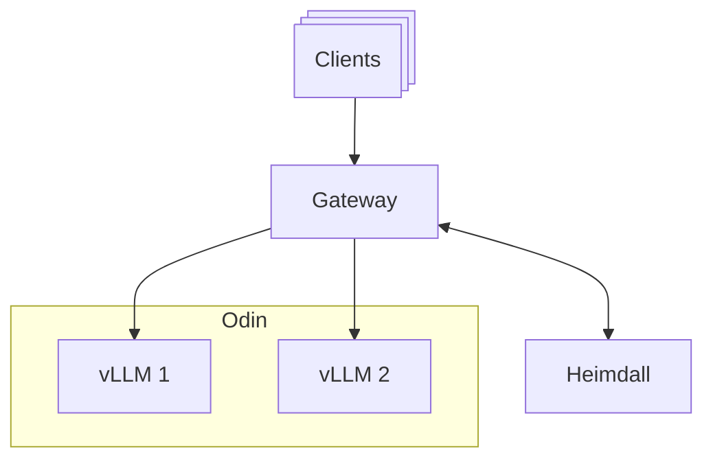

import Tabs from "@theme/Tabs";
import TabItem from "@theme/TabItem";

This quickstart launches two vLLM instances (pods) of the Llama 3.2 1B Instruct model and serves them through a single endpoint as an example. Please make sure to install all [prerequisites](./prerequisites.mdx), including the following versions of the components, before starting this quickstart guide.

- **moai-inference-framework** v0.2.0
- **moai-inference-preset** v0.2.0

## Required tools

To follow this quickstart, you need to install a few tools on the client machine.

### kubectl

This section describes how to install **kubectl**. See [Kubernetes / Install and Set Up kubectl on Linux](https://kubernetes.io/docs/tasks/tools/install-kubectl-linux/) for more details.

You can install kubectl binary with curl on Linux as follows. **Please replace `<kubernetesVersion>` and `<kubeconfigPath>` with your desired Kubernetes version and the path to your kubeconfig file, respectively**. If you did not set up the target cluster yourself, please request the relevant information from your administrator.

```shell {1,4}
KUBECTL_VERSION=<kubernetesVersion>
curl -LO https://dl.k8s.io/release/${KUBECTL_VERSION}/bin/linux/amd64/kubectl
sudo install -o root -g root -m 0755 kubectl /usr/local/bin/kubectl
export KUBECONFIG=<kubeconfigPath>
```

You can verify the installation by running the following command. Note that the printed version may vary depending on your cluster version.

```shell
kubectl version
```

Expected output:

```
Client Version: v1.32.9
Kustomize Version: v5.5.0
Server Version: v1.32.8
```

### Helm

You can install **Helm** by running the following command. See [Helm / Installing Helm](https://helm.sh/docs/intro/install/) for more details.

```shell
curl https://raw.githubusercontent.com/helm/helm/main/scripts/get-helm-3 | bash
```

You can verify the installation by running the following command. Note that the printed version may vary depending on the Helm version installed.

```shell
helm version
```

Expected output:

```
version.BuildInfo{Version:"v3.19.0", GitCommit:"3d8990f0836691f0229297773f3524598f46bda6", GitTreeState:"clean", GoVersion:"go1.24.7"}
```

### jq

You need to install **jq** to format JSON responses from the inference endpoint. See [Download jq](https://jqlang.github.io/jq/download/) for more details.

On Ubuntu or Debian, you can install jq as follows.

```shell
sudo apt-get update && sudo apt-get install -y jq
```

You can verify the installation by running the following command. Note that the printed version may vary depending on the version installed.

```shell
jq --version
```

Expected output:

```
jq-1.7.1
```

---

## Deployment

Deploy at least three components to completely run the MoAI Inference Framework on the cluster.

- **Gateway**: A component that receives all requests through a single endpoint and distributes them to one of the vLLM pods.
- **"Heimdall" scheduler**: A component that determines the rules the Gateway uses to select the proper destination for each request.
- **"Odin" inference service**: A collection of vLLM pods running across different GPUs/servers.



### Kubernetes namespace

You need to have a namespace for deploying and running the components of the MoAI Inference Framework. This guide assumes the namespace is named `quickstart`.

```shell
kubectl create namespace quickstart
kubectl label namespace quickstart mif=enabled
```

### Gateway

Gateway is not a component provided by the MoAI Inference Framework. You may use any gateway controller that is compatible with the [Gateway API Inference Extension](https://gateway-api-inference-extension.sigs.k8s.io/) in Kubernetes, though using **Istio** or **Kgateway** is recommended.

Create a `gateway.yaml` file to add the Gateway resource to the `quickstart` namespace. The contents of `gateway.yaml` vary depending on which gateway controller you use, and this guide provides instructions for both Istio and Kgateway. If you did not set up the target Kubernetes cluster yourself, ask your administrator to check which gateway controller is currently installed and available. The inference endpoint will be exposed on port 80 as specified in the `gateway.yaml` file.

<Tabs groupId="gateway-class">
<TabItem value="istio" label="Istio (Default)" default>

```yaml title="gateway.yaml"
apiVersion: v1
kind: ConfigMap
metadata:
  name: mif-gateway-infrastructure
data:
  service: |
    spec:
      type: ClusterIP
      ports:
        - name: http
          port: 80
          targetPort: http

  deployment: |
    spec:
      template:
        metadata:
          annotations:
            proxy.istio.io/config: |
              accessLogFile: /dev/stdout
              accessLogEncoding: JSON
        spec:
          containers:
            - name: istio-proxy
              resources:
                limits: null
              ports:
                - name: http
                  containerPort: 80

---
apiVersion: gateway.networking.k8s.io/v1
kind: Gateway
metadata:
  name: mif
spec:
  gatewayClassName: istio
  infrastructure:
    parametersRef:
      group: ""
      kind: ConfigMap
      name: mif-gateway-infrastructure
  listeners:
    - name: http
      protocol: HTTP
      port: 80
      allowedRoutes:
        namespaces:
          from: All
```

</TabItem>
<TabItem value="kgateway" label="Kgateway">

```yaml title="gateway.yaml"
apiVersion: gateway.kgateway.dev/v1alpha1
kind: GatewayParameters
metadata:
  name: mif-gateway-infrastructure
spec:
  kube:
    service:
      type: ClusterIP

---
apiVersion: gateway.networking.k8s.io/v1
kind: Gateway
metadata:
  name: mif
spec:
  gatewayClassName: kgateway
  infrastructure:
    parametersRef:
      group: gateway.kgateway.dev
      kind: GatewayParameters
      name: mif-gateway-infrastructure
  listeners:
    - name: http
      protocol: HTTP
      port: 80
      allowedRoutes:
        namespaces:
          from: All
```

</TabItem>
</Tabs>

Run the following command.

```shell
kubectl apply -n quickstart -f gateway.yaml
```

You can verify that the Gateway resource is created using the following command.

```shell
kubectl get pod -n quickstart -l gateway.networking.k8s.io/gateway-name=mif
```

Expected output:

```
NAME                         READY   STATUS    RESTARTS   AGE
mif-istio-78789865b7-747nz   1/1     Running   0          27s
```

### Heimdall

To deploy Heimdall and Odin, you must first add the Moreh Helm chart repository.

```shell
helm repo add moreh https://moreh-dev.github.io/helm-charts
helm repo update moreh
```

This quickstart uses a simple scheduling rule that selects the vLLM pod with fewer queued requests between the two pods. Create a `heimdall-values.yaml` file as shown below and deploy the Heimdall scheduler using this file. **Note that you need to set `gatewayClassName` to `kgateway` if you are using Kgateway as the gateway controller**.

```yaml title="heimdall-values.yaml"
global:
  imagePullSecrets:
    - name: moreh-registry

config:
  apiVersion: inference.networking.x-k8s.io/v1alpha1
  kind: EndpointPickerConfig
  plugins:
    - type: single-profile-handler
    - type: queue-scorer
    - type: max-score-picker
  schedulingProfiles:
    - name: default
      plugins:
        - pluginRef: queue-scorer
        - pluginRef: max-score-picker

gateway:
  name: mif
  gatewayClassName: istio

inferencePool:
  targetPorts:
    - number: 8000
```

```shell
helm upgrade -i heimdall moreh/heimdall \
    --version v0.6.1 \
    -n quickstart \
    -f heimdall-values.yaml
```

You can verify that the Heimdall pod is running and the related objects (ReplicaSet, Deployment and Service) are created as follows.

```shell
kubectl get all -n quickstart -l app.kubernetes.io/instance=heimdall
```

Expected output:

```
NAME                            READY   STATUS    RESTARTS   AGE
pod/heimdall-7d54fcbfff-chw94   1/1     Running   0          70s

NAME               TYPE        CLUSTER-IP     EXTERNAL-IP   PORT(S)                      AGE
service/heimdall   ClusterIP   10.110.35.57   <none>        9002/TCP,9090/TCP,5557/TCP   70s

NAME                       READY   UP-TO-DATE   AVAILABLE   AGE
deployment.apps/heimdall   1/1     1            1           70s

NAME                                  DESIRED   CURRENT   READY   AGE
replicaset.apps/heimdall-7d54fcbfff   1         1         1       70s
```

### Odin

This quickstart launches two vLLM instances using the `vllm-meta-llama-llama-3.2-1b-instruct-amd-mi250-tp2` preset, which includes the model name and model-specific arguments. Each pod utilizes two GPU devices to run the Llama 3.2 1B Instruct model with Tensor Parallelism (TP) set to 2.

:::info
For more information on presets, please refer to the [Odin Preset](/features/preset)
:::

To enable the vLLM pods to download model parameters from Hugging Face, you must generate a Hugging Face token at [Hugging Face / Access Tokens](https://huggingface.co/settings/tokens). In addition, you need to accept the model license at [meta-llama/Llama-3.2-1B-Instruct](https://huggingface.co/meta-llama/Llama-3.2-1B-Instruct).

:::info
In production environments, it is common to download the model parameters to a storage volume in advance and load them at runtime. Refer to the [Hugging Face model management with persistent volume](/best_practices/hf_model_management_with_pv) for more details.
:::

Create a `vllm-llama3-1b-instruct-tp2.yaml` file with the following contents. **Please replace `<huggingFaceToken>` with your Hugging Face token that has accepted the model license**.

```yaml title="vllm-llama3-1b-instruct-tp2.yaml" {20}
apiVersion: odin.moreh.io/v1alpha1
kind: InferenceService
metadata:
  name: vllm-llama3-1b-instruct-tp2
spec:
  replicas: 2
  inferencePoolRefs:
    - name: heimdall
  templateRefs:
    - name: vllm
    - name: vllm-meta-llama-llama-3.2-1b-instruct-amd-mi250-tp2
  parallelism:
    tensor: 2
  template:
    spec:
      containers:
        - name: main
          env:
            - name: HF_TOKEN
              value: <huggingFaceToken>
```

- The `replicas` field specifies the number of vLLM pods.
- The `inferencePoolRefs` field specifies the Heimdall's InferencePool where this vLLM pod will register to.
- The `templateRefs` field specifies the Odin Template resources; `vllm` is a runtime base, and `vllm-meta-llama-llama-3.2-1b-instruct-amd-mi250-tp2` is a model-specific template.

After that, you can deploy the Odin InferenceService by running the following command:

```shell
kubectl apply -n quickstart -f vllm-llama3-1b-instruct-tp2.yaml
```

You can wait for the Odin InferenceService to be ready as follows:

```shell
kubectl wait inferenceservice -n quickstart vllm-llama3-1b-instruct-tp2 \
  --for=condition=Ready \
  --timeout=15m
```

You can verify that the vLLM pods are running and the related objects (ReplicaSet and Deployment) are created as follows:

```shell
kubectl get all -n quickstart -l app.kubernetes.io/name=vllm-llama3-1b-instruct-tp2
```

Expected output:

```
NAME                                               READY   STATUS    RESTARTS   AGE
pod/vllm-llama3-1b-instruct-tp2-64d68f6466-klzll   1/1     Running   0          2m54s
pod/vllm-llama3-1b-instruct-tp2-64d68f6466-nzr89   1/1     Running   0          2m54s

NAME                                          READY   UP-TO-DATE   AVAILABLE   AGE
deployment.apps/vllm-llama3-1b-instruct-tp2   2/2     2            2           2m54s

NAME                                                     DESIRED   CURRENT   READY   AGE
replicaset.apps/vllm-llama3-1b-instruct-tp2-64d68f6466   2         2         2       2m54s
```

---

## Usage

You can set up port forwarding as follows to send API requests to the inference endpoint from your local machine. This forwards port 80 of the ingress gateway to port 8000 of the local machine (`localhost`).

```shell
SERVICE=$(kubectl -n quickstart get service -l gateway.networking.k8s.io/gateway-name=mif -o name)
kubectl -n quickstart port-forward $SERVICE 8000:80
```

Then, you can send a request to the inference endpoint as follows. Note that `jq` is used only to format the JSON response for better readability and is not required for the request to function.

```shell
curl http://localhost:8000/v1/chat/completions \
  -H "Content-Type: application/json" \
  -d '{
    "model": "meta-llama/Llama-3.2-1B-Instruct",
    "messages": [
      {
        "role": "developer",
        "content": "You are a helpful assistant."
      },
      {
        "role": "user",
        "content": "Hello!"
      }
    ]
  }' | jq '.'
```

Response:

```json
{
  "id": "chatcmpl-5613ccb4-d168-40df-a5b7-842ab4a00d6a",
  "object": "chat.completion",
  "created": 1761484035,
  "model": "meta-llama/Llama-3.2-1B-Instruct",
  "choices": [
    {
      "index": 0,
      "message": {
        "role": "assistant",
        "content": "Hello! How can I assist you today? Do you have a specific question or problem you'd like to talk about, or are you just looking for some information on a particular topic?",
        "refusal": null,
        "annotations": null,
        "audio": null,
        "function_call": null,
        "tool_calls": [],
        "reasoning_content": null
      },
      "logprobs": null,
      "finish_reason": "stop",
      "stop_reason": null,
      "token_ids": null
    }
  ],
  "service_tier": null,
  "system_fingerprint": null,
  "usage": {
    "prompt_tokens": 48,
    "total_tokens": 86,
    "completion_tokens": 38,
    "prompt_tokens_details": null
  },
  "prompt_logprobs": null,
  "prompt_token_ids": null,
  "kv_transfer_params": null
}
```

You can also run various benchmarking tools on this inference endpoint to evaluate the performance. However, for reliable performance evaluation, your client and the Kubernetes cluster must be connected through a sufficiently fast and stable network (e.g., the same local network).

---

## Cleanup

To delete all the resources created in this quickstart, run the following commands.

```shell
kubectl delete -n quickstart -f vllm-llama3-1b-instruct-tp2.yaml
helm uninstall -n quickstart heimdall
kubectl delete -n quickstart -f gateway.yaml
```
