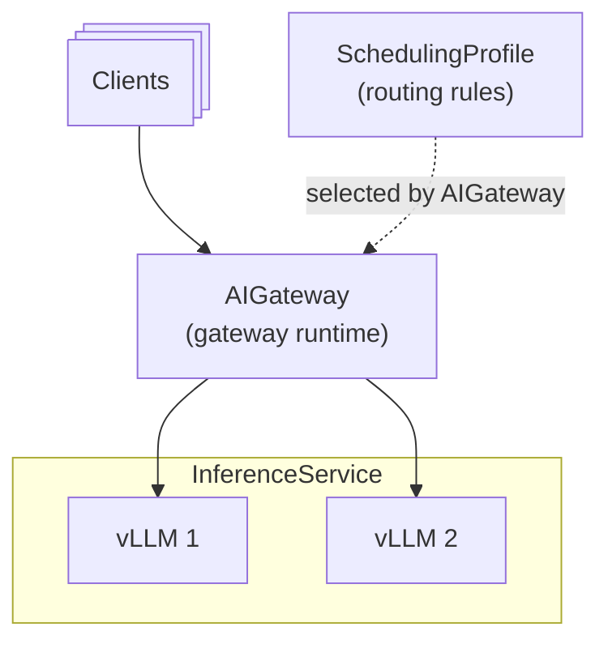

import Tabs from "@theme/Tabs";
import TabItem from "@theme/TabItem";

This quickstart launches two vLLM instances (pods) of the Llama 3.2 1B Instruct model and serves them through a single AI Gateway endpoint as an example. Please make sure to install all [prerequisites](./prerequisites.mdx) before starting this quickstart guide. The prerequisites install cert-manager, the infrastructure bundle, the required CRDs, and the **Odin** and **Heimdall** operators that this guide builds on.

---

## Required tools

To follow this quickstart, you need to install a few tools on the client machine.

### kubectl

This section describes how to install **kubectl**. See [Kubernetes / Install and Set Up kubectl on Linux](https://kubernetes.io/docs/tasks/tools/install-kubectl-linux/) for more details.

You can install kubectl binary with curl on Linux as follows. **Please replace `<kubernetesVersion>` and `<kubeconfigPath>` with your desired Kubernetes version and the path to your kubeconfig file, respectively**. If you did not set up the target cluster yourself, please request the relevant information from your administrator.

```shell {1,4}
KUBECTL_VERSION=<kubernetesVersion>
curl -LO https://dl.k8s.io/release/${KUBECTL_VERSION}/bin/linux/amd64/kubectl
sudo install -o root -g root -m 0755 kubectl /usr/local/bin/kubectl
export KUBECONFIG=<kubeconfigPath>
```

You can verify the installation by running the following command. Note that the printed version may vary depending on your cluster version.

```shell
kubectl version
```

Expected output:

```shell title="Expected output (kubectl version)"
Client Version: v1.32.9
Kustomize Version: v5.5.0
Server Version: v1.32.8
```

### Helm

You can install **Helm** by running the following command. See [Helm / Installing Helm](https://helm.sh/docs/intro/install/) for more details.

```shell
curl https://raw.githubusercontent.com/helm/helm/main/scripts/get-helm-3 | bash
```

You can verify the installation by running the following command. Note that the printed version may vary depending on the Helm version installed.

```shell
helm version
```

Expected output:

```shell title="Expected output (helm version)"
version.BuildInfo{Version:"v3.19.0", GitCommit:"3d8990f0836691f0229297773f3524598f46bda6", GitTreeState:"clean", GoVersion:"go1.24.7"}
```

### jq

You need to install **jq** to format JSON responses from the inference endpoint. See [Download jq](https://jqlang.github.io/jq/download/) for more details.

On Ubuntu or Debian, you can install jq as follows.

```shell
sudo apt-get update && sudo apt-get install -y jq
```

You can verify the installation by running the following command. Note that the printed version may vary depending on the version installed.

```shell
jq --version
```

Expected output:

```shell title="Expected output (jq --version)"
jq-1.7.1
```

---

## Deployment

This guide deploys three resources on top of the operators installed during the [prerequisites](./prerequisites.mdx):

- **SchedulingProfile**: defines the routing rules (which scorers and picker the gateway uses to choose a destination pod). Cluster-scoped.
- **AIGateway**: the request entrypoint. The Heimdall operator reconciles this resource and runs the gateway, which receives all requests through a single endpoint and routes each one to a vLLM pod according to the selected SchedulingProfile.
- **InferenceService**: a collection of vLLM pods running the model across GPUs/servers. Each pod is bound to an AIGateway by a label.


```mermaid
graph TB
    clients@{ shape: procs, label: "Clients" } --> gateway["AIGateway<br>(gateway runtime)"]
    sp["SchedulingProfile<br>(routing rules)"] -. selected by AIGateway .-> gateway
    subgraph odin["InferenceService"]
      vllm1[vLLM 1]
      vllm2[vLLM 2]
    end
    gateway --> vllm1
    gateway --> vllm2
```

### Kubernetes namespace

You need a namespace for deploying and running the workload. This guide assumes the namespace is named `quickstart`.

```shell
kubectl create namespace quickstart
```

### Scheduling profile

Create a `SchedulingProfile` that defines how the gateway selects a destination pod. A SchedulingProfile is **cluster-scoped**. This example uses a single end-to-end (`e2e`) profile that scores pods by the number of in-flight requests and picks the highest-scoring one.

```yaml title="scheduling-profile.yaml"
apiVersion: heimdall.moreh.io/v1alpha1
kind: SchedulingProfile
metadata:
  name: quickstart
spec:
  profileHandler: e2e
  plugins:
    - type: inflight-requests-scorer
    - type: max-score-picker
  profiles:
    default:
      pluginRefs:
        - name: inflight-requests-scorer
          weight: 100
        - name: max-score-picker
```

```shell
kubectl apply -f scheduling-profile.yaml
```

:::info
A SchedulingProfile is optional. If you do not create one, the gateway uses a built-in default profile. See the [SchedulingProfile reference](../reference/heimdall-aigateway/usage.mdx) for the full list of scorers, pickers, and the default profile composition.
:::

### AIGateway

Create an `AIGateway` resource in the `quickstart` namespace. The Heimdall operator reconciles it and creates the gateway `Deployment` and `Service`. The `schedulingProfiles` field binds request models to SchedulingProfiles by name; the reserved model `default` is the gateway-wide fallback applied to every model unless a per-model override is listed.

```yaml title="aigateway.yaml"
apiVersion: heimdall.moreh.io/v1alpha1
kind: AIGateway
metadata:
  name: mif
spec:
  replicas: 1
  schedulingProfiles:
    - model: default
      profile: quickstart
```

:::info
The gateway runtime image tag is filled in automatically by the Heimdall operator (from its `aigateway.defaultTag` chart value). Set `spec.image.tag` only to pin a specific gateway version.
:::

```shell
kubectl apply -n quickstart -f aigateway.yaml
```

Verify that the gateway pod is running:

```shell
kubectl get pod -n quickstart -l app.kubernetes.io/name=aigateway,app.kubernetes.io/instance=mif
```

```shell title="Expected output (gateway pod Running)"
NAME                  READY   STATUS    RESTARTS   AGE
mif-c45c66f8b-lnzm9   1/1     Running   0          12s
```

### Inference service

This quickstart launches two vLLM instances using the `quickstart-vllm-meta-llama-llama-3.2-1b-instruct-amd-mi250-tp2` preset, which includes the model name and model-specific arguments. Each pod utilizes two GPU devices to run the Llama 3.2 1B Instruct model with Tensor Parallelism (TP) set to 2.

:::info
For more information on presets, please refer to the [Odin Preset](../features/preset.mdx)
:::

To enable the vLLM pods to download model parameters from Hugging Face, you must generate a Hugging Face token at [Hugging Face / Access Tokens](https://huggingface.co/settings/tokens). In addition, you need to accept the model license at [meta-llama/Llama-3.2-1B-Instruct](https://huggingface.co/meta-llama/Llama-3.2-1B-Instruct).

:::info

In production environments, it is highly recommended to use **offline hub templates** (e.g., `vllm-hf-hub-offline`, `vllm-dp-hf-hub-offline`, or `vllm-pp-hf-hub-offline`) instead of `HF_TOKEN` to load pre-downloaded models from a Persistent Volume. This ensures reliability by avoiding dependencies on external network conditions during pod startup. These templates require a PVC named `models` in your namespace. Refer to the [Hugging Face model management with persistent volume](../operations/hf-model-management-with-pv.mdx) for more details.

:::

Create a `vllm-llama3-1b-instruct-tp2.yaml` file with the following contents. The `mif.moreh.io/aigateway` label binds this InferenceService to the AIGateway named `mif`; Odin propagates the label to the vLLM pods, and the Heimdall operator injects the gateway sidecar into them. **Please replace `<huggingFaceToken>` with your Hugging Face token that has accepted the model license**.

```yaml title="vllm-llama3-1b-instruct-tp2.yaml" {6,18}
apiVersion: odin.moreh.io/v1alpha1
kind: InferenceService
metadata:
  name: vllm-llama3-1b-instruct-tp2
  labels:
    mif.moreh.io/aigateway: mif
spec:
  replicas: 2
  templateRefs:
    - name: vllm
    - name: quickstart-vllm-meta-llama-llama-3.2-1b-instruct-amd-mi250-tp2
  template:
    spec:
      containers:
        - name: main
          env:
            - name: HF_TOKEN
              value: <huggingFaceToken>
```

- The `replicas` field specifies the number of vLLM pods.
- The `mif.moreh.io/aigateway` label binds the pods to the AIGateway. Routing and sidecar injection rely on this label.
- The `templateRefs` field specifies the list of `InferenceServiceTemplate` resources. These templates are merged in the order listed, with later templates overriding earlier ones. In this example, `vllm` is a runtime-base and `quickstart-vllm-meta-llama-llama-3.2-1b-instruct-amd-mi250-tp2` is a model-specific template. The `vllm` runtime-base sets the inference engine, so you do not need to set it on the InferenceService.

:::info
Select the appropriate runtime-base template according to your parallelism strategy:
- **TP-only (Tensor Parallel)**: Use `vllm`.
- **DP (Data Parallel)**: Use `vllm-dp`.
- **PP (Pipeline Parallel)**: Use `vllm-pp`.
:::

After that, you can deploy the InferenceService by running the following command:

```shell
kubectl apply -n quickstart -f vllm-llama3-1b-instruct-tp2.yaml
```

You can wait for the InferenceService to be ready as follows:

```shell
kubectl wait inferenceservice -n quickstart vllm-llama3-1b-instruct-tp2 \
  --for=condition=Ready \
  --timeout=15m
```

```shell title="Expected output (InferenceService Ready)"
inferenceservice.odin.moreh.io/vllm-llama3-1b-instruct-tp2 condition met
```

You can verify that the vLLM pods are running as follows:

```shell
kubectl get all -n quickstart -l app.kubernetes.io/name=vllm-llama3-1b-instruct-tp2
```

```shell title="Expected output (two vLLM pods Running)"
NAME                                               READY   STATUS    RESTARTS   AGE
pod/vllm-llama3-1b-instruct-tp2-6dff9fc488-g4qdw   2/2     Running   0          2m14s
pod/vllm-llama3-1b-instruct-tp2-6dff9fc488-z8hhh   2/2     Running   0          2m14s

NAME                                          READY   UP-TO-DATE   AVAILABLE   AGE
deployment.apps/vllm-llama3-1b-instruct-tp2   2/2     2            2           2m14s

NAME                                                     DESIRED   CURRENT   READY   AGE
replicaset.apps/vllm-llama3-1b-instruct-tp2-6dff9fc488   2         2         2       2m14s
```

---

## Usage

You can set up port forwarding as follows to send API requests to the gateway endpoint from your local machine. The Heimdall operator creates a `Service` named after the AIGateway (`mif`) that exposes the gateway on port 8000. This forwards it to port 8000 of the local machine (`localhost`).

```shell
kubectl -n quickstart port-forward service/mif 8000:8000
```

Then, you can send a request to the inference endpoint as follows. Note that `jq` is used only to format the JSON response for better readability and is not required for the request to function.

```shell
curl http://localhost:8000/v1/chat/completions \
  -H "Content-Type: application/json" \
  -d '{
    "model": "meta-llama/Llama-3.2-1B-Instruct",
    "messages": [
      {
        "role": "developer",
        "content": "You are a helpful assistant."
      },
      {
        "role": "user",
        "content": "Hello!"
      }
    ]
  }' | jq '.'
```

Response:

```json
{
  "id": "chatcmpl-019f166d-4915-7a83-a020-1b839b6d895c",
  "object": "chat.completion",
  "created": 1782787688,
  "model": "meta-llama/Llama-3.2-1B-Instruct",
  "choices": [
    {
      "index": 0,
      "message": {
        "role": "assistant",
        "content": "Hello! How can I assist you today?",
        "refusal": null,
        "annotations": null,
        "audio": null,
        "function_call": null,
        "tool_calls": []
      },
      "logprobs": null,
      "finish_reason": "stop"
    }
  ],
  "service_tier": null,
  "usage": {
    "prompt_tokens": 48,
    "total_tokens": 58,
    "completion_tokens": 10,
    "prompt_tokens_details": null,
    "completion_tokens_details": {
      "reasoning_tokens": 0
    }
  }
}
```

You can also run various benchmarking tools on this inference endpoint to evaluate the performance. However, for reliable performance evaluation, your client and the Kubernetes cluster must be connected through a sufficiently fast and stable network (e.g., the same local network).

---

## Cleanup

To delete all the resources created in this quickstart, run the following commands.

```shell
kubectl delete -n quickstart -f vllm-llama3-1b-instruct-tp2.yaml
kubectl delete -n quickstart -f aigateway.yaml
kubectl delete -f scheduling-profile.yaml
```
