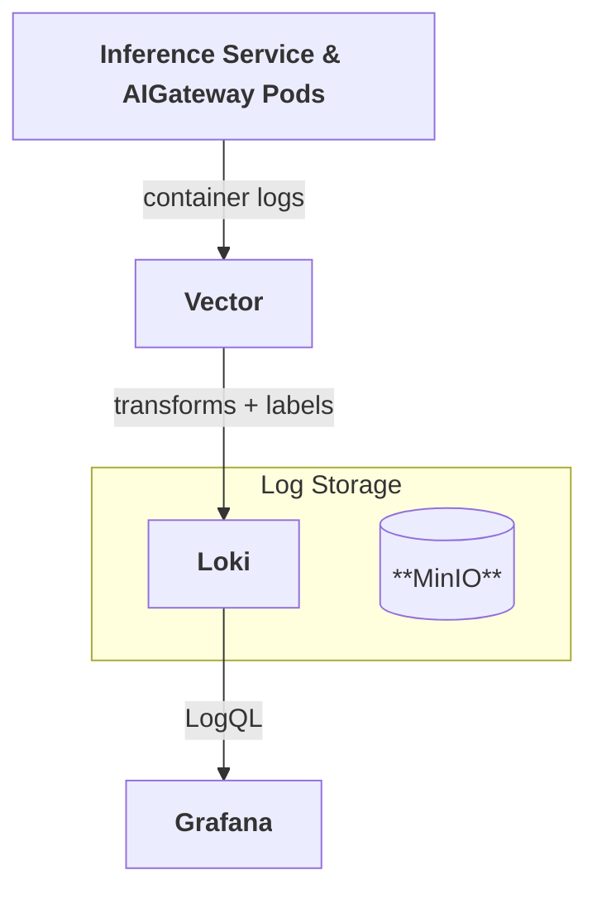

This document explains how to enable centralized log collection for the MoAI Inference Framework using [Loki](https://grafana.com/oss/loki/) (log aggregation) and [Vector](https://vector.dev/) (log collection agent).

## Overview



---

## Architecture details

### Loki

| Property          | Value                                          |
| :---------------- | :--------------------------------------------- |
| Helm chart        | `grafana/loki` v6.30.0                         |
| App version       | 3.5.1                                          |
| Storage backend   | S3 (MinIO), TSDB index                         |
| Retention         | 90 days (2160 h)                               |
| Ingestion limit   | 30 MB/s, 60 MB burst                           |
| Max entries/query | 50 000                                         |
| Deployment        | Distributed (gateway / read / write / backend) |

### Vector

| Property    | Value                                                                     |
| :---------- | :------------------------------------------------------------------------ |
| Helm chart  | `vector/vector` v0.39.0                                                   |
| Deployment  | DaemonSet (Agent mode, one pod per node)                                  |
| Log source  | Pods labelled `mif.moreh.io/log.collect=true`, plus AIGateway pods (`app.kubernetes.io/name=aigateway`) collected automatically (`kubernetes_logs`) |
| Log format  | JSON parsing applied to pods labelled `mif.moreh.io/log.format=json`, and always to AIGateway pods |
| Tolerations | unschedulable, compute, `amd.com/gpu`                                     |

### MinIO

| Property         | Value                                                        |
| :--------------- | :----------------------------------------------------------- |
| Helm chart       | `minio/minio` v5.4.0                                         |
| Mode             | Standalone                                                   |
| Bucket           | `loki` (created via post-install Job on startup)             |
| Loki credentials | Dedicated `loki` user with S3 policy scoped to `loki` bucket |
| Resources        | 2 Gi memory (requests)                                       |
| Persistence      | emptyDir (ephemeral by default)                              |
| Deployment       | Single pod                                                   |

### Component naming

Service names are derived from the Helm release name. With the default release name `mif`:

| Service      | Name (same-namespace access) |
| :----------- | :--------------------------- |
| MinIO        | `mif-minio`                  |
| Loki gateway | `mif-loki-gateway`           |
| Loki read    | `mif-loki-read`              |
| Loki write   | `mif-loki-write`             |

Vector connects to Loki using the release-prefixed service name since all components are co-located in the same namespace.

---

## Prerequisites

- The `moai-inference-framework` Helm chart installed (or being installed).

:::info
MinIO, Loki, and Vector are all **enabled by default** in the `moai-inference-framework` chart. No additional configuration is required to get started.
:::

---

## Installation

Log collection is installed as part of the `moai-inference-framework` Helm chart. See [Prerequisites](/getting-started/prerequisites.mdx#moai-inference-framework) for the required values and install command.

---

## Verifying the installation

Check that all Loki components are running.

```shell
kubectl get pods -n mif -l app.kubernetes.io/name=loki
```

```shell title="Expected output (all pods Running)"
NAME                           READY   STATUS    RESTARTS   AGE
loki-backend-0                 1/1     Running   0          2m
loki-gateway-xxxxxxxxx-xxxxx   1/1     Running   0          2m
loki-read-xxxxxxxxx-xxxxx      1/1     Running   0          2m
loki-write-0                   1/1     Running   0          2m
```

Check that Vector is running on all nodes.

```shell
kubectl get pods -n mif -l app.kubernetes.io/name=vector
```

```shell title="Expected output (one pod per node, all Running)"
NAME           READY   STATUS    RESTARTS   AGE
vector-xxxxx   1/1     Running   0          2m
vector-yyyyy   1/1     Running   0          2m
```

Check Vector logs to confirm it is shipping to Loki without errors.

```shell
kubectl logs -n mif -l app.kubernetes.io/name=vector --tail=50
```

---

## Enabling log collection for a pod

Most pods opt in to log collection explicitly, controlled by the two pod labels below. First-class components such as AIGateway are collected automatically — see [Automatically collected components](#automatically-collected-components).

### Opt-in label

Add the `mif.moreh.io/log.collect=true` label to a pod to include its logs in Vector's collection. Pods without this label are ignored, except for components collected automatically (see [Automatically collected components](#automatically-collected-components)).

```yaml
metadata:
  labels:
    mif.moreh.io/log.collect: "true"
```

### Log format label

Add the `mif.moreh.io/log.format=json` label to enable structured JSON log parsing for a pod. When set, Vector parses each log line as JSON and promotes the following fields:

| JSON field            | Mapped to             |
| :-------------------- | :-------------------- |
| `msg` or `message`    | `message`             |
| `time` or `timestamp` | `timestamp`           |
| `level`               | `level` (Loki label)  |
| others                | merged into the event |

Both common conventions are accepted: Go components emit `msg`/`time` (for example, the Heimdall scheduler), while Rust components emit `message`/`timestamp` (for example, AIGateway).

Without this label, the log line is forwarded as-is without any JSON parsing.

```yaml
metadata:
  labels:
    mif.moreh.io/log.collect: "true"
    mif.moreh.io/log.format: "json"
```

:::info
The `level` Loki label is only populated for JSON-parsed pods (those labelled `mif.moreh.io/log.format=json`, plus AIGateway). For plain-text pods, `level` remains empty.
:::

---

## Automatically collected components

AIGateway pods are collected automatically — no opt-in label is required. The Heimdall controller stamps the immutable label `app.kubernetes.io/name=aigateway` on every AIGateway pod and exposes no field to set `mif.moreh.io/log.collect`, so Vector selects these pods by that label and always parses their JSON output. This mirrors AIGateway metrics, which the controller exposes through an auto-created ServiceMonitor and PodMonitor with no per-pod configuration.

Query AIGateway logs in Grafana with the `app="aigateway"` selector (see [Searching logs in Grafana](#searching-logs-in-grafana)).

---

## Searching logs in Grafana

### Accessing Grafana

If you have not yet accessed Grafana, follow the [Accessing Grafana](/operations/monitoring/metrics/index.mdx#accessing-grafana) guide to retrieve admin credentials, set up port forwarding, and log in.

### Opening the Explore view

After logging in to Grafana, click on the **Explore** icon (compass) in the left sidebar. You will see the Explore view with a query editor:


### Selecting the Loki datasource

If the datasource is not already set to **Loki**, click the datasource dropdown at the top of the page and select **Loki**:


### Switching to Code mode

The query editor defaults to **Builder** mode, which provides a visual query builder. To write [LogQL](https://grafana.com/docs/loki/latest/query/log_queries/) queries directly, click the **Code** button to switch to Code mode:


### Running a log query

Enter a LogQL query in the query editor and click **Run query** (or press `Shift+Enter`). For example, `{app="aigateway"}` returns all logs from the AIGateway gateway pods. Because AIGateway emits structured JSON, Vector parses each line and promotes its fields (such as `level`, `message`, and `target`), as the results below show:


### Labels available for log search

Vector enriches every log entry with the following labels, which can be used as LogQL selectors:

| Label               | Source                                                                             | Example value           |
| :------------------ | :--------------------------------------------------------------------------------- | :---------------------- |
| `namespace`         | `kubernetes.pod_namespace`                                                         | `default`               |
| `inference_service` | pod label `app.kubernetes.io/instance`                                             | `llama-mi250`           |
| `pool_name`         | pod label `mif.moreh.io/pool`                                                      | (empty unless set)      |
| `role`              | pod label `mif.moreh.io/role`                                                      | `e2e`, `prefill`, `decode` |
| `app`               | pod label `app.kubernetes.io/name`                                                 | `vllm`, `aigateway`     |
| `node_name`         | `VECTOR_SELF_NODE_NAME` env var (injected by Vector)                               | `gpu-node-01`           |
| `level`             | parsed from JSON log field `level` (JSON-parsed pods only)                         | `info`, `warn`, `error` |

:::info
The `pool_name` label maps from the `mif.moreh.io/pool` pod label. Inference pods bound to an AIGateway through the `mif.moreh.io/aigateway` label do not carry `mif.moreh.io/pool`, so `pool_name` is empty for them. To scope a query to a deployment, use `inference_service` (the InferenceService name) or `app` (for example, `vllm` for model pods, `aigateway` for the gateway).
:::

### Query examples

Filter by a single label:

```promql
{namespace="default"}
{inference_service="llama-mi250"}
{app="vllm"}
{role="decode"}
```

Combine multiple labels and search for a keyword in the log line:

```promql
{namespace="default", inference_service="llama-mi250", role="prefill"} |= "error"
```

Filter by log level (available only for JSON-formatted pods):

```promql
{namespace="default", level="error"}
```

:::info
The `level` label is only available for JSON-parsed pods. To filter plain-text logs by level, use a pipeline filter instead:

```promql
{namespace="default"} |= "ERROR"
```
:::

### AIGateway logs

AIGateway logs are collected automatically and always parsed as JSON. Select them with the `app` label, and use `| json` to expose fields such as `target`, `request_id`, and `trace_id`:

```promql {3}
{app="aigateway"}
{app="aigateway"} | json
{app="aigateway"} | json | request_id="<requestId>"
```

AIGateway emits uppercase levels (`INFO`, `DEBUG`, `WARN`, `ERROR`), so filter by level with the uppercase value:

```promql
{app="aigateway", level="DEBUG"}
```

Each parsed line includes a `trace_id` field for correlating a log with its trace in Tempo. Automatic log-to-trace links require a `derivedFields` entry on the Loki datasource, which this chart does not configure by default.

---

## Using an external MinIO

If MinIO is already deployed outside this chart, set `minio.enabled: false` and configure `lokiBucket` with the host and credentials of a MinIO user that has read/write access to the `loki` bucket.

**Same namespace** — if the existing MinIO service name matches `<release>-minio`, only credentials are required:

```yaml title="moai-inference-framework-values.yaml" {4-5}
minio:
  enabled: false
lokiBucket:
  accessKey: <accessKey>
  secretKey: <secretKey>
```

**Different namespace** — set `lokiBucket.host` to the FQDN so that Loki can resolve it cross-namespace:

```yaml title="moai-inference-framework-values.yaml" {4-6}
minio:
  enabled: false
lokiBucket:
  host: <minio.minio.svc.cluster.local>
  accessKey: <accessKey>
  secretKey: <secretKey>
```

---

## Disabling log collection

```yaml title="moai-inference-framework-values.yaml"
minio:
  enabled: false
loki:
  enabled: false
vector:
  enabled: false
```
