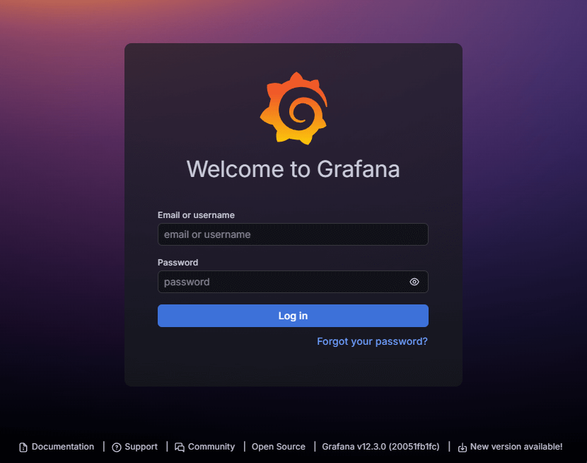
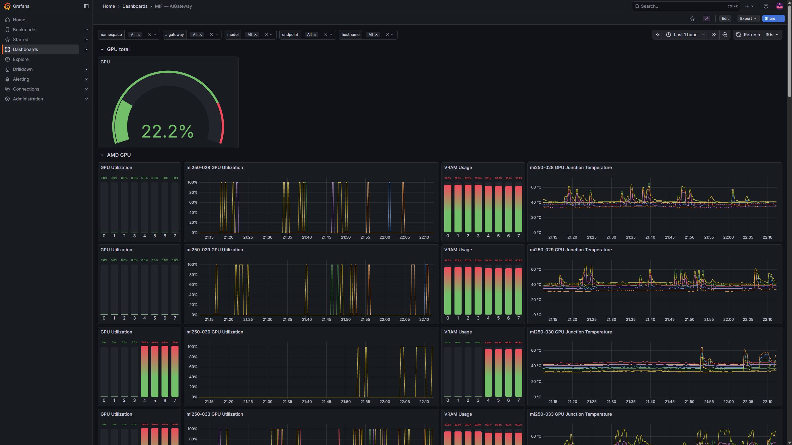
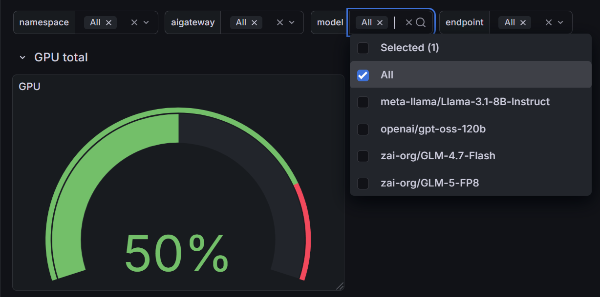
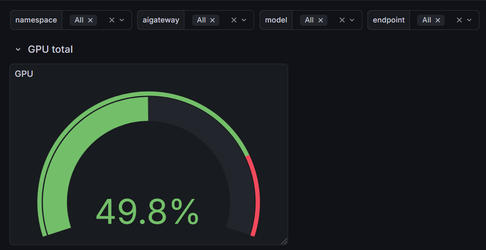
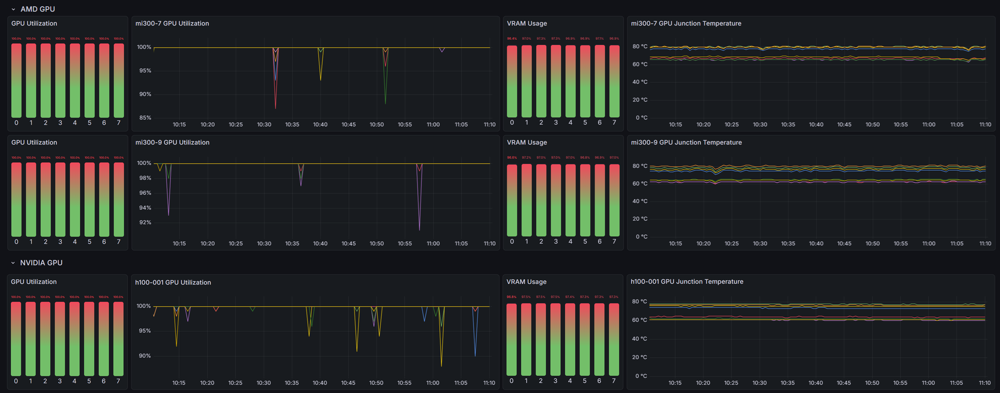
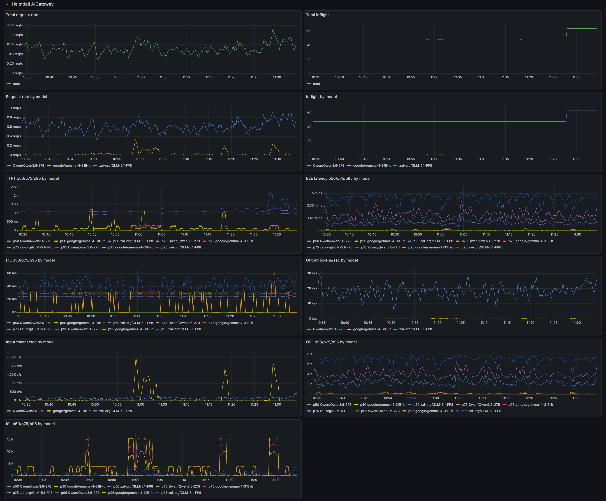
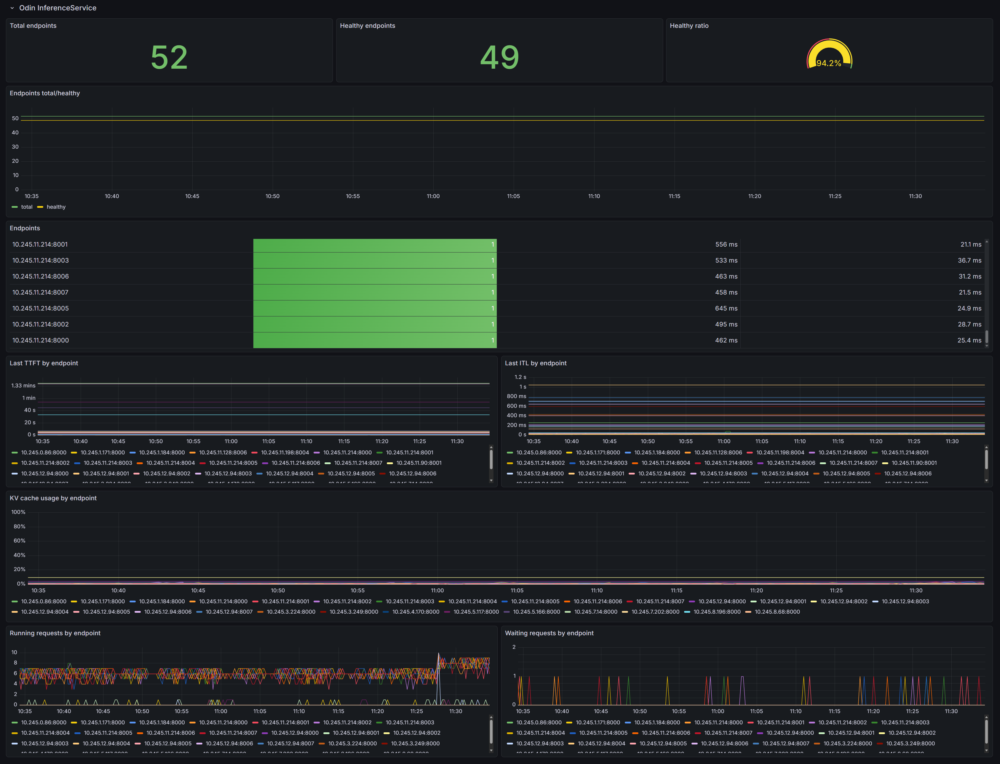

This document describes how to access the Grafana dashboard to monitor the MoAI Inference Framework and provides an overview of the available metrics. Please make sure to install all [prerequisites](/getting-started/prerequisites.mdx) before starting this monitoring guide.

---

## Accessing Grafana

### Admin credentials

Before setting up port forwarding, retrieve the admin credentials for Grafana. The default admin credentials are stored in a Kubernetes secret.

**Admin username:**

The admin username is typically `admin` by default. You can verify it using the following command:

```shell
kubectl get secret mif-grafana -n mif -o jsonpath='{.data.admin-user}' | base64 -d && echo
```

**Admin password:**

The admin password is a randomly generated alphanumeric string with a fixed length of 40 characters. Retrieve it using the following command:

```shell
kubectl get secret mif-grafana -n mif -o jsonpath='{.data.admin-password}' | base64 -d && echo
```

:::info Tip
Save these credentials in a secure location. You will need them to log in to Grafana.
:::

### Port-forward

To access Grafana from your local machine, set up port forwarding as follows:

```shell
kubectl port-forward -n mif services/mif-grafana 3000:80
```

You should see output similar to the following, indicating that port forwarding is active:

```shell title="Expected output (port-forward active)"
Forwarding from 127.0.0.1:3000 -> 80
Forwarding from [::1]:3000 -> 80
```

:::info
Keep this terminal window open while accessing Grafana. Stop port-forwarding by pressing `Ctrl+C` in the terminal where the command is running.
:::

### Logging in

Open [http://localhost:3000](http://localhost:3000) in your browser. You will see the Grafana login page:



1. Enter the admin username (typically `admin`) in the **Username or email** field.
2. Enter the admin password (retrieved from the secret) in the **Password** field.
3. Click **Log in**.

### Accessing dashboards

After logging in:

1. Click on the **Dashboards** icon in the left sidebar.
2. In the dashboard list, find and click on the **MIF — AIGateway** dashboard, which provides comprehensive monitoring of the MoAI Inference Framework.



---

## Dashboard filters

The dashboard includes several filters (Grafana template variables) at the top that scope every panel to the components you care about:



- **namespace**: Filter metrics by Kubernetes namespace. Use this to isolate a specific deployment.
- **aigateway**: Filter by AIGateway name. Gateway metrics are labeled with the name of the AIGateway that routed the request, so this scopes the view to a single gateway.
- **model**: Filter by served model name (for example, `meta-llama/Llama-3.2-1B-Instruct`). The Heimdall AIGateway section breaks its metrics down per model, so this narrows the view to one model served by the gateway.
- **endpoint**: Filter by individual inference endpoint (a single inference pod). The Odin InferenceService section reports per-endpoint metrics, so this focuses on one pod.

By setting **namespace** and **aigateway** together, you can view metrics for a specific gateway. For example, if you followed the [quickstart guide](/getting-started/quickstart.mdx), set **namespace** to `quickstart` and **aigateway** to `mif` (the AIGateway name) to see metrics for the `meta-llama/Llama-3.2-1B-Instruct` model deployed in that guide.

Most filters accept `All` to view aggregate metrics across the cluster. Use specific values when drilling down — for example, set **model** to compare how the gateway serves different models, or **endpoint** to compare individual inference pods.

---

## Dashboard overview

The MIF — AIGateway dashboard is organized into several sections, each focusing on a different layer of the system.

### GPU total

This section displays the overall GPU utilization across the cluster's GPU nodes as a gauge panel, providing a quick overview of GPU usage.



### AMD / NVIDIA GPU

These sections provide detailed per-node GPU metrics for each vendor. The dashboard detects AMD and NVIDIA GPU nodes automatically, so these panels populate without any filter selection. The screenshot below shows the AMD GPU section; the NVIDIA GPU section mirrors it for NVIDIA nodes.



- **GPU Utilization**: Utilization percentage for each GPU device, displayed as both bar gauges and per-host time series graphs.
- **VRAM Usage**: The percentage of video memory (VRAM) used by each GPU device.
- **GPU Junction Temperature**: The junction temperature of each GPU device in Celsius.

These metrics help you identify GPU bottlenecks, memory pressure, and thermal issues across your cluster.

### Heimdall AIGateway

:::info
These panels are fed by the Heimdall AI Gateway, so they only show data once Heimdall is installed and an AIGateway is up and serving traffic. Empty panels here usually mean no gateway is running yet.
:::

This section reports the request traffic the Heimdall AI Gateway routes, both in aggregate and broken down per served model. Use the **model** filter to focus these panels on a single model.



- **Total request rate / Total inflight**: Aggregate requests per second and the number of in-flight requests across all models served by the gateway.
- **Request rate by model / Inflight by model**: The same two metrics broken down per served model.
- **TTFT p50/p75/p95 by model**: Time to first token per model, at the 50th, 75th, and 95th percentiles.
- **E2E latency p50/p75/p95 by model**: End-to-end request latency per model, from the gateway's perspective.
- **ITL p50/p75/p95 by model**: Inter-token latency (time between consecutive output tokens) per model.
- **Output tokens/sec / Input tokens/sec by model**: Token throughput per model, for generated and prompt tokens respectively.
- **ISL p50/p75/p95 by model**: Input sequence length distribution per model.
- **OSL p50/p75/p95 by model**: Output sequence length distribution per model.

### Odin InferenceService

:::info
These panels are fed by Odin's inference endpoints, so they only show data once Odin is installed and at least one InferenceService is Ready. Empty panels here usually mean no InferenceService is running yet.
:::

This section reports the health and per-endpoint performance of the inference pods behind the gateway. Use the **endpoint** filter to focus these panels on a single inference pod.



- **Total endpoints / Healthy endpoints / Healthy ratio**: The number of inference endpoints, how many are healthy, and the healthy percentage.
- **Endpoints total/healthy**: The total and healthy endpoint counts over time.
- **Endpoints**: A table listing each endpoint with its current status and latency.
- **Last TTFT by endpoint / Last ITL by endpoint**: The most recent time to first token and inter-token latency for each endpoint.
- **KV cache usage by endpoint**: KV cache utilization percentage for each endpoint.
- **Running requests by endpoint / Waiting requests by endpoint**: The number of requests currently running and the number queued on each endpoint.
