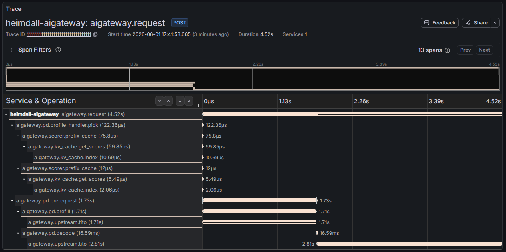

The MoAI Inference Framework bundles [Grafana Tempo](https://grafana.com/oss/tempo/) for distributed tracing. The Heimdall AI Gateway emits OpenTelemetry traces that show how it routes and schedules each request, and the `moai-inference-framework` chart provisions Tempo as a Grafana data source automatically. This guide shows how to view those traces in Grafana.

---

## Enabling tracing

Tracing is off by default. To turn it on, point the Heimdall operator at the bundled Tempo OTLP endpoint by setting `telemetry.trace.exporter.endpoint` when you install or upgrade Heimdall.

```yaml title="heimdall-values.yaml"
telemetry:
  trace:
    exporter:
      # Bundled Tempo distributor (OTLP gRPC). Adjust the release name and
      # namespace if they differ from this guide (release "mif", namespace "mif").
      endpoint: http://mif-tempo-distributor.mif.svc.cluster.local:4317
```

Pass this file to the Heimdall install command in [Prerequisites](/getting-started/prerequisites.mdx#heimdall) by adding `-f heimdall-values.yaml`.

:::info Trace sampling

To keep overhead low, the gateway records only about **5%** of requests by default, so an individual request usually will not show up in Tempo. You can change this ratio in two places:

- **All gateways**: set the Heimdall chart value `telemetry.trace.sampler.argument` (for example `1.0` to record every request).
- **A single gateway**: override `OTEL_TRACES_SAMPLER_ARG` on that `AIGateway` through its `spec.extraEnvVars`.

To force one specific request to be recorded regardless of the ratio, see [Capturing a specific request](#capturing-a-specific-request).

:::

---

## Accessing Grafana

See [Accessing Grafana](../metrics/index.mdx#accessing-grafana) in the metrics guide for the admin credentials and port-forward steps.

---

## Viewing traces

1. Open **Explore** in Grafana (the compass icon in the left sidebar).
2. Select the **Tempo** data source from the dropdown at the top.
3. Find a trace using one of the **Search** query types:
   - **Search**: filter by service name (`heimdall-aigateway`), span name, duration, and so on.
   - **TraceQL**: write a query such as `{ resource.service.name = "heimdall-aigateway" }`.
   - **Trace ID**: paste a known trace ID to open that trace directly.
4. Click a result to open the trace's waterfall view.

---

## Capturing a specific request

Because only a fraction of requests are sampled, a one-off request may not be recorded. To guarantee a request is traced — and to give it a trace ID you can look up directly — send it with a `traceparent` header whose trailing flag is `01` (sampled). Add the header to the inference request from the [Quickstart](/getting-started/quickstart.mdx#usage):

```shell {3}
curl http://localhost:8000/v1/chat/completions \
  -H "Content-Type: application/json" \
  -H "traceparent: 00-11111111111111111111111111111111-2222222222222222-01" \
  -d '{
    "model": "meta-llama/Llama-3.2-1B-Instruct",
    "messages": [{"role": "user", "content": "Hello!"}]
  }'
```

The header format is `00-<32-hex trace id>-<16-hex parent span id>-01`. The gateway honors the sampled flag, so this request is always recorded under the trace ID you chose (here `1111...1111`). Paste that trace ID into the **Trace ID** search in Grafana to open it.

---

## Reading an AI Gateway trace

A gateway trace shows the full routing and scheduling path of one request. A prefill-decode (PD) request, for example, produces a span tree like this:

```text title="Example AIGateway trace (prefill-decode request)"
aigateway.request                       ← request received (root span)
├─ aigateway.pd.profile_handler.pick    ← prefill/decode scheduling decision
├─ aigateway.scorer.prefix_cache ×2     ← scoring (prefill and decode profiles)
├─ aigateway.kv_cache.get_scores ×2     ← KV prefix-cache lookup
│   └─ aigateway.kv_cache.index ×2
├─ aigateway.pd.prerequest              ← prefill request preparation
├─ aigateway.pd.prefill                 ← prefill stage
│   └─ aigateway.upstream.tito          ← prefill worker call
└─ aigateway.pd.decode                  ← decode stage
    └─ aigateway.upstream.tito          ← decode worker call
```

In the waterfall, each span's bar shows where time is spent. Scheduling work (`profile_handler`, `scorer.*`, `kv_cache.*`) is typically sub-millisecond, while most of the latency comes from the upstream worker calls (`aigateway.upstream.tito`):



An end-to-end (non-PD) scheduling profile produces a simpler tree without the `pd.*` stages.
