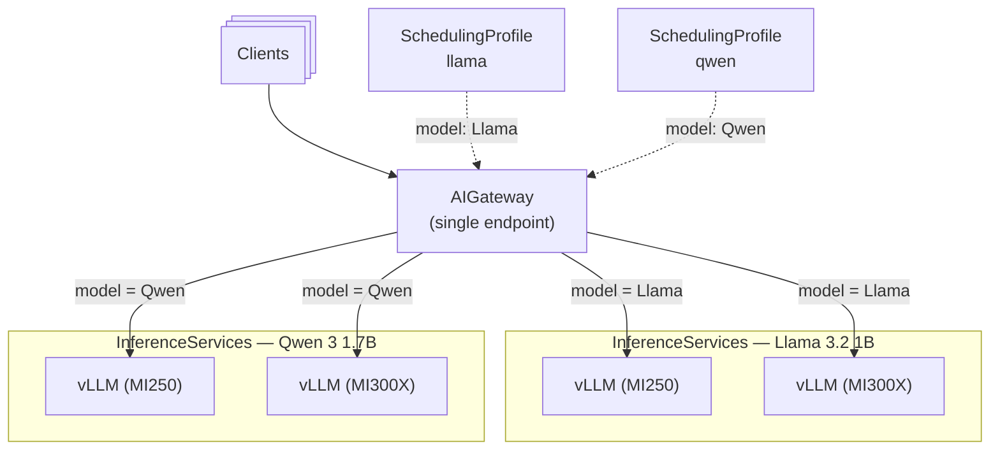

Multi-model serving exposes multiple models through a single endpoint and routes each request to the right model based on the `model` field in the request body. A single `AIGateway` matches the requested model to a `SchedulingProfile` and forwards the request to the inference pods serving that model.

This is the multi-model generalization of the single-model flow in the [Quickstart](../getting-started/quickstart.mdx). Read the Quickstart first to understand the base setup: a `SchedulingProfile`, an `AIGateway`, and an `InferenceService` bound to the gateway by the `mif.moreh.io/aigateway` label.

---

## Architecture overview

This example deploys four `InferenceService` instances serving two models (Llama 3.2 1B and Qwen 3 1.7B) across two GPU types (AMD MI250 and AMD MI300X):

- **One AIGateway**: receives all requests through a single endpoint and routes each request to the inference pods of the requested model.
- **Per-model SchedulingProfile**: one cluster-scoped `SchedulingProfile` per model, each defining that model's routing rules. The `AIGateway`'s `schedulingProfiles` field binds each request model name to its profile.
- **Four InferenceService instances**: two models, each deployed on two GPU types. All four are bound to the same gateway by the `mif.moreh.io/aigateway` label.



When a request arrives:

1. The client sends a request with the `model` field in the body (for example, `"model": "meta-llama/Llama-3.2-1B-Instruct"`).
2. The gateway reads the `model` field and looks it up in its `schedulingProfiles` bindings to select the matching `SchedulingProfile`.
3. The gateway considers only the pods that serve the requested model. Each pod advertises its served model name (the InferenceService's `spec.model.name`, set by the preset), so the gateway knows which pods host which model.
4. The selected profile scores the candidate pods and picks one to serve the request.

:::info
The reserved model name `default` in `schedulingProfiles` is the gateway-wide fallback applied to any request whose model is not listed. Per-model entries are evaluated in list order before the fallback.
:::

---

## Prerequisites

- Complete the [Prerequisites](../getting-started/prerequisites.mdx) setup, including the MoAI Inference Framework and preset chart installation. This installs the Odin and Heimdall operators this guide builds on.
- Pre-download the required models to a shared persistent volume by following the [HF Model Management (PV)](./hf-model-management-with-pv.mdx) guide. The `vllm-hf-hub-offline` template used in this guide requires a PVC named `models` in the deployment namespace.

---

## Create a namespace

```shell
kubectl create namespace multi-model-test
kubectl label namespace multi-model-test mif=enabled
```

---

## Create the scheduling profiles

Create one `SchedulingProfile` per model. A `SchedulingProfile` is **cluster-scoped**, so it is created without a namespace. This example uses a single end-to-end (`e2e`) profile per model that scores pods by the number of in-flight requests and picks the highest-scoring one. You can give each model different routing rules by adjusting its profile's scorers and picker.

```yaml title="scheduling-profiles.yaml"
apiVersion: heimdall.moreh.io/v1alpha1
kind: SchedulingProfile
metadata:
  name: llama
spec:
  profileHandler: e2e
  plugins:
    - type: inflight-requests-scorer
    - type: max-score-picker
  profiles:
    default:
      pluginRefs:
        - name: inflight-requests-scorer
          weight: 100
        - name: max-score-picker
---
apiVersion: heimdall.moreh.io/v1alpha1
kind: SchedulingProfile
metadata:
  name: qwen
spec:
  profileHandler: e2e
  plugins:
    - type: inflight-requests-scorer
    - type: max-score-picker
  profiles:
    default:
      pluginRefs:
        - name: inflight-requests-scorer
          weight: 100
        - name: max-score-picker
```

```shell
kubectl apply -f scheduling-profiles.yaml
```

:::info
If every model should share the same routing rules, you can create a single `SchedulingProfile` and bind it to the reserved model `default` instead of one profile per model. Per-model profiles are useful when different models need different scorers, pickers, or weights.
:::

---

## Deploy the gateway

Create a single `AIGateway` whose `schedulingProfiles` field binds each request model name to its `SchedulingProfile`. The model name must match the served model name of the corresponding InferenceServices (the preset's `spec.model.name`).

```yaml title="aigateway.yaml" {7-11}
apiVersion: heimdall.moreh.io/v1alpha1
kind: AIGateway
metadata:
  name: mif
spec:
  replicas: 1
  schedulingProfiles:
    - model: meta-llama/Llama-3.2-1B-Instruct
      profile: llama
    - model: Qwen/Qwen3-1.7B
      profile: qwen
```

```shell
kubectl apply -n multi-model-test -f aigateway.yaml
```

Verify that the gateway pod is running:

```shell
kubectl get pod -n multi-model-test -l app.kubernetes.io/name=aigateway,app.kubernetes.io/instance=mif
```

```shell title="Expected output (gateway pod Running)"
NAME                  READY   STATUS    RESTARTS   AGE
mif-c45c66f8b-lnzm9   1/1     Running   0          12s
```

---

## Deploy InferenceService instances

Deploy four `InferenceService` instances: two models (Llama 3.2 1B and Qwen 3 1.7B) each on two GPU types (MI250 and MI300X). Each instance references the `vllm-hf-hub-offline` template to load models from the shared persistent volume, and each is bound to the gateway by the `mif.moreh.io/aigateway: mif` label.

:::info

The `vllm-hf-hub-offline` template is installed by the `moai-inference-preset` chart in the `mif` namespace. It configures offline mode (`HF_HUB_OFFLINE=1`) and mounts the `models` PVC at `/mnt/models`. Ensure the PVC exists in the `multi-model-test` namespace with the required models pre-downloaded. See [HF Model Management (PV)](./hf-model-management-with-pv.mdx) for setup instructions.

:::

The served model name comes from the preset's `spec.model.name`: the Llama presets serve `meta-llama/Llama-3.2-1B-Instruct` and the Qwen presets serve `Qwen/Qwen3-1.7B`. These are the names the gateway matches against the request `model` field and against the `schedulingProfiles` bindings above.

```yaml title="isvc-llama-mi250.yaml" {5-6}
apiVersion: odin.moreh.io/v1alpha1
kind: InferenceService
metadata:
  name: llama-mi250
  labels:
    mif.moreh.io/aigateway: mif
spec:
  replicas: 1
  templateRefs:
    - name: vllm
    - name: quickstart-vllm-meta-llama-llama-3.2-1b-instruct-amd-mi250-tp2
    - name: vllm-hf-hub-offline
```

```yaml title="isvc-llama-mi300x.yaml" {5-6}
apiVersion: odin.moreh.io/v1alpha1
kind: InferenceService
metadata:
  name: llama-mi300x
  labels:
    mif.moreh.io/aigateway: mif
spec:
  replicas: 1
  templateRefs:
    - name: vllm
    - name: quickstart-vllm-meta-llama-llama-3.2-1b-instruct-amd-mi300x-tp2
    - name: vllm-hf-hub-offline
```

```yaml title="isvc-qwen-mi250.yaml" {5-6}
apiVersion: odin.moreh.io/v1alpha1
kind: InferenceService
metadata:
  name: qwen-mi250
  labels:
    mif.moreh.io/aigateway: mif
spec:
  replicas: 1
  templateRefs:
    - name: vllm
    - name: quickstart-vllm-qwen-qwen3-1.7b-amd-mi250-tp2
    - name: vllm-hf-hub-offline
```

```yaml title="isvc-qwen-mi300x.yaml" {5-6}
apiVersion: odin.moreh.io/v1alpha1
kind: InferenceService
metadata:
  name: qwen-mi300x
  labels:
    mif.moreh.io/aigateway: mif
spec:
  replicas: 1
  templateRefs:
    - name: vllm
    - name: quickstart-vllm-qwen-qwen3-1.7b-amd-mi300x-tp2
    - name: vllm-hf-hub-offline
```

Deploy all four instances:

```shell
kubectl apply -n multi-model-test \
    -f isvc-llama-mi250.yaml \
    -f isvc-llama-mi300x.yaml \
    -f isvc-qwen-mi250.yaml \
    -f isvc-qwen-mi300x.yaml
```

Wait for all services to be ready:

```shell
kubectl wait inferenceservice -n multi-model-test \
    llama-mi250 llama-mi300x qwen-mi250 qwen-mi300x \
    --for=condition=Ready \
    --timeout=15m
```

```shell title="Expected output (all InferenceServices Ready)"
inferenceservice.odin.moreh.io/llama-mi250 condition met
inferenceservice.odin.moreh.io/llama-mi300x condition met
inferenceservice.odin.moreh.io/qwen-mi250 condition met
inferenceservice.odin.moreh.io/qwen-mi300x condition met
```

---

## Send requests

Set up port forwarding to the gateway. The Heimdall operator creates a `Service` named after the AIGateway (`mif`) that exposes the gateway on port 8000:

```shell
kubectl -n multi-model-test port-forward service/mif 8000:8000
```

Send a request to the Llama model:

```shell
curl http://localhost:8000/v1/chat/completions \
    -H "Content-Type: application/json" \
    -d '{
      "model": "meta-llama/Llama-3.2-1B-Instruct",
      "messages": [
        {
          "role": "user",
          "content": "Hello!"
        }
      ]
    }' | jq '.'
```

Send a request to the Qwen model:

```shell
curl http://localhost:8000/v1/chat/completions \
    -H "Content-Type: application/json" \
    -d '{
      "model": "Qwen/Qwen3-1.7B",
      "messages": [
        {
          "role": "user",
          "content": "Hello!"
        }
      ]
    }' | jq '.'
```

Both requests go to the same endpoint. The gateway reads the `model` field, selects the matching `SchedulingProfile`, and routes the request to the pods serving that model &mdash; across both GPU types for that model.

---

## Cleanup

Delete all resources in reverse order:

```shell
# Delete InferenceService instances
kubectl delete -n multi-model-test \
    -f isvc-llama-mi250.yaml \
    -f isvc-llama-mi300x.yaml \
    -f isvc-qwen-mi250.yaml \
    -f isvc-qwen-mi300x.yaml

# Delete the gateway
kubectl delete -n multi-model-test -f aigateway.yaml

# Delete the scheduling profiles (cluster-scoped)
kubectl delete -f scheduling-profiles.yaml

# Delete the namespace
kubectl delete namespace multi-model-test
```
