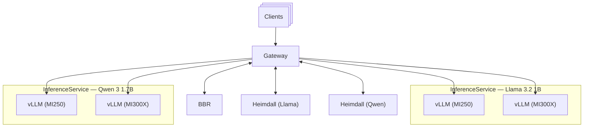

import Tabs from "@theme/Tabs";
import TabItem from "@theme/TabItem";

Multi-model serving enables serving multiple models through a single endpoint, routing requests to the appropriate model based on the `model` field in the request body. By combining the Body-Based Router (BBR) with Heimdall schedulers, the MoAI Inference Framework can serve multiple models across different GPU types through a unified API.

---

## Architecture overview

This example deploys four InferenceService instances serving two models (Llama 3.2 1B and Qwen 3 1.7B) across two GPU types (AMD MI250 and AMD MI300X):

- **Gateway**: Receives all requests through a single endpoint (port 80)
- **BBR (Body-Based Router)**: Extracts the model name from the request body and injects it as an HTTP header
- **2x Heimdall schedulers**: One per model, each managing its own InferencePool
- **4x InferenceService instances**: Two models across two GPU types



When a request arrives:

1. The client sends a request with the `model` field in the body (e.g., `"model": "meta-llama/Llama-3.2-1B-Instruct"`)
2. BBR extracts the model name and injects it as the `X-Gateway-Model-Name` header
3. The gateway matches the header to the correct Heimdall instance via HTTPRoute rules
4. Heimdall selects a pod within the InferencePool based on its scheduling profiles

---

## Prerequisites

- Complete the [Prerequisites](../getting-started/prerequisites.mdx) setup, including the MoAI Inference Framework and preset chart installation.
- Pre-download the required models to a shared persistent volume by following the [HF Model Management (PV)](./hf-model-management-with-pv.mdx) guide. The `vllm-hf-hub-offline` template used in this guide requires a PVC named `models` in the deployment namespace.

---

## Create a namespace

```shell
kubectl create namespace multi-model-test
kubectl label namespace multi-model-test mif=enabled
```

---

## Deploy the gateway

Create a `gateway.yaml` file. The contents vary depending on which gateway controller you use.

<Tabs groupId="gateway-class">
<TabItem value="istio" label="Istio (Default)" default>

```yaml title="gateway.yaml"
apiVersion: v1
kind: ConfigMap
metadata:
  name: mif-gateway-infrastructure
data:
  service: |
    spec:
      type: ClusterIP
      ports:
        - name: http
          port: 80
          targetPort: http
  deployment: |
    spec:
      template:
        metadata:
          annotations:
            proxy.istio.io/config: |
              accessLogFile: /dev/stdout
              accessLogEncoding: JSON
        spec:
          containers:
            - name: istio-proxy
              resources:
                limits: null
              ports:
                - name: http
                  containerPort: 80
---
apiVersion: gateway.networking.k8s.io/v1
kind: Gateway
metadata:
  name: mif
spec:
  gatewayClassName: istio
  infrastructure:
    parametersRef:
      group: ""
      kind: ConfigMap
      name: mif-gateway-infrastructure
  listeners:
    - name: http
      protocol: HTTP
      port: 80
      allowedRoutes:
        namespaces:
          from: All
```

</TabItem>
<TabItem value="kgateway" label="Kgateway">

```yaml title="gateway.yaml"
apiVersion: gateway.kgateway.dev/v1alpha1
kind: GatewayParameters
metadata:
  name: mif-gateway-infrastructure
spec:
  kube:
    service:
      type: ClusterIP
---
apiVersion: gateway.networking.k8s.io/v1
kind: Gateway
metadata:
  name: mif
spec:
  gatewayClassName: kgateway
  infrastructure:
    parametersRef:
      group: gateway.kgateway.dev
      kind: GatewayParameters
      name: mif-gateway-infrastructure
  listeners:
    - name: http
      protocol: HTTP
      port: 80
      allowedRoutes:
        namespaces:
          from: All
```

</TabItem>
</Tabs>

```shell
kubectl apply -n multi-model-test -f gateway.yaml
```

---

## Deploy the Body-Based Router

BBR is an external processor extension to the gateway that parses request bodies and extracts the `model` field as an HTTP header (`X-Gateway-Model-Name`). This enables routing to different InferencePool backends based on the requested model.

:::warning

BBR is only needed when clients send the model name in the request body (e.g., OpenAI-compatible API). If the client can set the `X-Gateway-Model-Name` header directly, you can skip the BBR deployment entirely — the gateway will route based on the header alone.

:::

:::info

This guide demonstrates BBR deployment using Istio. For other gateway controllers, refer to the [Gateway API Inference Extension documentation](https://gateway-api-inference-extension.sigs.k8s.io/guides/serving-multiple-inference-pools-latest/#deploy-body-based-routing-extension).

:::

Create a `bbr-values.yaml` file:

```yaml title="bbr-values.yaml"
provider:
  name: istio

inferenceGateway:
  name: mif
```

```shell
helm upgrade -i body-based-router \
    oci://us-central1-docker.pkg.dev/k8s-staging-images/gateway-api-inference-extension/charts/body-based-routing \
    --version v1.4.0 \
    -n multi-model-test \
    -f bbr-values.yaml \
    --wait
```

---

## Deploy Heimdall schedulers

Deploy two Heimdall instances, one for each model. Each instance specifies `gateway.bbr.models` so that requests matching the model name in the `X-Gateway-Model-Name` header are routed to its InferencePool.

:::info

Set `gateway.gatewayClassName` to `kgateway` if you are using Kgateway as the gateway controller.

:::

Create `heimdall-llama-values.yaml`:

```yaml title="heimdall-llama-values.yaml"
global:
  imagePullSecrets:
    - name: moreh-registry

config:
  apiVersion: inference.networking.x-k8s.io/v1alpha1
  kind: EndpointPickerConfig
  plugins:
    - type: single-profile-handler
    - type: queue-scorer
    - type: max-score-picker
  schedulingProfiles:
    - name: default
      plugins:
        - pluginRef: queue-scorer
        - pluginRef: max-score-picker

gateway:
  name: mif
  gatewayClassName: istio
  bbr:
    models:
      - meta-llama/Llama-3.2-1B-Instruct

inferencePool:
  targetPorts:
    - number: 8000
```

Create `heimdall-qwen-values.yaml` with the same structure but a different `gateway.bbr.models` value:

```yaml title="heimdall-qwen-values.yaml"
global:
  imagePullSecrets:
    - name: moreh-registry

config:
  apiVersion: inference.networking.x-k8s.io/v1alpha1
  kind: EndpointPickerConfig
  plugins:
    - type: single-profile-handler
    - type: queue-scorer
    - type: max-score-picker
  schedulingProfiles:
    - name: default
      plugins:
        - pluginRef: queue-scorer
        - pluginRef: max-score-picker

gateway:
  name: mif
  gatewayClassName: istio
  bbr:
    models:
      - Qwen/Qwen3-1.7B

inferencePool:
  targetPorts:
    - number: 8000
```

Deploy both instances:

```shell {2,7}
helm upgrade -i heimdall-llama moreh/heimdall \
    --version <heimdallVersion> \
    -n multi-model-test \
    -f heimdall-llama-values.yaml

helm upgrade -i heimdall-qwen moreh/heimdall \
    --version <heimdallVersion> \
    -n multi-model-test \
    -f heimdall-qwen-values.yaml
```

Verify that both Heimdall pods are running:

```shell
kubectl get pods -n multi-model-test -l app.kubernetes.io/name=heimdall
```

```shell title="Expected output"
NAME                               READY   STATUS    RESTARTS   AGE
heimdall-llama-7d54fcbfff-abc12    1/1     Running   0          30s
heimdall-qwen-8e65gdcggg-def34     1/1     Running   0          25s
```

---

## Deploy InferenceService instances

Deploy four InferenceService instances: two models (Llama 3.2 1B and Qwen 3 1.7B) each on two GPU types (MI250 and MI300X). Each instance references the `vllm-hf-hub-offline` template to load models from the shared persistent volume.

:::info

The `vllm-hf-hub-offline` template is installed by the `moai-inference-preset` chart in the `mif` namespace. It configures offline mode (`HF_HUB_OFFLINE=1`) and mounts the `models` PVC at `/mnt/models`. Ensure the PVC exists in the `multi-model-test` namespace with the required models pre-downloaded. See [HF Model Management (PV)](./hf-model-management-with-pv.mdx) for setup instructions.

:::

```yaml title="isvc-llama-mi250.yaml"
apiVersion: odin.moreh.io/v1alpha1
kind: InferenceService
metadata:
  name: llama-mi250
spec:
  replicas: 1
  inferencePoolRefs:
    - name: heimdall-llama
  templateRefs:
    - name: vllm
    - name: quickstart-vllm-meta-llama-llama-3.2-1b-instruct-amd-mi250-tp2
    - name: vllm-hf-hub-offline
```

```yaml title="isvc-llama-mi300x.yaml"
apiVersion: odin.moreh.io/v1alpha1
kind: InferenceService
metadata:
  name: llama-mi300x
spec:
  replicas: 1
  inferencePoolRefs:
    - name: heimdall-llama
  templateRefs:
    - name: vllm
    - name: quickstart-vllm-meta-llama-llama-3.2-1b-instruct-amd-mi300x-tp2
    - name: vllm-hf-hub-offline
```

```yaml title="isvc-qwen-mi250.yaml"
apiVersion: odin.moreh.io/v1alpha1
kind: InferenceService
metadata:
  name: qwen-mi250
spec:
  replicas: 1
  inferencePoolRefs:
    - name: heimdall-qwen
  templateRefs:
    - name: vllm
    - name: quickstart-vllm-qwen-qwen3-1.7b-amd-mi250-tp2
    - name: vllm-hf-hub-offline
```

```yaml title="isvc-qwen-mi300x.yaml"
apiVersion: odin.moreh.io/v1alpha1
kind: InferenceService
metadata:
  name: qwen-mi300x
spec:
  replicas: 1
  inferencePoolRefs:
    - name: heimdall-qwen
  templateRefs:
    - name: vllm
    - name: quickstart-vllm-qwen-qwen3-1.7b-amd-mi300x-tp2
    - name: vllm-hf-hub-offline
```

Deploy all four instances:

```shell
kubectl apply -n multi-model-test \
    -f isvc-llama-mi250.yaml \
    -f isvc-llama-mi300x.yaml \
    -f isvc-qwen-mi250.yaml \
    -f isvc-qwen-mi300x.yaml
```

Wait for all services to be ready:

```shell
kubectl wait inferenceservice -n multi-model-test \
    llama-mi250 llama-mi300x qwen-mi250 qwen-mi300x \
    --for=condition=Ready \
    --timeout=15m
```

---

## Send requests

Set up port forwarding to access the gateway:

```shell
SERVICE=$(kubectl -n multi-model-test get service -l gateway.networking.k8s.io/gateway-name=mif -o name)
kubectl -n multi-model-test port-forward $SERVICE 8000:80
```

Send a request to the Llama model:

```shell
curl http://localhost:8000/v1/chat/completions \
    -H "Content-Type: application/json" \
    -d '{
      "model": "meta-llama/Llama-3.2-1B-Instruct",
      "messages": [
        {
          "role": "user",
          "content": "Hello!"
        }
      ]
    }' | jq '.'
```

Send a request to the Qwen model:

```shell
curl http://localhost:8000/v1/chat/completions \
    -H "Content-Type: application/json" \
    -d '{
      "model": "Qwen/Qwen3-1.7B",
      "messages": [
        {
          "role": "user",
          "content": "Hello!"
        }
      ]
    }' | jq '.'
```

Both requests go to the same endpoint. BBR routes each request to the correct model group based on the `model` field, and Heimdall distributes the load across available pods within each group.

---

## Cleanup

Delete all resources in reverse order:

```shell
# Delete InferenceService instances
kubectl delete -n multi-model-test \
    -f isvc-llama-mi250.yaml \
    -f isvc-llama-mi300x.yaml \
    -f isvc-qwen-mi250.yaml \
    -f isvc-qwen-mi300x.yaml

# Uninstall Heimdall instances
helm uninstall -n multi-model-test heimdall-llama
helm uninstall -n multi-model-test heimdall-qwen

# Uninstall BBR
helm uninstall -n multi-model-test body-based-router

# Delete gateway
kubectl delete -n multi-model-test -f gateway.yaml

# Delete namespace
kubectl delete namespace multi-model-test
```
