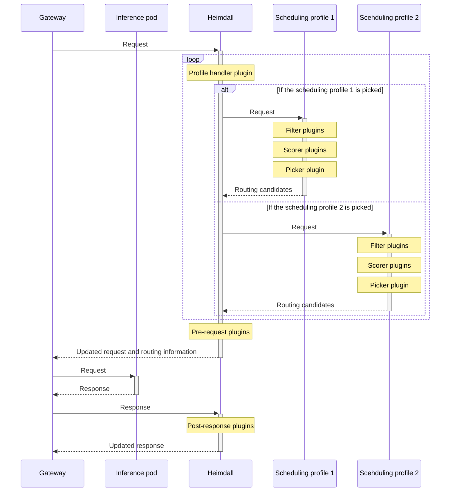

# Heimdall scheduler

**Heimdall** is the component that performs smart routing and scheduling across multiple inference pods, deciding which pod each request should be sent to. It is implemented according to the Kubernetes [Gateway API Inference Extension](https://gateway-api-inference-extension.sigs.k8s.io/) and can operate together with various gateway controllers.

Heimdall's behavior can be flexibly defined by composing multiple scheduling profiles, filters, scorers, and pickers as plugins. The MoAI Inference Framework provides a wide range of plugins &mdash; from advanced plugins that enable fully automated routing and scheduling to low-level plugins that allow fine-grained customization.

---

## Architecture

### Control flow



### Plugins

MoAI Inference Framework supports six categories of plugins &mdash; **profile handler**, **pre-request**, **post-response**, **filter**, **scorer**, and **picker** plugins. Users need to instantiate and activate some of the plugins to define the behavior of Heimdall.

| Category        | Description                                                                                    | Instantiation and activation                                                         |
| --------------- | ---------------------------------------------------------------------------------------------- | ------------------------------------------------------------------------------------ |
| Profile handler | Determines the scheduling profile(s) to be used for each incoming request.                     | Automatically invoked by Heimdall; exactly one profile handler must be instantiated. |
| Pre-request     | Performs certain processing or transformations before the request is delivered to a pod.       | Automatically invoked by Heimdall once instantiated.                                 |
| Post-response   | Performs certain processing or transformations before the response is delivered to the client. | Automatically invoked by Heimdall once instantiated.                                 |
| Filter          | Restricts the set of pods that a scheduling profile may consider as candidates.                | Becomes active only when included in a scheduling profile.                           |
| Scorer          | Adds a score to each individual pod.                                                           | Becomes active only when included in a scheduling profile.                           |
| Picker          | Selects the routing target based on the scores of pods.                                        | Becomes active only when included in a scheduling profile.                           |

#### Profile handler

| Plugin                   | Description                                                                                          | Reference                                                                |
| ------------------------ | ---------------------------------------------------------------------------------------------------- | ------------------------------------------------------------------------ |
| `single-profile-handler` | Uses the `default` scheduling profile to select a single pod.                                        |                                                                          |
| `pd-profile-handler`     | Uses the `prefill` and `decode` scheduling profile to select both prefill-only and decode-only pods. | [Prefill-decode disaggregation](/features/prefill_decode_disaggregation) |

#### Filter

| Plugin           | Description                                                                      | Reference                                                                |
| ---------------- | -------------------------------------------------------------------------------- | ------------------------------------------------------------------------ |
| `decode-filter`  | Selects only decode-only pods, and is used by the `decode` scheduling profile.   | [Prefill-decode disaggregation](/features/prefill_decode_disaggregation) |
| `prefill-filter` | Selects only prefill-only pods, and is used by the `prefill` scheduling profile. | [Prefill-decode disaggregation](/features/prefill_decode_disaggregation) |

#### Scorer

| Plugin                        | Description                                                                                                         | Reference                                                          |
| ----------------------------- | ------------------------------------------------------------------------------------------------------------------- | ------------------------------------------------------------------ |
| `active-request-scorer`       | Scores based on the number of active requests.                                                                      | [Load-aware routing](/features/load_aware_routing)                 |
| `load-aware-scorer`           | Scores based on the number of queued requests.                                                                      | [Load-aware routing](/features/load_aware_routing)                 |
| `no-hit-lru-scorer`           | Scores based on whether the request hits the prefix cache, and if it misses, when each pod last experienced a miss. | [Load-aware routing](/features/load_aware_routing)                 |
| `precise-prefix-cache-scorer` | Scores based on the prefix cache hit rate.                                                                          | [Prefix cache-aware routing](/features/prefix_cache_aware_routing) |
| `queue-scorer`                | Scores based on the number of queued requests.                                                                      | [Load-aware routing](/features/load_aware_routing)                 |
| `session-affinity-scorer`     | Scores based on whether the pod has previously handled a request from the same session.                             | [Load-aware routing](/features/load_aware_routing)                 |

#### Picker

| Plugin                   | Description                                                         | Reference |
| ------------------------ | ------------------------------------------------------------------- | --------- |
| `max-score-picker`       | Selects the pod with the highest total score.                       |           |
| `random-picker`          | Selects a pod randomly without considering scores.                  |           |
| `weighted-random-picker` | Selects a pod randomly with probabilities weighted by their scores. |           |

---

## Configuration

```yaml heimdall-values.yaml
global:
  imagePullSecrets:
    - name: moreh-registry

config:
  apiVersion: inference.networking.x-k8s.io/v1alpha1
  kind: EndpointPickerConfig
  plugins:
    - type: pd-profile-handler
    - type: prefill-filter
    - type: decode-filter
    - type: queue-scorer
    - type: kv-cache-utilization-scorer
    - type: max-score-picker
  schedulingProfiles:
    - name: prefill
      plugins:
        - pluginRef: prefill-filter
        - pluginRef: queue-scorer
        - pluginRef: kv-cache-utilization-scorer
        - pluginRef: max-score-picker
    - name: decode
      plugins:
        - pluginRef: decode-filter
        - pluginRef: queue-scorer
        - pluginRef: kv-cache-utilization-scorer
        - pluginRef: max-score-picker

gateway:
  name: mif
  gatewayClassName: istio

serviceMonitor:
  labels:
    release: prometheus-stack
```

### `config` section

The `config` section defines Heimdall's routing rules. As explained earlier, this is achieved by appropriately combining and configuring multiple plugins.

This section begins with `config.apiVersion` and `config.kind`, which should be set to `inference.networking.x-k8s.io/v1alpha1` and `EndpointPickerConfig`, respectively.

The `config.plugins` list instantiates the plugins to be used, specifying their respective parameters. In most cases, a single instance per plugin is sufficient, but you may instantiate the same plugin multiple times under different names if you need to apply different parameters. Each plugin instance is defined by an entry of the following form:

```yaml
- name: <instanceName>
  type: <pluginName>
  parameters:
    <parameter>: <value>
```

- `name` (optional): The name used to reference the plugin instance in scheduling profiles. If omitted, the plugin's `type` is used as its name.
- `type` (required): The predefined name of the plugin to instantiate.
- `parameters` (optional): Configuration options specific to this plugin instance.

The `config.schedulingProfiles` combines zero or more filter and scorer plugins with exactly one picker plugin to define a rule for making routing decisions. Each scheduling profile is defined by an entry of the following form:

```yaml
- name: <profileName>
  plugins:
    - pluginRef: <instanceName>
      weight: <weight>
```

- `name` (required): The name of the scheduling profile.
- `plugins` (required): A list of filter, scorer, and picker plugins that make up the scheduling profile.
  - `pluginRef` (required): The name of the plugin instance as defined in the `config.plugins` section.
  - `weight` (optional, for scorer plugins only): A numerical weight that influences the scoring outcome. Higher weights increase the impact of the scorer on the final decision. If omitted, a default weight of 1 is applied.
